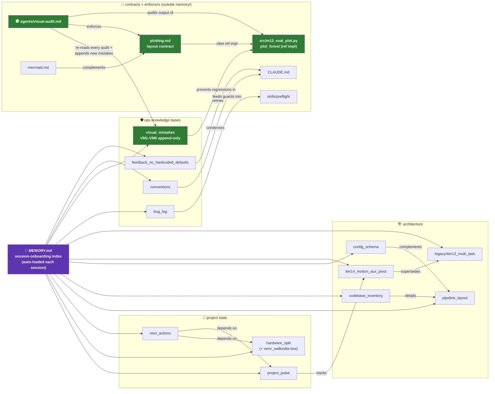

# 🕸️ Memory graph (derived view — source of truth = `MEMORY.md`)

> 🤖 Machine-readable twin: [`memory_graph.jsonl`](memory_graph.jsonl) — one JSON record per line in the
> **official MCP memory-server schema** (`{"type":"entity"|"relation", ...}`), so it can be dropped straight
> into `@modelcontextprotocol/server-memory` via `MEMORY_FILE_PATH` if graph *queries* are ever wanted.
> ⚠️ **Derived, not loaded**: Claude Code auto-loads `MEMORY.md` each session; nothing auto-loads this graph.
> Update discipline: edit `MEMORY.md` + the memory file FIRST, then mirror the node/edge here — never the
> reverse. If they ever disagree, `MEMORY.md` wins.

## 🔁 The self-correcting loop encoded above (green nodes)

| step | node | action |
|---|---|---|
| 1 | `plot_forest` | renders a figure |
| 2 | `visual-audit` agent | loads `plotting.md` + `visual_mistakes.md`, Reads the PNG, verdicts |
| 3 | `visual_mistakes.md` | any NEW failure class appended as VM<n> |
| 4 | next audit | VM<n> is now a checklist item → same mistake can never ship twice |
