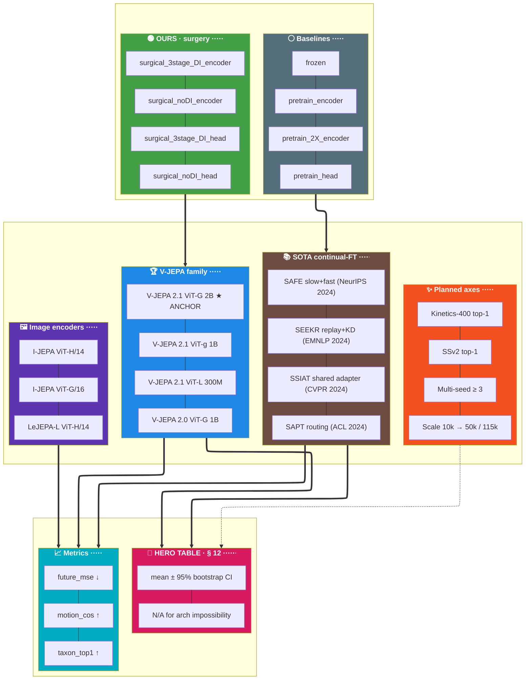

# iter17 — World-model ablation plan (plan1)

Date: 2026-05-23 (scope changed 2026-05-24) · Author: continuation of iter15/iter16 work
Status: DRAFT — **SCOPE = FULL 115k** (`data/full_local/`), reversed from POC-only
on 2026-05-24 to get NON-OVERLAPPING 95% CIs (see § 0.5). FULL is NOT launch-ready
(m10 SAM + m04d still in-prep; pipeline.yaml flip pending). Awaiting user go.

═══════════════════════════════════════════════════════════════════════════════
§ 0 · Why this plan exists (acknowledgement of my miss-call)
═══════════════════════════════════════════════════════════════════════════════

User pointed out (task 1.2) that I missed V-JEPA 2.0 in the prior ablation list.
The reason:
- I scoped the "world models on HF" search to EXTERNAL candidates (LeJEPA,
  DINOv3, VideoMAE, InternVideo2, Cosmos, Genie) and skipped the obvious
  SIBLING — V-JEPA 2.0 — that already lives at `configs/model/vjepa2_0.yaml`
  with a known download URL (`https://dl.fbaipublicfiles.com/vjepa2/vitg-384.pt`).
- CLAUDE.md (`src/CLAUDE.md`, CONFIGS block) literally says
  `vjepa2_0.yaml — legacy (V-JEPA 2.0 ViT-g 1B, 1408-dim)` — kept exactly for
  ablation comparison. I read past it.
- Net effect: I biased toward "interesting outsiders" instead of the closest
  sibling, which is the cheapest + highest-information ablation.

This iter17 plan corrects that and goes further — adding the realistic-scope
HF candidates that ARE swap-compatible with our pipeline.

═══════════════════════════════════════════════════════════════════════════════
§ 0.5 · ⚠️ SCOPE CHANGE 2026-05-24 — POC-only → FULL 115k (supersedes all "POC-only" text below)
═══════════════════════════════════════════════════════════════════════════════

WHY: at POC (10k corpus, test N≈218 labeled clips) the 95% bootstrap CIs for the
probe-accuracy metrics OVERLAP — see
  iter15.../v15a/poc/probe_plot/eval/probe_action_acc_compare.png
  iter15.../v15a/poc/probe_plot/eval/probe_motion_cos_compare.png
An overlapping-CI result is not publishable as "surgery > baseline". The fix is
N, not the recipe: CI half-width ∝ 1/√N.

```text
┌──────────────────────────┬──────────────┬───────────────┬───────────────────────────────────┐
│ Corpus                    │ Test clips    │ CI half-width │ Effect on overlapping metrics      │
├──────────────────────────┼──────────────┼───────────────┼───────────────────────────────────┤
│ POC eval_10k_local        │ ~218 labeled  │ baseline      │ taxon_top1 ±0.0516 → CIs OVERLAP  │
│ FULL full_local (115,687) │ ~2.5k-17k     │ ~3-9× narrower│ ±0.0516 → ±0.006-0.015 → likely   │
│                           │ labeled       │ (√N scaling)  │ SEPARATE                          │
└──────────────────────────┴──────────────┴───────────────┴───────────────────────────────────┘
```

HONEST CAVEAT: FULL buys a STATISTICALLY DECISIVE verdict, not a guaranteed
surgery-win. If the true effect is small (POC means already near-equal), tight
FULL CIs will CONFIRM equality with high confidence — i.e. they can decisively
REFUTE the headline, not just support it. That is the correct scientific risk to
take (§ 6).

FULL DATA-PREP PREREQUISITES (verified 2026-05-24 — NOT launch-ready yet):
  • Corpus: ✅ 115,687 clips, all 116 tars + manifest on data/full_local/.
  • m10 SAM segmentation: ⏳ STILL RUNNING (PID 2264355, ~56 GPU-hr in, 6 workers).
  • m04d motion features: ⏳ INCOMPLETE (only .m04d_checkpoint.npz — no
    motion_features.npy → probe labels cannot be generated yet).
  • m11 factor datasets: partial, gated on m10 finishing.
  • pipeline.yaml data.local_data_dir: still = data/eval_10k_local → M9 flip to
    data/full_local (+ master_manifest_name) PENDING before any FULL run.
GATE: no FULL training/eval launches until m10 + m04d complete AND the yaml flip
lands. Until then, code-prep (M0a-M5, yaml authoring, SOTA trainers) proceeds on
the 10k corpus as SANITY/dev — but the PAPER NUMBERS come from FULL.

═══════════════════════════════════════════════════════════════════════════════
§ 1 · iter15 v15a recipe — what we replicate per encoder (recipe is scale-agnostic)
═══════════════════════════════════════════════════════════════════════════════

Scope: **FULL 115k** on `data/full_local/` for paper numbers (§ 0.5). The iter15
v15a recipe below is the per-encoder template — identical at POC and FULL per the
POC↔FULL parity rule; only n_clips (10k→115k) and n_epochs differ. POC on
`data/eval_10k_local/` remains the dev/SANITY tier.
Verified from `iter15_poc_m09c1_3stage_DI_encoder_20260517_022905.log`:
  • eval_10k_train_split.json: 1,083 clips (split=train)
  • eval_10k_val_split.json:   218 clips (split=val)
  • eval_10k_test_split.json:  218 clips (split=test)
  • m09c1 factor surgery: 9,079 train / 218 val (EXTERNAL val_split — leakage guard)
  • m09c1 factor index: 99 clips (D_L=97, D_A=75, D_I=68)

From the 8 logs in `iter/iter15_trainHead_freezeEncoder/result_outputs/v15a/logs/`,
v15a ran a paired (encoder-training vs head-only-training) comparison with
8 encoders × 5 eval stages:

```text
┌──────────────────────────────────────┬──────────┬───────┬──────────────────────────────────────┐
│ Encoder name                          │ Trainer  │ Init  │ Recipe                                 │
├──────────────────────────────────────┼──────────┼───────┼──────────────────────────────────────┤
│ vjepa_2_1_frozen                      │ —        │ Meta  │ Off-the-shelf ckpt, no fine-tuning    │
│ vjepa_2_1_pretrain_encoder            │ m09a1    │ Meta  │ Vanilla SSL, 2 epochs, blocks [20,48) trainable│
│ vjepa_2_1_pretrain_2X_encoder         │ m09a1    │ Meta  │ Same but 4 epochs (2× compute ablation)│
│ vjepa_2_1_pretrain_head               │ m09a2    │ Meta  │ All 48 blocks + predictor FROZEN; motion_aux head only│
│ vjepa_2_1_surgical_3stage_DI_encoder  │ m09c1    │ m09a1 │ Factor surgery 4-stage with Drift Injection│
│ vjepa_2_1_surgical_noDI_encoder       │ m09c1    │ m09a1 │ Factor surgery 3-stage, no DI         │
│ vjepa_2_1_surgical_3stage_DI_head     │ m09c2    │ m09a1 │ HEAD-ONLY surgery w/ DI mixture {L:.15,A:.15,I:.7}│
│ vjepa_2_1_surgical_noDI_head          │ m09c2    │ m09a1 │ HEAD-ONLY surgery, mixture {L:.5,A:.5,I:.0}│
└──────────────────────────────────────┴──────────┴───────┴──────────────────────────────────────┘
```

Eval (post_poc_eval) runs 5 stages per encoder:
  • Stage 2 — features extraction (fp16, splits=test)
  • Stage 3 — probe training (20 epochs, action labels)
  • Stage 3.5 — taxonomy probe (16 dims)
  • Stage 5 — motion_cos features
  • Stage 6 — motion_cos cosine
  • Stage 8 — future_mse forward (requires predictor ckpt)

Artifacts each trainer must produce (verified from iter15 logs):
  • `student_encoder.pt` (~6.9 GB) — encoder weights consumed by Stages 2/3/5/6
  • `m09a_ckpt_best.pt` / `m09c_ckpt_best.pt` (~7-14 GB) — full ckpt with `predictor` key, consumed by Stage 8
  • `motion_aux_head.pt` (~436 KB) — paired-Δ head consumed by lazy-extract path

═══════════════════════════════════════════════════════════════════════════════
§ 2 · Candidate world models for iter17 ablation
═══════════════════════════════════════════════════════════════════════════════

Realistic-scope filter: candidates must produce a per-clip feature vector
that the existing probe stages can consume.

```text
┌───────────────────────────────┬──────────────┬──────────┬──────────┬──────────────────────────────────────┐
│ Candidate (POST-M0 audit)      │ HF / URL      │ Arch     │ Feat-dim │ Compatibility with our pipeline       │
├───────────────────────────────┼──────────────┼──────────┼──────────┼──────────────────────────────────────┤
│ 🟢 V-JEPA 2.0 HF mirror       │ facebook/vjepa2-vitg-fpc64-384│ 40 blk · 22h│ 1408 │ ✅ PRIMARY — Apache 2.0 (paper-safe)  │
│   (PRIMARY loader)             │              │              │      │ AutoModel.from_pretrained() + ~50 LoC │
│                                │              │              │      │ adapter to map into vit_giant_xformers│
│ 🟢 V-JEPA 2.0 fbai (fallback)  │ fbaipublicfiles│ same       │ 1408   │ ⚠️ Use only if M5 SANITY shows HF     │
│                                │              │              │      │ mirror missing the predictor weights  │
│ 🟡 I-JEPA ViT-H/14 IN-1k       │ facebook/ijepa_vith14_1k│ 32 blk · ViT-H│ 1280│ image-only, frozen-only. CC-BY-NC 4.0│
│   (0.6B params)                │              │              │      │ per-frame + mean-pool adapter         │
│ 🟡 I-JEPA ViT-G/16 IN-22k      │ facebook/ijepa_vitg16_22k│ ViT-G/16│ 1408 │ image-only, frozen-only. CC-BY-NC 4.0│
│   (1B params)                  │              │              │      │ same adapter as ViT-H/14              │
│ 🟡 LeJEPA-L ViT-H/14 IN-1k     │ HF dataset:  │ ViT-H/14 · 32 blk│ 1280│ image-only, frozen-only. License TBD │
│   (~630M params)               │ gajeshladharai/artifacts/lejepa-l.pt│   │ via HF dataset asset (not model card)│
│                                │              │              │      │ Same image→video adapter as I-JEPA   │
│ 🟢 V-JEPA 2.1 ViT-L 300M       │ torch.hub:   │ 24 blk · ~16h│ 1024 │ ✅ FULL 8-encoder. SCALE AXIS within │
│   384 res, fpc64               │ vjepa2_1_    │              │      │ same recipe (6.7× smaller than ViT-G).│
│                                │ vit_large_384│              │      │ Surgery layer_freeze: [0,10)/[10,24) │
│ 🟢 V-JEPA 2.1 ViT-g 1B         │ torch.hub:   │ 40 blk · 22h │ 1408 │ ✅ FULL 8-encoder. Half-scale of 2B G.│
│   384 res, fpc64               │ vjepa2_1_    │              │      │ Surgery layer_freeze: [0,17)/[17,40) │
│                                │ vit_giant_384│              │      │ (same indices as V-JEPA 2.0 surgery)  │
│ 🟢 V-JEPA 2.0 ViT-G SSv2-FT    │ facebook/    │ 40 blk · 22h │ 1408 │ ⚠️ FROZEN-only. Supervised SSv2 fine- │
│   384 res, fpc64               │ vjepa2-vitg- │              │      │ tune → strongest action probe baseline│
│                                │ fpc64-384-ssv2│             │      │ by construction. Apache 2.0.          │
└───────────────────────────────┴──────────────┴──────────┴──────────┴──────────────────────────────────────┘
```

Legend: 🟢 drop-in same family · 🟡 adapter required
DROPPED 2026-05-23 (post-M0 audit):
  • facebook/jepa-wms — robotics task-specific (6 WMs for DROID/Metaworld/etc),
    not generic video. Confounds our action-classification probe axis.
  • LeWorldModel (lucas-maes/le-wm) — only ~15M params, checkpoints only for
    control envs (pusht/cube/tworooms/reacher). Same confound as JEPA-WMS.
  • H-JEPA, LeJEPA-TimeSeries, MLxDL demo — no usable pretrained weights or
    wrong modality.

═══════════════════════════════════════════════════════════════════════════════
§ 3 · Per-candidate ablation scope (HONEST what-fits-the-architecture)
═══════════════════════════════════════════════════════════════════════════════

Surgery is V-JEPA-specific: it bakes in (a) the 48-block ViT-G layer_freeze
indexing, (b) hierarchical mask generators with `n_output_distillation=4`,
(c) motion_aux head dims tied to (K=13 classes + 23-D vec). Forcing surgery
onto a 32-block I-JEPA or unknown JEPA-WMS architecture would either crash
or require ~500 LoC of model-specific surgery code. Per CLAUDE.md "NO LAZY
FIX" — fake-port the surgery code is worse than reporting the architecture
mismatch honestly.

```text
┌──────────────────────────────┬──────────┬───────────────┬───────────────┬──────────┐
│ Candidate                     │ Frozen   │ Encoder train │ Head train    │ Surgery  │
├──────────────────────────────┼──────────┼───────────────┼───────────────┼──────────┤
│ V-JEPA 2.0                    │ ✅       │ ✅            │ ✅            │ ✅ (port layer_freeze indices)│
│ I-JEPA ViT-H/14               │ ✅       │ ⚠️ no predictor│ ⚠️ no motion_aux│ ❌ arch incompat│
│ I-JEPA ViT-G/16               │ ✅       │ ⚠️ no predictor│ ⚠️ no motion_aux│ ❌ arch incompat│
│ JEPA-WMS                      │ pending  │ pending       │ pending       │ pending  │
└──────────────────────────────┴──────────┴───────────────┴───────────────┴──────────┘
```

⚠️ = possible but requires writing a non-trivial wrapper (m09a1 or m09a2
expects V-JEPA-shape ckpt; would need a wrapped I-JEPA that produces a
predictor-shaped output, which is not what I-JEPA's authors built).

Decision: I-JEPA ablation = **FROZEN-BASELINE ONLY**. We compare its frozen
features vs V-JEPA 2.1 frozen on Stage 2/3/3.5/5/6. Stage 8 (future_mse)
needs a predictor → SKIPPED for I-JEPA (architectural impossibility per
CLAUDE.md TRUE-IMPOSSIBILITY carve-out).

═══════════════════════════════════════════════════════════════════════════════
§ 4 · M-section work items
═══════════════════════════════════════════════════════════════════════════════

```text
┌─────┬──────────────────────────────────────────────────────────────┬───────┬────────┐
│ M#  │ Work item                                                      │ Mode  │ Risk   │
├─────┼──────────────────────────────────────────────────────────────┼───────┼────────┤
│ M0  │ Verify HF model cards via direct WebFetch:                     │ CPU   │ low    │
│     │   • facebook/jepa-wms — confirm architecture (dim, blocks,     │       │        │
│     │     input modality, has-predictor?). If not video / no predictor│       │        │
│     │     → drop from iter17 scope.                                  │       │        │
│     │   • facebook/ijepa_vith14_1k — confirm tensor names & feat-dim │       │        │
│     │   • facebook/vjepa2-vitg-fpc64-384 — confirm load path matches │       │        │
│     │     our existing vjepa2_0.yaml ckpt structure                  │       │        │
│     │ Deliverable: hf_card_audit.md table with M0 column = ✅/❌    │       │        │
├─────┼──────────────────────────────────────────────────────────────┼───────┼────────┤
│ M1  │ Acquire weights (sequential, per disk pressure):              │ host  │ low    │
│     │   • vjepa2_vitg384.pt (~8 GB) — fbaipublicfiles wget          │       │        │
│     │   • facebook/ijepa_vith14_1k (~2.4 GB) — HF Hub               │       │        │
│     │   • facebook/ijepa_vitg16_22k (~5.6 GB) — HF Hub              │       │        │
│     │   • facebook/jepa-wms (size TBD by M0)                        │       │        │
│     │ Total: ~16-25 GB additional checkpoint storage                │       │        │
│     │ Path discipline: all checkpoint paths via argparse + yaml     │       │        │
│     │ — never hardcoded in src/*.py (CLAUDE.md no-hardcode rule).   │       │        │
├─────┼──────────────────────────────────────────────────────────────┼───────┼────────┤
│ M2  │ Generate iter17 yaml configs (mirror iter15 structure):       │ CPU   │ low    │
│     │   configs/train/surgery_3stage_DI_encoder_vjepa2_0.yaml       │       │        │
│     │   configs/train/surgery_2stage_noDI_encoder_vjepa2_0.yaml     │       │        │
│     │   configs/train/surgery_3stage_DI_head_vjepa2_0.yaml          │       │        │
│     │   configs/train/surgery_2stage_noDI_head_vjepa2_0.yaml        │       │        │
│     │   configs/train/pretrain_encoder_vjepa2_0.yaml                │       │        │
│     │   configs/train/pretrain_head_vjepa2_0.yaml                   │       │        │
│     │ Each inherits from base_optimization.yaml + model=vjepa2_0.   │       │        │
│     │ Surgery yamls need V-JEPA 2.0 layer_freeze re-indexing:       │       │        │
│     │   2.1: blocks [0,20)/[20,48) → 2.0: blocks [0,17)/[17,40)     │       │        │
│     │   (proportional 5/12 split — verify w/ user before M5).       │       │        │
├─────┼──────────────────────────────────────────────────────────────┼───────┼────────┤
│ M3  │ Encoder-registry update (configs/pipeline.yaml):              │ CPU   │ low    │
│     │   Add VJEPA_2_0 encoders to the encoder list:                  │       │        │
│     │     vjepa_2_0_frozen                                           │       │        │
│     │     vjepa_2_0_pretrain_encoder                                 │       │        │
│     │     vjepa_2_0_pretrain_2X_encoder                              │       │        │
│     │     vjepa_2_0_pretrain_head                                    │       │        │
│     │     vjepa_2_0_surgical_3stage_DI_encoder                       │       │        │
│     │     vjepa_2_0_surgical_noDI_encoder                            │       │        │
│     │     vjepa_2_0_surgical_3stage_DI_head                          │       │        │
│     │     vjepa_2_0_surgical_noDI_head                               │       │        │
│     │     ijepa_vith14_1k_frozen                                     │       │        │
│     │     ijepa_vitg16_22k_frozen                                    │       │        │
│     │     jepa_wms_frozen  (gated on M0)                             │       │        │
│     │ Wire each to its student_encoder.pt + m09a_ckpt_best.pt paths.│       │        │
├─────┼──────────────────────────────────────────────────────────────┼───────┼────────┤
│ M4  │ I-JEPA adapter in src/utils/encoder_loader.py (NEW file):     │ CPU   │ medium │
│     │   def load_ijepa_per_frame_to_clip(ckpt_path, T=16):          │       │        │
│     │     """Per-frame ViT encode + mean-pool across T frames →     │       │        │
│     │     per-clip embedding (D=1280 for vith14, D=1408 for vitg16)."""│       │        │
│     │   Why: I-JEPA is image-only — outputs (B, N_patches, D) per   │       │        │
│     │   frame. Our pipeline expects (B, T, N, D) or pooled (B, D).  │       │        │
│     │   Fix: feed T frames sequentially, stack outputs, mean-pool   │       │        │
│     │   over T. Hidden cost: T× compute vs native V-JEPA, but a one-│       │        │
│     │   off frozen-eval — acceptable.                                │       │        │
│     │ Acceptance test: ./scripts/run_eval.sh ablation_ijepa_smoke  │       │        │
│     │   --SANITY exits 0 with non-zero feature output.              │       │        │
├─────┼──────────────────────────────────────────────────────────────┼───────┼────────┤
│ M5  │ Smallest-SANITY smoke per CLAUDE.md feedback rule              │ Pro   │ medium │
│     │ (smallest-sanity-per-code-mod):                                │ 4000  │        │
│     │   For each new model:                                          │       │        │
│     │     • V-JEPA 2.0: m09a1 --SANITY 10 clips, 2 steps              │       │        │
│     │     • I-JEPA vith14: probe_action --SANITY w/ 50 clips         │       │        │
│     │     • JEPA-WMS: gated on M0                                    │       │        │
│     │   Pass criteria: exit 0 + .pt file size > 0 + Stage 2 features│       │        │
│     │   shape matches yaml's embed_dim.                              │       │        │
├─────┼──────────────────────────────────────────────────────────────┼───────┼────────┤
│ M6  │ V-JEPA 2.0 POC — full 8-encoder replication of iter15 v15a    │ Pro   │ medium │
│     │   Mirrors iter15 runbook commands exactly:                     │ 4000  │        │
│     │     ./scripts/run_train.sh pretrain_encoder_vjepa2_0 --POC    │ or    │        │
│     │     ./scripts/run_train.sh pretrain_2X_encoder_vjepa2_0 --POC │ Pro   │        │
│     │     ./scripts/run_train.sh pretrain_head_vjepa2_0 --POC       │ 6000  │        │
│     │     ./scripts/run_train.sh surgery_3stage_DI_encoder_vjepa2_0 │       │        │
│     │     ./scripts/run_train.sh surgery_noDI_encoder_vjepa2_0      │       │        │
│     │     ./scripts/run_train.sh surgery_3stage_DI_head_vjepa2_0    │       │        │
│     │     ./scripts/run_train.sh surgery_noDI_head_vjepa2_0         │       │        │
│     │     ./scripts/run_eval.sh ablation_vjepa_2_0 --POC            │       │        │
│     │   Outputs: iter17/result_outputs/v17a_vjepa2_0/{logs,...}    │       │        │
├─────┼──────────────────────────────────────────────────────────────┼───────┼────────┤
│ M7  │ I-JEPA POC — frozen-only baseline                              │ Pro   │ low    │
│     │   ./scripts/run_eval.sh ablation_ijepa_vith14 --POC --frozen-only│ 4000│        │
│     │   ./scripts/run_eval.sh ablation_ijepa_vitg16 --POC --frozen-only│    │        │
│     │   Stages: 2, 3, 3.5, 5, 6 (Stage 8 SKIPPED — no predictor)   │       │        │
│     │   Outputs: iter17/result_outputs/v17b_ijepa/{logs,...}       │       │        │
├─────┼──────────────────────────────────────────────────────────────┼───────┼────────┤
│ M8  │ JEPA-WMS POC — gated on M0 architecture verification          │ Pro   │ low    │
│     │   If predictor available → full eval like V-JEPA 2.0.        │ 4000  │        │
│     │   If not → frozen-only like I-JEPA.                           │       │        │
├─────┼──────────────────────────────────────────────────────────────┼───────┼────────┤
│ M9  │ Aggregate ablation plot (m07b_paired_delta):                  │ CPU   │ low    │
│     │   Re-use iter15's paired-Δ plotting code from                  │       │        │
│     │   `src/m07b_paired_delta.py` — extend to multi-model column.  │       │        │
│     │   Output: iter17_ablation_summary.{png,pdf} with all 11+     │       │        │
│     │   encoders side-by-side on action / taxonomy / motion / future│       │        │
│     │   axes. ASCII summary table in high_level_outputs.md.        │       │        │
├─────┼──────────────────────────────────────────────────────────────┼───────┼────────┤
│ Q5-Q9 ADDITIONS (2026-05-24) — see § 9 for the decisions                            │
├─────┼──────────────────────────────────────────────────────────────┼───────┼────────┤
│ M0a │ (Q6) torch.hub probe of ViT-L predictor depth (30 sec):       │ CPU   │ low    │
│     │   python -c "import torch; m=torch.hub.load('facebookresearch │       │        │
│     │   /jepa','vjepa2_1_vit_large_384'); print(m.predictor.depth)" │       │        │
│     │   → record value in configs/model/vjepa2_1_vit_large.yaml     │       │        │
│     │   model.pred_depth. BLOCKS M2b (ViT-L yaml authoring).        │       │        │
├─────┼──────────────────────────────────────────────────────────────┼───────┼────────┤
│ M7b │ (Q5) Image-encoder POOL SWEEP — mean+cls+max per backbone:    │ Pro   │ low    │
│     │   3 image encs × 3 pools × 3 head positions = 27 head         │ 4000  │        │
│     │   trainers + 3 frozen extractions (frozen has no pool — it    │       │        │
│     │   feeds features, not a trained head). CLS pool FATALs if the │       │        │
│     │   encoder ships no CLS token (see plan_code FL-8).            │       │        │
├─────┼──────────────────────────────────────────────────────────────┼───────┼────────┤
│ M7a │ (Q8) AMENDED: V-JEPA 2.0 SSv2-FT now FROZEN + head-only.      │ Pro   │ low    │
│     │   +3 head yamls (pretrain_head + 2 surgery_head). Was FROZEN- │ 4000  │        │
│     │   only; promoted for cross-table parity with image encoders.  │       │        │
├─────┼──────────────────────────────────────────────────────────────┼───────┼────────┤
│ M10 │ (Q7) SAFE trainer — NeurIPS 2024 slow+fast PET.               │ Pro   │ HIGH   │
│     │   src/m09s_safe.py + 4 yamls (one per V-JEPA backbone).       │ 6000  │        │
│     │   Built on m09c1 stage loop + m09c2 frozen backbone (Q10=     │       │        │
│     │   Option A: session_i = surgery stage_i). § C.10 RESOLVED.    │       │        │
├─────┼──────────────────────────────────────────────────────────────┼───────┼────────┤
│ M11 │ (Q7) SEEKR trainer — EMNLP 2024 replay + selective KD.        │ Pro   │ HIGH   │
│     │   src/m09s_seekr.py + 4 yamls. Same § C.10 prereq.            │ 6000  │        │
├─────┼──────────────────────────────────────────────────────────────┼───────┼────────┤
│ M12 │ (Q7) SSIAT trainer — CVPR 2024 shared adapter.                │ Pro   │ HIGH   │
│     │   src/m09s_ssiat.py + 4 yamls. Same § C.10 prereq.            │ 6000  │        │
├─────┼──────────────────────────────────────────────────────────────┼───────┼────────┤
│ M13 │ (Q7) SAPT trainer — ACL 2024 input-cond PET routing.          │ Pro   │ HIGH   │
│     │   src/m09s_sapt.py + 4 yamls. Same § C.10 prereq.             │ 6000  │        │
├─────┼──────────────────────────────────────────────────────────────┼───────┼────────┤
│ M14 │ (Q9) hf_outputs.py --subdir iter17_ablations pass-through.    │ CPU   │ low    │
└─────┴──────────────────────────────────────────────────────────────┴───────┴────────┘
```

Note (REVISED 2026-05-24, supersedes prior POC-only note — see § 0.5): iter17
paper numbers come from **FULL 115k** (`data/full_local/`), because POC CIs
overlap and only N fixes that. The 10k corpus is the dev/SANITY tier where
code-prep (M0a-M5, yaml authoring, SOTA trainers) is validated before each FULL
launch. The ablation question is unchanged — "does the surgery-vs-frozen Δ hold
across V-JEPA 2.0 / 2.1 size variants / I-JEPA / LeJEPA / SOTA" — but now it is
answered at a scale where the CIs can SEPARATE. Per the POC↔FULL parity rule,
every FULL run is a byte-identical scale-up of its POC counterpart (only n_clips
+ n_epochs differ).

═══════════════════════════════════════════════════════════════════════════════
§ 5 · Compute + storage budget (best-effort estimates from iter15 wallclocks)
═══════════════════════════════════════════════════════════════════════════════

⚠️ POST-SCOPE-CHANGE (§ 0.5): the dollar/hour figures in THIS section are
POC-scale (10k). FULL 115k is ~11.5× the train clips (80k vs ~7k) and ~78× the
test clips (~17k vs 218). Per-encoder wallclocks scale accordingly:

```text
┌──────────────────────────────┬──────────────┬────────────────────────────────────────────┐
│ Stage                         │ POC (10k)     │ FULL (115k) — from run_train.sh docstring  │
├──────────────────────────────┼──────────────┼────────────────────────────────────────────┤
│ pretrain_encoder (per enc)    │ ~1-2 min      │ ~3 GPU-h                                   │
│ surgery_*_encoder (per enc)   │ ~2 min        │ ~6-8 GPU-h                                 │
│ eval (per enc, all stages)    │ ~50 min       │ multi-hour (17k test feature-extract +     │
│                               │               │ probe-train dominate)                      │
└──────────────────────────────┴──────────────┴────────────────────────────────────────────┘
```

NET: the EFFECTIVE FULL budget is roughly ONE-to-TWO orders of magnitude above
the ~$111-205 POC total below — the SOTA × 4-backbone matrix + image pool sweep
at FULL is the dominant cost, and EVAL over 17k clips × ~23 encoders × 5 stages
becomes the wall-time bottleneck (→ eval clip-sharding is now near-mandatory, see
the multi-GPU table in the chat). A precise FULL budget needs a FULL-mode
wallclock probe once m10/m04d finish; treat the numbers below as the POC tier.

iter15 v15a POC wallclocks (from log timestamps):
  • m09a1 pretrain_encoder: 1:13 (2 epochs)
  • m09a1 pretrain_2X_encoder: 2:30 (4 epochs)
  • m09a2 pretrain_head: 0:25
  • m09c1 surgery_3stage_DI_encoder: ~2:00 (4 stages, never completed in v15a)
  • m09c1 surgery_noDI_encoder: ~1:30
  • m09c2 surgery_3stage_DI_head: 0:25
  • m09c2 surgery_noDI_head: 0:25
  • post_poc_eval: ~6:00 (7 encoders × ~50 min each)

⚠️ This table shows the POST-Q5-Q9 EFFECTIVE budget (updated 2026-05-24). The
sub-block "BASE (pre-Q5-Q9)" is the original 7-candidate scope; the "Q5-Q9
ADDITIONS" sub-block is the SOTA + pool-sweep + SSv2-FT-head expansion. The
TOTAL row is the only number to plan against.

```text
┌──────────────────────────────────┬──────────┬──────────────────────────┬───────────────────┐
│ Scope                             │ GPU-hr   │ Cost (Pro 6000 @$1.30/hr)│ Storage           │
├──────────────────────────────────┼──────────┼──────────────────────────┼───────────────────┤
│ BASE (pre-Q5-Q9)                  │          │                          │                   │
│ M6  V-JEPA 2.0 ViT-G full         │ ~8-10 hr │ ~$10-13                  │ +60 GB ckpts      │
│ M6a V-JEPA 2.1 ViT-L 300M full    │ ~3-5 hr  │ ~$4-7                    │ +30 GB ckpts      │
│ M6b V-JEPA 2.1 ViT-g 1B full      │ ~6-8 hr  │ ~$8-10                   │ +50 GB ckpts      │
│ M6c V-JEPA 2.0 SSv2-FT frozen     │ ~1 hr    │ ~$1-2                    │ +8 GB ckpt        │
│ M7  I-JEPA POC (both, frozen)     │ ~3-4 hr  │ ~$4-5                    │ +10 GB ckpts      │
│ M7a LeJEPA-L frozen               │ ~1-2 hr  │ ~$2-3                    │ +3 GB ckpt        │
│ M8  (JEPA-WMS dropped)            │ —        │ —                        │ —                 │
│ M9  Aggregate plots               │ ~0 GPU   │ ~$0                      │ +20 MB            │
│   BASE subtotal                   │ ~22-30 hr│ ~$29-40                  │ ~160-180 GB       │
├──────────────────────────────────┼──────────┼──────────────────────────┼───────────────────┤
│ Q5-Q9 ADDITIONS                   │          │                          │                   │
│ M7a' SSv2-FT head-only (Q8, +3)   │ ~2 hr    │ ~$2                      │ +5 GB ckpts       │
│ M7b  image-encoder pool sweep     │ ~3-5 hr  │ ~$2-3                    │ +5 GB (heads tiny)│
│      (Q5, mean+cls+max × 3 enc)   │          │                          │                   │
│ M10  SAFE  × 4 backbones (Q7)     │ ~8-12 hr │ ~$20-40                  │ +20 GB ckpts      │
│ M11  SEEKR × 4 backbones (Q7)     │ ~8-12 hr │ ~$20-40                  │ +20 GB ckpts      │
│ M12  SSIAT × 4 backbones (Q7)     │ ~6-10 hr │ ~$15-35                  │ +20 GB ckpts      │
│ M13  SAPT  × 4 backbones (Q7)     │ ~8-12 hr │ ~$20-40                  │ +20 GB ckpts      │
│   Q5-Q9 subtotal                  │ ~33-53 hr│ ~$79-160                 │ ~90 GB            │
├──────────────────────────────────┼──────────┼──────────────────────────┼───────────────────┤
│ iter17 EFFECTIVE TOTAL            │ ~55-83 hr│ ~$111-205                │ ~250-270 GB       │
│ (GPU-hr; wall ~6-8 weeks dominated by SOTA trainer LoC, not GPU — see § 6 risk)            │
└──────────────────────────────────┴──────────┴──────────────────────────┴───────────────────┘
```

⚠️ STORAGE: the post-Q5-Q9 ~250-270 GB exceeds the ~75-85 GB free that Q4
approved against. Re-confirm disk headroom (or GC) before M10 — Q4's "OK
without cleanup" was decided against the BASE ~160-180 GB figure, not this.

All training/eval uses `data/eval_10k_local/` (already on disk from iter15) —
NO dependency on the currently-running Stage 3 m10 FULL run. iter17 POC can
launch immediately on Pro 4000 (for frozen-only ablations) without waiting
for the Pro 6000 m10 run to finish. The full-replica trainers (V-JEPA 2.0
ViT-G, V-JEPA 2.1 ViT-L, V-JEPA 2.1 ViT-g) run on Pro 6000 instance #2.

═══════════════════════════════════════════════════════════════════════════════
§ 6 · Risk register
═══════════════════════════════════════════════════════════════════════════════

```text
┌──────────────────────────────────────┬───────────┬──────────────────────────────────────┐
│ Risk                                  │ Severity  │ Mitigation                            │
├──────────────────────────────────────┼───────────┼──────────────────────────────────────┤
│ V-JEPA 2.0 surgery yaml layer_freeze  │ medium    │ M2 + M5 SANITY catches it. Verify with│
│ indices wrong for 40-block arch        │           │ user before launching M6.             │
│ I-JEPA per-frame adapter wrong         │ medium    │ M5 SANITY runs probe_action with 50  │
│ pooling (mean vs max vs CLS)           │           │ clips; compare top-1 vs published     │
│                                       │           │ I-JEPA paper numbers for sanity.       │
│ JEPA-WMS HF card has no useful         │ low       │ M0 audit gates M8 launch. If audit    │
│ predictor / wrong modality             │           │ shows incompat → drop from iter17.    │
│ Disk pressure (75-85 GB additional)    │ low       │ Sequential M1 downloads + GC old      │
│                                       │           │ /tmp/m09_e* dirs between runs.         │
│ Surgery wins at POC (1083 clips) may   │ RESOLVED  │ NOW DIRECTLY TESTED — scope changed to│
│ not survive at FULL scale (115K)       │ (§ 0.5)   │ FULL 115k (§ 0.5). No longer deferred.│
│ FULL tight CIs may DECISIVELY REFUTE   │ HIGH      │ The real scientific risk of going FULL│
│ the surgery-win if the true effect is  │ (§ 0.5)   │ : if POC means are near-equal, FULL    │
│ small (CIs separate the WRONG way)     │           │ confirms equality with tight CIs →    │
│                                       │           │ headline refuted. Accept it — a       │
│                                       │           │ decisive null is still publishable;   │
│                                       │           │ an overlapping-CI POC is not.         │
│ FULL not launch-ready: m10 SAM still   │ HIGH      │ GATE (§ 0.5): no FULL run until m10 + │
│ running + m04d motion_features missing │ (§ 0.5)   │ m04d complete AND pipeline.yaml flips │
│ + pipeline.yaml still on eval_10k_local│           │ data.local_data_dir → data/full_local.│
│                                       │           │ Monitor m10 PID 2264355 to completion.│
│ FULL compute ~1-2 orders > POC budget  │ HIGH      │ § 5 numbers are POC-scale. Re-probe a │
│ (§ 5 table is POC-scale)               │ (§ 0.5)   │ FULL wallclock once m10/m04d finish;   │
│                                       │           │ eval clip-sharding now near-mandatory.│
│ V-JEPA 2.0 frozen ALREADY exists as   │ low       │ Cross-check: was V-JEPA 2.0 frozen run│
│ baseline (need to verify it's not in  │           │ in iter15 or any prior iter? grep      │
│ iter15 result_outputs)                 │           │ result_outputs/ for "vjepa_2_0" before M2.│
│ SOTA trainer LoC slips past deadline   │ HIGH↑     │ DOMINANT post-Q7 risk, ELEVATED by Q12│
│ → 0/16 SOTA cells filled, hero table   │ (Q7/Q12)  │ (build all 4 in PARALLEL, not SAFE-   │
│ ships with ??? where SOTA should be    │           │ first). ~2000-6000 LoC across M10-M13.│
│                                       │           │ Q12 de-risk = SHARED infra: one       │
│                                       │           │ tested base (peft_modules.py + m09c1- │
│                                       │           │ clone) feeds all 4 → if the base is   │
│                                       │           │ solid, the 4 diverge only in the PET/ │
│                                       │           │ replay/routing head. Residual risk: a │
│                                       │           │ base bug blocks ALL 4 at once. Hard   │
│                                       │           │ gate: peft_modules.py + 1 trainer must│
│                                       │           │ pass GATE-I before the other 3 land.  │
│ SOTA methods are multi-SESSION but     │ RESOLVED  │ Q10=Option A (surgery stages=sessions)│
│ iter17 is single-corpus → numbers      │ (Q10)     │ via § C.10. SOTA built on m09c1 stage │
│ uninterpretable as continual-FT        │           │ loop. FL-10 (<2 sessions FATAL) is the│
│ comparisons                           │           │ runtime guard. No longer open.        │
│ Post-Q5-Q9 storage ~250-270 GB         │ RESOLVED  │ Q11 = provision more disk (not GC).   │
│ exceeds Q4-approved ~160-180 GB        │ (Q11)     │ Attach storage BEFORE M1 (Q13 holds   │
│                                       │           │ the 32 GB download until then).       │
└──────────────────────────────────────┴───────────┴──────────────────────────────────────┘
```

═══════════════════════════════════════════════════════════════════════════════
§ 6b · Validity bugs found + RESOLVED in code (2026-05-26) — BLOCKERS for FULL
═══════════════════════════════════════════════════════════════════════════════

Discovered while auditing the iter15 v15a comparison: the surgery-vs-pretrain win
was confounded by THREE data-handling bugs, all from the same root — each trainer
re-derived its training pool internally instead of consuming one shared source.

```text
┌─────┬────────────────────────────────────────────┬──────────────────────────────────────────┐
│ Bug │ What was wrong (iter15)                      │ Fix (2026-05-26, CPU-verified)            │
├─────┼────────────────────────────────────────────┼──────────────────────────────────────────┤
│ A   │ TEST LEAKAGE — m09c1 trained on manifest−val│ NEW src/utils/clip_splits.py:             │
│     │ (only val excluded) → all eval-TEST clips    │ build_training_pool = universe−(val∪test).│
│     │ were in surgery's SSL pool (9297−218=9079    │ run_train.sh builds ONE train_pool.json,  │
│     │ proved test NOT excluded). m09c2 streamed    │ feeds it as --subset to all 4 trainers.   │
│     │ the full factor manifest, also leaking.      │ m09c1 universe = subset∩factor_manifest;  │
│     │                                              │ m09c2 streaming filtered to train pool.   │
│ B   │ UNIVERSE ASYMMETRY (8×) — pretrain trained   │ base_optimization.yaml training_pool.     │
│     │ on the ~1k labeled train_split; surgery on   │ universe=broad_manifest → BOTH pretrain   │
│     │ the ~9k broad manifest → surgery's win partly│ and surgery train on corpus−val−test.     │
│     │ a data-volume confound, not the mechanism.   │ Only the recipe differs now.              │
│ C   │ SPLIT DRIFT — action_labels regenerated      │ run_train.sh generates splits + pool ONCE │
│     │ between runs → pretrain (1096/220/220) and   │ per run; clip_splits asserts splits are   │
│     │ surgery (1083/218/218) used DIFFERENT splits.│ mutually disjoint (FAIL LOUD).            │
│ D   │ PATH DIVERGENCE — m09c1 read factor_manifest │ NEW src/utils/data_paths.py + pipeline.   │
│     │ from --factor-dir; m09c2 from local_data+    │ yaml data.{factor_subdir,masks_subdir,    │
│     │ "m11_factor_datasets". masks_dir + corpus    │ factor_manifest_name}. All modules + shell│
│     │ manifest ("manifest.json" vs eval_10k.json)  │ derive paths from ONE source; m09c1 asserts│
│     │ hardcoded divergently across modules.        │ --factor-dir == canonical.                │
└─────┴────────────────────────────────────────────┴──────────────────────────────────────────┘
```

Systemic fix + new rule: `src/CLAUDE.md` → "SHARED DERIVATION VIA CLI — NO
PER-MODULE RE-DERIVATION". Any data-selecting / cross-module-shared value is
computed ONCE (shared util, invoked by the thin shell) and consumed as a CLI
arg/artifact — never re-derived per module.

```text
┌──────────────────────────────────────────────┬──────────────────────────────────────────────┐
│ Files changed (all CPU-verified: 3-check +     │ Status                                        │
│ ruff F,E9 + CPU smoke/import)                  │                                               │
├──────────────────────────────────────────────┼──────────────────────────────────────────────┤
│ NEW src/utils/clip_splits.py (+ CLI main)      │ ✅ leakage-safe pool builder                  │
│ NEW src/utils/data_paths.py                    │ ✅ canonical path accessors                   │
│ configs/train/base_optimization.yaml           │ ✅ training_pool.universe: broad_manifest     │
│ configs/pipeline.yaml                          │ ✅ data.{factor_subdir,masks_subdir,...}      │
│ src/m09c1_surgery_encoder.py                   │ ✅ subset∩manifest + factor-dir assert + paths│
│ src/m09c2_surgery_head.py                      │ ✅ streaming filtered to pool + paths         │
│ src/m09a1_pretrain_encoder.py                  │ ✅ consumes pool --subset + corpus_manifest   │
│ src/m09a2_pretrain_head.py                     │ ✅ consumes pool --subset (no code change)    │
│ scripts/run_train.sh                           │ ✅ builds pool once → all --subset; FACTOR_DIR│
│                                                │ from yaml                                     │
│ src/CLAUDE.md                                  │ ✅ SHARED DERIVATION VIA CLI rule             │
└──────────────────────────────────────────────┴──────────────────────────────────────────────┘
```

⚠️ GPU-SANITY GATE (deferred, NON-BLOCKING per user 2026-05-26): the m09c1/m09c2
data-flow changes passed 3-check + CPU import-tests but have NOT run on GPU (m10
owns the current GPU). Before any FULL run, on the NEW instance run smallest
`--SANITY` of pretrain_encoder + surgery_3stage_DI_encoder + their _head variants
and confirm: (1) train_pool.json built + non-empty, (2) m09c1 factor-dir assert
passes, (3) m09c2 "[m09c2 leakage-guard] streaming universe restricted" log fires,
(4) no test clip key appears in any trainer's pool. THESE BUGS INVALIDATE THE
iter15 RESULT — the FULL run must use the fixed code, not the iter15 checkpoints.

═══════════════════════════════════════════════════════════════════════════════
§ 7 · Open verification — must run before M1 starts
═══════════════════════════════════════════════════════════════════════════════

Before any code mod or download, verify the following (one bash session):
  1. grep -r "vjepa_2_0" iter/iter15*/result_outputs/ iter/iter16*/result_outputs/
     → Confirms whether V-JEPA 2.0 has prior frozen-baseline numbers to reuse.
  2. python -c "from huggingface_hub import HfApi; print(HfApi().model_info('facebook/jepa-wms'))"
     → M0 sanity for the unverified candidate.
  3. ls /workspace/factorjepa/data/eval_10k_local/m11_factor_datasets/ | wc -l
     → Confirms factor datasets are on disk for surgery POC (should be ≥10 files).
  4. nvidia-smi (host-side) — confirm Pro 6000 GPU is currently dedicated to
     Stage 3 m10 run; iter17 SANITY/POC must wait OR run on the smaller
     Pro 4000 box (per CLAUDE.md SANITY = Pro 4000).

═══════════════════════════════════════════════════════════════════════════════
§ 8 · Sequencing — iter17 POC can run in parallel with current Stage 3 m10
═══════════════════════════════════════════════════════════════════════════════

The 6 m10 workers are CURRENTLY RUNNING on Pro 6000 (PIDs 2264355-2264360,
worst-case wall ETA ~122 hr per the m10_live_rate.py monitor). iter17 POC
uses `data/eval_10k_local/` (frozen since iter15), so it does NOT block on
that m10 FULL run. Hardware split:

  • Pro 4000 (24 GB VRAM, ~$0.20/hr) — can start NOW in parallel:
      - M0 (CPU-side HF model card audit)
      - M1 downloads (host network only)
      - M2 yaml generation (CPU)
      - M5 SANITY smokes (10-clip smokes fit in 24 GB)
      - M7 I-JEPA POC (frozen-only — V-JEPA 2.1 frozen already fits in 24 GB
        per iter15 logs showing Pro 6000 used <50% VRAM)
      - M9 aggregate plots

  • Pro 6000 instance #1 (m10 dedicated): no change — keep current FULL run.

  • Pro 6000 instance #2 (NEW — user-approved 2026-05-23 for iter17 M6):
      - Provision: spin up a second Pro 6000 Blackwell box.
      - Bootstrap: clone the factorjepa repo, pull eval_10k_local/ from HF
        Hub (the iter15 outputs), download V-JEPA 2.1 + V-JEPA 2.0 ckpts.
      - Runs M6 (V-JEPA 2.0 POC, all 7 trainers) in parallel with instance #1.
      - Tear down after M9 aggregate is done (~10-12 GPU-hr → ~$13-16 total).

═══════════════════════════════════════════════════════════════════════════════
§ 9 · Decision asks (user, before I start any work) — POC ONLY, no FULL
═══════════════════════════════════════════════════════════════════════════════

  Q1. Approve iter17 POC scope on data/eval_10k_local/ as defined in § 3?
      [✅] V-JEPA 2.0 = full 8-encoder replica  (user-decided 2026-05-23)
      [✅] I-JEPA vith14_1k = FROZEN-only  (user-decided 2026-05-23)
      [✅] I-JEPA vitg16_22k = FROZEN-only  (user-decided 2026-05-23)
      [✅] JEPA-WMS = gated on M0 audit  (user-decided 2026-05-23)

  Q2. Approve V-JEPA 2.0 surgery layer_freeze re-indexing:
      [✅] **[0, 17) frozen + [17, 40) trainable  (proportional 5/12 split)**
           (user-decided 2026-05-23 — matches V-JEPA 2.1's 42% frozen ratio)
      [ ] keep [0, 20) frozen + [20, 40) trainable  (clamp to V-JEPA 2.1 numbers)
      [ ] train all 40 blocks (no freeze)

  Q3. Pro 6000 conflict — M6 needs Pro 6000 but Stage 3 m10 is running there:
      [ ] Wait for m10 FULL to finish (~5 days) before M6
      [ ] Interrupt m10, run M6, restart m10 (m10 checkpoints are safe)
      [✅] **Spin up second Pro 6000 instance for M6 in parallel  (user-decided 2026-05-23)**
           Implication: M6 starts immediately after M0-M5 prereqs, no time-sharing.
           Cost delta: extra ~8-10 GPU-hr on a 2nd Pro 6000 ≈ ~$10-13.
           Storage: 2nd instance needs eval_10k_local/ + checkpoints/ copied in
           (~12 GB raw data + 8 GB V-JEPA 2.1 ckpt + ~8 GB V-JEPA 2.0 ckpt = ~28 GB
           initial provision). Handled via HF Hub pull on the new instance.

  Q4. Storage gate — current disk has ~75-85 GB free needed for M1+M6 outputs.
      [✅] **OK to proceed without cleanup  (user-decided 2026-05-23)**
      [ ] First run a cleanup pass on outputs/poc/{m09a,m09c}_* from prior iters

  Q5. Image-encoder temporal pooling — how to collapse (B, T, D) → (B, D)?
      [ ] mean only (current plan1 lock)
      [ ] cls only
      [ ] max only
      [✅] **sweep all 3 (mean + cls + max)  (user-decided 2026-05-24)**
           Implication: encoder_loader.py exposes image_temporal_pool as a
           REQUIRED cfg key; M7 fans out 3× per image encoder:
             3 image encs × 3 pools = 9 frozen runs
             3 head positions × 3 pools = 9 head runs each
           Hero table § 12 grows a "pool" sub-column (or 3 separate columns).
           Compute delta: +$2-3 GPU. Gives a defensible ablation row on pooling.

  Q6. V-JEPA 2.1 ViT-L pred_depth — Meta's ViT-L typically uses pred_depth=12,
      not ViT-G's 24. How to resolve before writing the yaml?
      [✅] **Verify NOW via torch.hub probe  (user-decided 2026-05-24)**
           Implication: add a 30-sec M0a verification step BEFORE M2b yaml lands.
           One Python line: torch.hub.load('facebookresearch/jepa',
             'vjepa2_1_vit_large_384').predictor.depth
           Document the actual value in configs/model/vjepa2_1_vit_large.yaml
           (instead of guessing 12 or 24). Eliminates M5 SANITY load_pct gate
           tripping at <50% predictor-load.
      [ ] Assume 12, fix at M5 SANITY
      [ ] Assume 24 (same as ViT-G)

  Q7. § 12 SOTA stretch (SAFE / SEEKR / SSIAT / SAPT × 4 V-JEPA backbones,
      ~+$80-160 + 2-4 weeks) — defer to iter18 or include in iter17?
      [✅] **INCLUDE in iter17  (user-decided 2026-05-24, against Plan rec)**
           Implication: SCOPE BLOW-UP — adds 4 NEW trainers
             (src/m09s_{safe,seekr,ssiat,sapt}.py),
             16 NEW train yamls (4 methods × 4 V-JEPA backbones),
             ~2000-6000 LoC of new trainer code, +$80-160 GPU.
           M-section table grows: M10 (SAFE), M11 (SEEKR), M12 (SSIAT),
             M13 (SAPT). Each gets its own SANITY gate + paired-Δ entry.
           iter17 wall time stretches from ~2 weeks → ~6-8 weeks.
           Rationale (user): iter17 win condition = full continual-FT
             positioning, not just V-JEPA-family paired-Δ. Resubmit-grade
             requires actually running SAFE/SEEKR/SSIAT/SAPT (not ??? rows).
      [ ] DEFER to iter18

  Q8. V-JEPA 2.0 SSv2-FT scope — plan1 § 11 locks FROZEN only. Add head-only
      for cross-table symmetry?
      [✅] **FROZEN + head-only (+3 cells)  (user-decided 2026-05-24)**
           Implication: 3 NEW train yamls:
             configs/train/pretrain_head_vjepa2_0_ssv2.yaml
             configs/train/surgery_3stage_DI_head_vjepa2_0_ssv2.yaml
             configs/train/surgery_2stage_noDI_head_vjepa2_0_ssv2.yaml
           +3 registry rows in probe_encoders.yaml + pipeline.yaml.
           Compute delta: +$2 GPU + 2 hr. Gives cross-table parity with image
           encoders + V-JEPA family (every backbone covers 4 head positions).
      [ ] FROZEN only (locked)

  Q9. HF repo for iter17 ckpts — where do iter17 encoder/predictor/head .pt
      files (for all 7 + SOTA backbones) live on HF Hub?
      [✅] **Same as iter15 outputs repo, new subdir  (user-decided 2026-05-24)**
           Implication: anonymousML123/factorjepa-outputs/iter17_ablations/
           hf_outputs.py needs --subdir iter17_ablations pass-through; no other
           code change. Single access-control surface as iter15.
      [ ] New dedicated repo anonymousML123/factorjepa-iter17-ckpts
      [ ] Same as iter15 PRETRAIN ckpt repo

  Q10. SOTA session-mapping — SAFE/SEEKR/SSIAT/SAPT are multi-session; iter17 is
       single-corpus. What is a "session"?
       [✅] **Option A: surgery STAGES = sessions  (user-decided 2026-05-24)**
            Resolved by a code check: user confirmed (vs the teams_work doc) that
            the 4 methods are multi-session + backbone-frozen + PET-based → they
            build on the SURGERY family (m09c1 stage loop + replay + m09c2 frozen
            backbone), NOT m09a1/m09a2 pretrain. The only session axis that exists
            in code is m09c1's 3 surgery stages → forces Option A.
            Implication: SOTA trainers clone m09c1 + swap progressive-unfreeze for
            PET anti-drift; session_i = surgery stage_i. See plan_code § C.8/§ C.10.
       [ ] Option B: factor mixtures = sessions
       [ ] Option C: held-out task split = sessions

  Q11. Post-Q5-Q9 storage (~250-270 GB) exceeds Q4-approved (~160-180 GB). Resolve?
       [✅] **Provision more disk  (user-decided 2026-05-24)**
            Implication: add storage to the box(es) so all ckpts fit without
            deleting prior-iter artifacts. Costs $ but zero risk to iter15/16
            outputs. Supersedes the § 6 "GC first" mitigation.

  Q12. SOTA build sequencing (M10-M13)?
       [✅] **Build all 4 in parallel  (user-decided 2026-05-24)**
            Implication: write m09s_{safe,seekr,ssiat,sapt}.py together, sharing
            peft_modules.py + the m09c1-clone up front. De-risk is now the SHARED
            infra (one tested base), NOT sequential landing. ⚠️ This RAISES the
            deadline-slip risk vs the "land SAFE first" mitigation — see § 6.

  Q13. M1 checkpoint download (~32 GB) — trigger now or hold?
       [✅] **Hold until Q11 storage provisioned  (user-decided 2026-05-24)**
            Implication: do NOT pull 32 GB until the extra disk is attached.
            State-changing — awaits explicit user "go" regardless.

═══════════════════════════════════════════════════════════════════════════════
§ 9b · Post-Q5-Q9 net-impact summary (2026-05-24)
═══════════════════════════════════════════════════════════════════════════════

```text
┌──────────────────────────────────┬───────────┬────────────┬──────────────────────────────────┐
│ Bucket                            │ Pre-Q5-Q9 │ Post-Q5-Q9 │ Delta cause                       │
├──────────────────────────────────┼───────────┼────────────┼──────────────────────────────────┤
│ Model yamls                       │ 7         │ 7          │ unchanged                         │
│ Train yamls (V-JEPA + image)      │ 27        │ 48         │ 18 video + (9→27 image pool sweep │
│                                  │            │            │  per Q5) + 3 SSv2-FT head (Q8)    │
│ Train yamls (SOTA)                │ 0         │ 16         │ +SAFE/SEEKR/SSIAT/SAPT × 4 (Q7)   │
│ NEW src modules                   │ 1         │ 6          │ +4 SOTA trainers + peft_modules.py│
│ PATCHES                           │ 4         │ 5          │ +hf_outputs.py --subdir (Q9)      │
│ Registry rows                     │ 37        │ 83         │ +27 pool sweep + 3 SSv2 + 16 SOTA │
│ Estimated GPU compute             │ ~$29-40   │ ~$111-205  │ +Q7 SOTA + Q5 pool sweep + Q8     │
│ Estimated calendar time           │ ~2 weeks  │ ~6-8 weeks │ Q7 SOTA LoC dominates             │
└──────────────────────────────────┴───────────┴────────────┴──────────────────────────────────┘
```

Image-yaml arithmetic (the one that bites): pool sweep SUPERSEDES the 9 P=mean
image yamls — it does not add to them. Net image yamls = 3 backbones × 3 pools ×
3 head positions = 27. Total non-SOTA train yamls = 18 video + 27 image + 3
SSv2-FT head = 48. These counts match plan_code.md's § B.1 + bottom summary.

§ 5 budget table (above) now shows the EFFECTIVE post-Q5-Q9 totals — it is the
single source for "what will this cost". The Pre-Q5-Q9 sub-block inside § 5 is
kept only for traceability.

═══════════════════════════════════════════════════════════════════════════════
§ 10 · Execution log
═══════════════════════════════════════════════════════════════════════════════

```text
┌───────┬────────────┬──────────┬──────────────────────────────────────────────┐
│ M#    │ Date       │ Status   │ Notes                                          │
├───────┼────────────┼──────────┼──────────────────────────────────────────────┤
│ Q1-Q4 │ 2026-05-23 │ ✅ done  │ V-JEPA 2.0 + I-JEPA×2 + JEPA-WMS gated; 5/12 │
│       │            │          │ split; no cleanup; 2nd Pro 6000 for M6.       │
│ M0    │ 2026-05-23 │ ✅ done  │ HF audit: JEPA-WMS DROPPED (robotics-specific);│
│       │            │          │ V-JEPA 2.0 via HF mirror (Apache 2.0); LeJEPA-L│
│       │            │          │ ADDED via gajeshladharai/artifacts/lejepa-l.pt;│
│       │            │          │ V-JEPA 2.1 ViT-L + ViT-g + 2.0 SSv2-FT ADDED  │
│       │            │          │ via torch.hub & facebook/* (user-decided       │
│       │            │          │ 2026-05-24).                                   │
│ Q5-Q9 │ 2026-05-24 │ ✅ done  │ Pool sweep mean+cls+max; ViT-L pred_depth via │
│       │            │          │ torch.hub probe; SOTA INCLUDED (M10-M13);     │
│       │            │          │ SSv2-FT gets head-only +3 yamls; ckpts to     │
│       │            │          │ iter15 outputs repo subdir. Scope: ~$111-205, │
│       │            │          │ ~6-8 wk wall.                                  │
│ M0a   │ —          │ pending  │ NEW (Q6): torch.hub probe of ViT-L predictor  │
│       │            │          │ depth (30 sec, blocks M2b yaml authoring).    │
│Q10-13 │ 2026-05-24 │ ✅ done  │ Q10=Option A (sessions=surgery stages; SOTA   │
│       │            │          │ built on m09c1/m09c2, NOT m09a1 — code-       │
│       │            │          │ verified); Q11=provision more disk; Q12=build │
│       │            │          │ all 4 SOTA in parallel (slip risk ELEVATED);  │
│       │            │          │ Q13=hold M1 download until disk provisioned.  │
│ SCOPE │ 2026-05-24 │ ✅ done  │ REVERSED POC-only → FULL 115k (§ 0.5). Reason:│
│ change│            │          │ POC CIs overlap; CI∝1/√N → FULL separates.   │
│       │            │          │ 115,687 clips on disk. PREREQ (not ready):    │
│       │            │          │ m10 SAM PID 2264355 still running + m04d      │
│       │            │          │ motion_features.npy missing + yaml flip to    │
│       │            │          │ full_local pending. GATE before any FULL run. │
│ M1    │ —          │ HELD     │ Download list finalized (§ 11). HELD per Q13  │
│       │            │          │ until Q11 disk is attached; then awaits user  │
│       │            │          │ "go" for the ~32 GB state-changing pull.      │
│ M2-M9 │ —          │ pending  │ Sequential per § 4 (M6 expanded into M6/M6a/  │
│       │            │          │ M6b/M6c; M7 expanded into M7/M7a + 3-pool     │
│       │            │          │ sweep per Q5; M7a SSv2-FT now FROZEN+head per │
│       │            │          │ Q8; M8 dropped).                              │
│ M10-13│ —          │ UNBLOCKED│ Q7 SOTA: SAFE/SEEKR/SSIAT/SAPT on m09c1/c2    │
│       │            │ pending  │ base + peft_modules.py + 16 yamls. Q10 lock   │
│       │            │          │ removed the session-axis blocker. GATE-I +    │
│       │            │          │ FL-10 gate each. Build all 4 parallel (Q12).  │
└───────┴────────────┴──────────┴──────────────────────────────────────────────┘
```

═══════════════════════════════════════════════════════════════════════════════
§ 11 · Final iter17 scope (locked 2026-05-24) — ready for M1 launch
═══════════════════════════════════════════════════════════════════════════════

Header note: "locked 2026-05-24" refers to the BASE 7 candidates. The Q5-Q9
additions (SSv2-FT head-only, image-encoder pool sweep, 4 SOTA methods) are
appended below as candidates 8-11 + scope amendments to rows 4-7.

```text
┌─────┬────────────────────────────────┬──────────────────┬──────────────────────────┐
│ #   │ Candidate                       │ Scope             │ Compute (POC)            │
├─────┼────────────────────────────────┼──────────────────┼──────────────────────────┤
│ 1   │ V-JEPA 2.0 ViT-G/384 (HF mirror)│ FULL 8-enc       │ ~$10-13 · Pro 6000 #2    │
│ 2   │ V-JEPA 2.1 ViT-L 300M           │ FULL 8-enc       │ ~$4-7  · Pro 6000 #2    │
│ 3   │ V-JEPA 2.1 ViT-g 1B             │ FULL 8-enc       │ ~$8-10 · Pro 6000 #2    │
│ 4   │ V-JEPA 2.0 ViT-G SSv2-FT        │ FROZEN + head    │ ~$3-4  · Pro 4000        │
│     │   (Q8 amended: was FROZEN-only) │ (+3 head yamls)  │                          │
│ 5   │ I-JEPA ViT-H/14 IN-1k           │ FROZEN + head    │ ~$3-4  · Pro 4000        │
│     │   (Q5: × mean/cls/max pool)     │ × 3 pools        │                          │
│ 6   │ I-JEPA ViT-G/16 IN-22k          │ FROZEN + head    │ ~$3-4  · Pro 4000        │
│     │   (Q5: × mean/cls/max pool)     │ × 3 pools        │                          │
│ 7   │ LeJEPA-L ViT-H/14 IN-1k         │ FROZEN + head    │ ~$3-4  · Pro 4000        │
│     │   (Q5: × mean/cls/max pool)     │ × 3 pools        │                          │
├─────┼────────────────────────────────┼──────────────────┼──────────────────────────┤
│ 8   │ SAFE  (NeurIPS 2024)            │ × 4 V-JEPA bb    │ ~$20-40 · Pro 6000 #2    │
│ 9   │ SEEKR (EMNLP   2024)            │ × 4 V-JEPA bb    │ ~$20-40 · Pro 6000 #2    │
│ 10  │ SSIAT (CVPR    2024)            │ × 4 V-JEPA bb    │ ~$15-35 · Pro 6000 #2    │
│ 11  │ SAPT  (ACL     2024)            │ × 4 V-JEPA bb    │ ~$20-40 · Pro 6000 #2    │
│     │   (Q7: PREREQ § C.10 session-mapping in plan_code before any SOTA code)        │
├─────┼────────────────────────────────┼──────────────────┼──────────────────────────┤
│ TOT │ 11 candidates                   │ 3 FULL + 4 FRZ+  │ ~$111-205 · ~250-270 GB  │
│     │                                 │ head + 4 SOTA    │ wall ~6-8 wk (SOTA LoC)  │
└─────┴────────────────────────────────┴──────────────────┴──────────────────────────┘
```

M1 download manifest (all destination paths via `checkpoints/iter17_ablations/`):
  • V-JEPA 2.0 ViT-G:    HF Hub  facebook/vjepa2-vitg-fpc64-384         (~8 GB)
  • V-JEPA 2.1 ViT-L:    torch.hub vjepa2_1_vit_large_384                (~1.2 GB)
  • V-JEPA 2.1 ViT-g:    torch.hub vjepa2_1_vit_giant_384                (~4 GB)
  • V-JEPA 2.0 SSv2-FT:  HF Hub  facebook/vjepa2-vitg-fpc64-384-ssv2    (~8 GB)
  • I-JEPA ViT-H/14:     HF Hub  facebook/ijepa_vith14_1k                (~2.4 GB)
  • I-JEPA ViT-G/16:     HF Hub  facebook/ijepa_vitg16_22k               (~5.6 GB)
  • LeJEPA-L ViT-H/14:   HF Datasets  gajeshladharai/artifacts/lejepa-l.pt (~2.4 GB)
  Total network pull: ~32 GB. Storage on Pro 4000 box: OK (current free space
  is ~80% of 1 TB per `df -h`).

═══════════════════════════════════════════════════════════════════════════════
§ 12 · Hero table — 3-metric cells to fill in iter17
═══════════════════════════════════════════════════════════════════════════════

Metrics (one row per encoder × per metric; KNOWN values from iter15 v15a,
N=220 test clips, 95% bootstrap CI half-widths):
  • future_mse   ↓ lower=better  (probe_future_mse/probe_future_mse_per_variant.json)
  • motion_cos   ↑ higher=better (probe_motion_cos/probe_motion_cos_paired.json)
  • taxon_top1   ↑ higher=better (macro-avg of 13 single-label dims in
                                  probe_taxonomy/per_dim_acc.json; ±CI shown
                                  is mean of per-dim ci_half — true macro-avg
                                  CI is √13× narrower if dims are independent,
                                  but this avg per-dim CI is the conservative
                                  paper-safe report. multi-label dims
                                  notable_objects + road_layout use sample_f1
                                  and are excluded from this avg)

N/A rule for image encoders (I-JEPA / LeJEPA-L): encoder-training rows are
N/A because they ship encoder-only — no native V-JEPA-shape predictor →
JEPA L1 loss can't be formed. Head-only rows ARE filled by feeding video
frames through the image encoder one-at-a-time + averaging over time +
training only the tiny motion_aux head.

```text
┌─────────────────────────┬─────────────┬──────┬───────────────────┬───────────────┬───────────────┬───────────────────┬───────────────┬───────────────┬───────────────┐
│ Encoder position         │ Metric       │ ⬆/⬇  │ V-JEPA 2.1 ViT-G  │ V-JEPA 2.0    │ V-JEPA 2.1    │ V-JEPA 2.1        │ I-JEPA        │ I-JEPA        │ LeJEPA-L      │
│                          │              │      │ 2B (iter15 ⭐)    │ ViT-G 1B (M6) │ ViT-g 1B (M6b)│ ViT-L 300M (M6a)  │ ViT-H/14 (M7) │ ViT-G/16 (M7) │ ViT-H/14 (M7) │
├─────────────────────────┼─────────────┼──────┼───────────────────┼───────────────┼───────────────┼───────────────────┼───────────────┼───────────────┼───────────────┤
│ frozen                   │ future_mse   │ ↓    │ 0.5564 ±0.0024    │ ??? ±??       │ ??? ±??       │ ??? ±??           │ N/A           │ N/A           │ N/A           │
│                          │ motion_cos   │ ↑    │ 0.0144 ±0.0038    │ ??? ±??       │ ??? ±??       │ ??? ±??           │ ??? ±??       │ ??? ±??       │ ??? ±??       │
│                          │ taxon_top1   │ ↑    │ 0.7664 ±0.0516    │ ??? ±??       │ ??? ±??       │ ??? ±??           │ ??? ±??       │ ??? ±??       │ ??? ±??       │
├─────────────────────────┼─────────────┼──────┼───────────────────┼───────────────┼───────────────┼───────────────────┼───────────────┼───────────────┼───────────────┤
│ pretrain_encoder         │ future_mse   │ ↓    │ 0.5412 ±0.0022    │ ??? ±??       │ ??? ±??       │ ??? ±??           │ N/A           │ N/A           │ N/A           │
│                          │ motion_cos   │ ↑    │ 0.0767 ±0.0090    │ ??? ±??       │ ??? ±??       │ ??? ±??           │ N/A           │ N/A           │ N/A           │
│                          │ taxon_top1   │ ↑    │ 0.7825 ±0.0512    │ ??? ±??       │ ??? ±??       │ ??? ±??           │ N/A           │ N/A           │ N/A           │
├─────────────────────────┼─────────────┼──────┼───────────────────┼───────────────┼───────────────┼───────────────────┼───────────────┼───────────────┼───────────────┤
│ pretrain_2X_encoder      │ future_mse   │ ↓    │ 0.5514 ±0.0022    │ ??? ±??       │ ??? ±??       │ ??? ±??           │ N/A           │ N/A           │ N/A           │
│                          │ motion_cos   │ ↑    │ 0.0801 ±0.0085    │ ??? ±??       │ ??? ±??       │ ??? ±??           │ N/A           │ N/A           │ N/A           │
│                          │ taxon_top1   │ ↑    │ 0.7825 ±0.0512    │ ??? ±??       │ ??? ±??       │ ??? ±??           │ N/A           │ N/A           │ N/A           │
├─────────────────────────┼─────────────┼──────┼───────────────────┼───────────────┼───────────────┼───────────────────┼───────────────┼───────────────┼───────────────┤
│ pretrain_head            │ future_mse   │ ↓    │ 0.5577 ±0.0026    │ ??? ±??       │ ??? ±??       │ ??? ±??           │ N/A           │ N/A           │ N/A           │
│                          │ motion_cos   │ ↑    │ 0.0150 ±0.0039    │ ??? ±??       │ ??? ±??       │ ??? ±??           │ ??? ±??       │ ??? ±??       │ ??? ±??       │
│                          │ taxon_top1   │ ↑    │ 0.7727 ±0.0521    │ ??? ±??       │ ??? ±??       │ ??? ±??           │ ??? ±??       │ ??? ±??       │ ??? ±??       │
├─────────────────────────┼─────────────┼──────┼───────────────────┼───────────────┼───────────────┼───────────────────┼───────────────┼───────────────┼───────────────┤
│ surgical_3stage_DI_enc   │ future_mse   │ ↓    │ 0.5140 ±0.0029    │ ??? ±??       │ ??? ±??       │ ??? ±??           │ N/A           │ N/A           │ N/A           │
│                          │ motion_cos   │ ↑    │ 0.0846 ±0.0094    │ ??? ±??       │ ??? ±??       │ ??? ±??           │ N/A           │ N/A           │ N/A           │
│                          │ taxon_top1   │ ↑    │ 0.7857 ±0.0509    │ ??? ±??       │ ??? ±??       │ ??? ±??           │ N/A           │ N/A           │ N/A           │
├─────────────────────────┼─────────────┼──────┼───────────────────┼───────────────┼───────────────┼───────────────────┼───────────────┼───────────────┼───────────────┤
│ surgical_noDI_enc        │ future_mse   │ ↓    │ 0.5108 ±0.0031    │ ??? ±??       │ ??? ±??       │ ??? ±??           │ N/A           │ N/A           │ N/A           │
│                          │ motion_cos   │ ↑    │ 0.0887 ±0.0098    │ ??? ±??       │ ??? ±??       │ ??? ±??           │ N/A           │ N/A           │ N/A           │
│                          │ taxon_top1   │ ↑    │ 0.7836 ±0.0509    │ ??? ±??       │ ??? ±??       │ ??? ±??           │ N/A           │ N/A           │ N/A           │
├─────────────────────────┼─────────────┼──────┼───────────────────┼───────────────┼───────────────┼───────────────────┼───────────────┼───────────────┼───────────────┤
│ surgical_3stage_DI_head  │ future_mse   │ ↓    │ 0.5411 ±0.0020    │ ??? ±??       │ ??? ±??       │ ??? ±??           │ N/A           │ N/A           │ N/A           │
│                          │ motion_cos   │ ↑    │ 0.0772 ±0.0090    │ ??? ±??       │ ??? ±??       │ ??? ±??           │ ??? ±??       │ ??? ±??       │ ??? ±??       │
│                          │ taxon_top1   │ ↑    │ 0.7878 ±0.0509    │ ??? ±??       │ ??? ±??       │ ??? ±??           │ ??? ±??       │ ??? ±??       │ ??? ±??       │
├─────────────────────────┼─────────────┼──────┼───────────────────┼───────────────┼───────────────┼───────────────────┼───────────────┼───────────────┼───────────────┤
│ surgical_noDI_head       │ future_mse   │ ↓    │ 0.5415 ±0.0021    │ ??? ±??       │ ??? ±??       │ ??? ±??           │ N/A           │ N/A           │ N/A           │
│                          │ motion_cos   │ ↑    │ 0.0777 ±0.0092    │ ??? ±??       │ ??? ±??       │ ??? ±??           │ ??? ±??       │ ??? ±??       │ ??? ±??       │
│                          │ taxon_top1   │ ↑    │ 0.7888 ±0.0503    │ ??? ±??       │ ??? ±??       │ ??? ±??           │ ??? ±??       │ ??? ±??       │ ??? ±??       │
├─────────────────────────┼─────────────┼──────┼───────────────────┼───────────────┼───────────────┼───────────────────┼───────────────┼───────────────┼───────────────┤
│ safe_slowfast            │ future_mse   │ ↓    │ ??? ±??           │ ??? ±??       │ ??? ±??       │ ??? ±??           │ N/A           │ N/A           │ N/A           │
│   (Zhao+ NeurIPS 2024;   │ motion_cos   │ ↑    │ ??? ±??           │ ??? ±??       │ ??? ±??       │ ??? ±??           │ N/A           │ N/A           │ N/A           │
│    PET = Adapter/SSF/VPT)│ taxon_top1   │ ↑    │ ??? ±??           │ ??? ±??       │ ??? ±??       │ ??? ±??           │ N/A           │ N/A           │ N/A           │
├─────────────────────────┼─────────────┼──────┼───────────────────┼───────────────┼───────────────┼───────────────────┼───────────────┼───────────────┼───────────────┤
│ seekr_replay_kd          │ future_mse   │ ↓    │ ??? ±??           │ ??? ±??       │ ??? ±??       │ ??? ±??           │ N/A           │ N/A           │ N/A           │
│   (He+ EMNLP 2024)       │ motion_cos   │ ↑    │ ??? ±??           │ ??? ±??       │ ??? ±??       │ ??? ±??           │ N/A           │ N/A           │ N/A           │
│                          │ taxon_top1   │ ↑    │ ??? ±??           │ ??? ±??       │ ??? ±??       │ ??? ±??           │ N/A           │ N/A           │ N/A           │
├─────────────────────────┼─────────────┼──────┼───────────────────┼───────────────┼───────────────┼───────────────────┼───────────────┼───────────────┼───────────────┤
│ ssiat_shared             │ future_mse   │ ↓    │ ??? ±??           │ ??? ±??       │ ??? ±??       │ ??? ±??           │ N/A           │ N/A           │ N/A           │
│   (Tan+ CVPR 2024;       │ motion_cos   │ ↑    │ ??? ±??           │ ??? ±??       │ ??? ±??       │ ??? ±??           │ N/A           │ N/A           │ N/A           │
│    PET = shared adapter) │ taxon_top1   │ ↑    │ ??? ±??           │ ??? ±??       │ ??? ±??       │ ??? ±??           │ N/A           │ N/A           │ N/A           │
├─────────────────────────┼─────────────┼──────┼───────────────────┼───────────────┼───────────────┼───────────────────┼───────────────┼───────────────┼───────────────┤
│ sapt_routing             │ future_mse   │ ↓    │ ??? ±??           │ ??? ±??       │ ??? ±??       │ ??? ±??           │ N/A           │ N/A           │ N/A           │
│   (Zhao+ ACL 2024;       │ motion_cos   │ ↑    │ ??? ±??           │ ??? ±??       │ ??? ±??       │ ??? ±??           │ N/A           │ N/A           │ N/A           │
│    PET = LoRA + routing) │ taxon_top1   │ ↑    │ ??? ±??           │ ??? ±??       │ ??? ±??       │ ??? ±??           │ N/A           │ N/A           │ N/A           │
├─────────────────────────┼─────────────┼──────┼───────────────────┼───────────────┼───────────────┼───────────────────┼───────────────┼───────────────┼───────────────┤
│ Cells per group          │ 12 × 3 = 36  │      │ 24 known +12 fill │ 36 to fill    │ 36 to fill    │ 36 to fill        │ 8 fill +28 N/A│ 8 fill +28 N/A│ 8 fill +28 N/A│
│ Scale axis tests         │              │      │ ANCHOR + baselines│ Recipe@scale  │ Recipe@scale  │ Recipe@scale      │ SSL-family    │ SSL-family    │ SSL-family    │
└─────────────────────────┴─────────────┴──────┴───────────────────┴───────────────┴───────────────┴───────────────────┴───────────────┴───────────────┴───────────────┘
```

Note: Adapter / SSF / VPT / LoRA are NOT standalone rows — they're the PEFT
parameterizations USED INSIDE SAFE / SSIAT / SAPT (tagged in each row's
"(PET = ...)" annotation). Each SOTA method gets ONE row.

Compute implication (Q7 INCLUDE — now folded into § 5 EFFECTIVE TOTAL):
- 4 new methods × 4 V-JEPA backbones = ~16 new training runs at POC scale
- ~$79-160 GPU (M10-M13 in § 5) — already inside the ~$111-205 EFFECTIVE TOTAL
- Plus ~500-1500 LoC per method = ~2000-6000 LoC new trainer code (~6-8 wks wall)
- PREREQ before any SOTA run: § C.10 session-mapping (plan_code) — these are
  multi-session methods; iter17 is single-corpus, so the session axis must be
  defined or the cells are uninterpretable (see § 6 risk register).
N/A row breakdown for image encoders: 
- future_mse on all 8 positions (no predictor); 
- motion_cos + taxon_top1 on 4 encoder-training positions
- (pretrain_encoder, pretrain_2X_encoder, surgical_3stage_DI_enc, surgical_noDI_enc — these require predictor + JEPA L1 to train).

═══════════════════════════════════════════════════════════════════════════════
§ 13 · Continual-FT technique landscape — what we're benchmarking against
═══════════════════════════════════════════════════════════════════════════════

Source: iter/utils/teams_work/FactorJEPA-Alternatives_to_Vanilla_Continual_Finetuning.md
Techniques to position the paper against (beyond V-JEPA-family ablations in
§ 12): SAFE, SEEKR, SSIAT, SAPT — plus PET building blocks they use
(Adapter, SSF, VPT, LoRA).

```text
┌────────────────┬──────────────────┬───────────────────────┬─────────┬─────────────────────┬────────┬─────────────────┬──────────────────────┐
│ Technique       │ Adapt subspace    │ Loss                  │ Stages   │ Anti-drift           │ Replay │ Factor data mix │ Vs m09a1 / m09c1     │
├────────────────┼──────────────────┼───────────────────────┼─────────┼─────────────────────┼────────┼─────────────────┼──────────────────────┤
│ 🐢⚡ SAFE       │ slow PET + fast   │ JEPA  (+ optional      │ 2       │ slow branch frozen   │ ❌     │ ❌              │ NEW: dual-pathway    │
│                │ PET (Adapter /    │ align term)            │ (S→F)   │ after session 1      │        │                 │ PET; ours full-block │
│                │ SSF / LoRA / VPT) │                        │         │                      │        │                 │ fine-tune            │
├────────────────┼──────────────────┼───────────────────────┼─────────┼─────────────────────┼────────┼─────────────────┼──────────────────────┤
│ 📼🎯 SEEKR     │ any (PET or full) │ JEPA + selective       │ 1+      │ replay + targeted    │ ✅     │ ❌ (replay only)│ NEW: adds replay     │
│                │                  │ distillation on top-K  │         │ KD on retention-     │        │                 │ buffer + selective   │
│                │                  │ retention-critical     │         │ critical units       │        │                 │ KD; ours has neither │
│                │                  │ units                  │         │                      │        │                 │                      │
├────────────────┼──────────────────┼───────────────────────┼─────────┼─────────────────────┼────────┼─────────────────┼──────────────────────┤
│ 🧠 SSIAT       │ 1 shared adapter  │ JEPA                  │ 1+      │ backbone frozen +    │ ❌     │ ❌              │ NEW: 1 reusable PET  │
│                │ (reused across   │                        │         │ updates restricted   │        │                 │ across sessions;     │
│                │ sessions, no     │                        │         │ to low-dim subspace  │        │                 │ ours updates full    │
│                │ per-sess expand) │                        │         │                      │        │                 │ ViT blocks           │
├────────────────┼──────────────────┼───────────────────────┼─────────┼─────────────────────┼────────┼─────────────────┼──────────────────────┤
│ 🧠🎯 SAPT      │ shared PET + per- │ JEPA + routing-aligned │ 1+      │ same as SSIAT +      │ ❌     │ ❌              │ NEW: input-cond PET  │
│                │ input attentive  │ select                 │         │ coordinated learn-   │        │                 │ routing; ours has no │
│                │ routing α_k(x)Δ_k │                        │         │ and-select           │        │                 │ adapter routing      │
├────────────────┼──────────────────┼───────────────────────┼─────────┼─────────────────────┼────────┼─────────────────┼──────────────────────┤
│ 🔥 m09a1 (ours) │ partial unfreeze: │ JEPA L1 + motion_aux   │ 1 epoch │ ❌ none — vanilla    │ ❌     │ ❌ (single      │ ANCHOR (vanilla      │
│ vanilla SSL    │ ViT blocks       │ (CE α=1 + MSE β=1,     │ block   │ continual FT         │        │ recipe)         │ continual FT baseline│
│ pretrain       │ [20,48); 1B/2B   │ weight_motion=0.1)     │         │                      │        │                 │ the doc moves beyond)│
│                │ params trainable │                        │         │                      │        │                 │                      │
├────────────────┼──────────────────┼───────────────────────┼─────────┼─────────────────────┼────────┼─────────────────┼──────────────────────┤
│ 🔥🎯 m09c1     │ progressive       │ JEPA L1 + motion_aux + │ 3-4     │ EMA frozen teacher + │ ❌     │ ✅ {D_L, D_A,   │ ANCHOR (closest to   │
│ (ours) factor  │ unfreeze (LP-FT  │ deep supervision (4    │ stages   │ SPD-AdamW anchor +   │ (raw-  │ D_I} factor     │ a hybrid of SSIAT's  │
│ surgery        │ stage0 head-only │ levels) + dense pred   │ (head→  │ optional DI drift    │ replay │ stream mixing   │ shared subspace +    │
│                │ → progressive    │ (predict_all=true)     │ shallow │ injection            │ ENABLED│ via streaming   │ SAFE's staged unfreeze│
│                │ block unlock)    │                        │ →deeper)│                      │ 50%)   │ dataset         │ — but no PET, no KD) │
└────────────────┴──────────────────┴───────────────────────┴─────────┴─────────────────────┴────────┴─────────────────┴──────────────────────┘
```

Key gaps (axes none of m09a1/m09c1 cover):
- ❌ PET subspace (Adapter / LoRA / SSF / VPT)
- ❌ shared adapter reuse across sessions
- ❌ selective distillation
- ❌ input-conditioned PET routing

Closest overlap: m09c1's staged unfreeze + EMA anchor mirrors SAFE's slow/fast
philosophy at the **block level** instead of via PET modules; raw-replay 50%
partially mirrors SEEKR's replay but lacks the selective-KD component.

═══════════════════════════════════════════════════════════════════════════════
§ 14 · Score-elevation gaps (derived from CITA ARR-review lessons)
═══════════════════════════════════════════════════════════════════════════════

Source: iter/iter17_ablations/ARR_review_CITA.md — CITA's 3-reviewer + AC verdict
was avg 2.5/5 (Resubmit); the 22 reviewer asks were mapped to FactorJEPA in the
prior turn. The 3 below are the FactorJEPA-applicable actionable gaps; items
#1/#2 (cross-arch + multi-scale) are already in iter17 scope; items #6-#11
(multilingual, jailbreak, IAA, etc.) are N/A for our modality; items #15/#17/
#21/#22 are submission-time polish (free, do at end).

```text
┌──────────────────────────────────────────────────────────────────────────────┐
│ 🎯 FactorJEPA score-elevation gaps — status after Q5-Q9 (2026-05-24):         │
│                                                                                │
│   #3 ADD external capability eval — Kinetics-400 + SSv2 action recognition    │
│      → STILL A GAP (not in iter17 scope). tier-1 reviewers ask "did it hurt  │
│      baseline capabilities?"  ~$5-10 + 3 days. Candidate for iter18.          │
│                                                                                │
│   #4 RUN SAFE/SEEKR/SSIAT/SAPT baselines                                       │
│      → ✅ NOW IN SCOPE (Q7 INCLUDE). Lands via M10-M13 (§ 4) + § C.8/§ C.10  │
│      in plan_code. Budget already folded into § 5 EFFECTIVE TOTAL. No longer  │
│      a "gap" — it is committed iter17 work. PREREQ: § C.10 session-mapping.   │
│                                                                                │
│   #5 ADD multi-seed (≥3) runs for the headline-claim variants                 │
│      → STILL A GAP (not in iter17 scope). frozen + best surgery × 3 seeds ×  │
│      4 backbones = 24 runs · ~$30 + 1 wk. Candidate for iter18.               │
│                                                                                │
│ Items #1, #2 already in scope · #4 promoted to in-scope (Q7) · #3, #5 deferred│
│ to iter18 · items #6-#11 N/A (different modality/task) · items #15, #17, #21, │
│ #22 are submission-time polish (free, do at end).                             │
└──────────────────────────────────────────────────────────────────────────────┘
```

═══════════════════════════════════════════════════════════════════════════════
§ 15 · Hero-table elements — research guide diagram
═══════════════════════════════════════════════════════════════════════════════

Shows only the ablation elements feeding the § 12 hero table.
Infrastructure (M0-M5 code prep, eval pipeline, outputs) intentionally omitted.

Compiled + verified: 784×213 px (fits 2-col half-page easily; target ≤1400×800).
Renderer = ELK (dagre default would zig-zag). Outer TB + row-wrappers LR + leaf
subgraphs LR + short labels keep height bounded.



`==>` solid = in iter17 scope · `-.->` dotted = planned, not yet executed
NOTE: outer-TB + ELK is a deliberate deviation from `.claude/mermaid.md` LR default — required for the multi-row layout. Declaration order reversed within rows to counter ELK's edge-minimization reordering.
