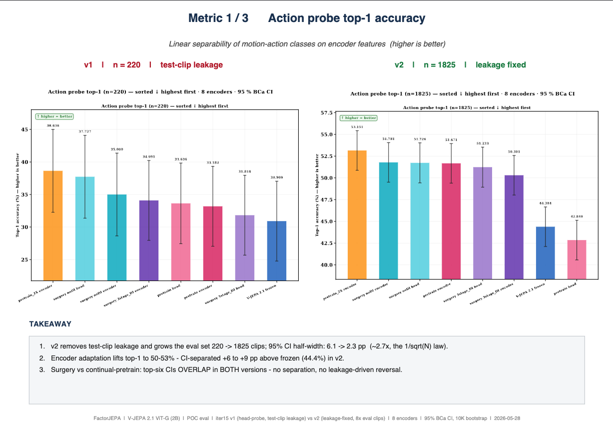
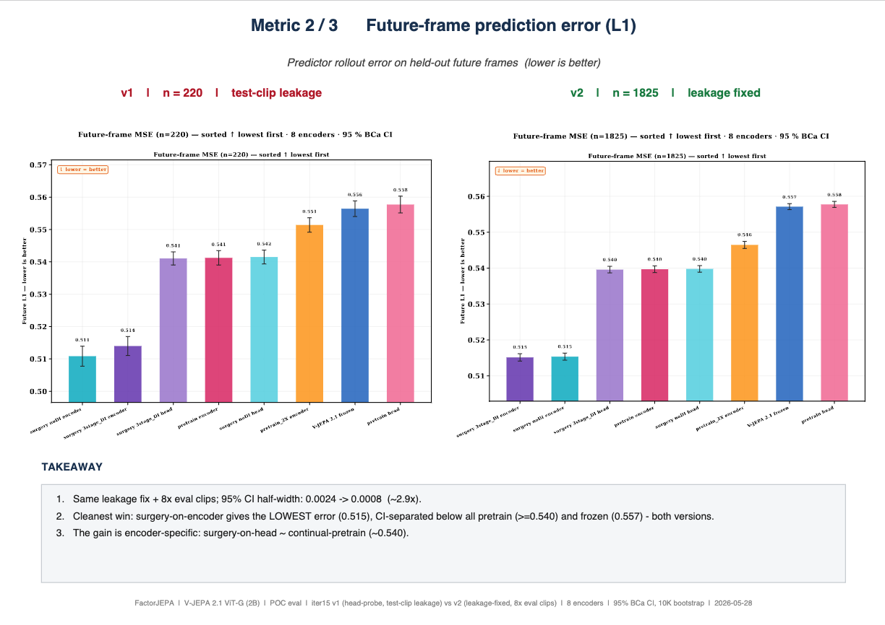
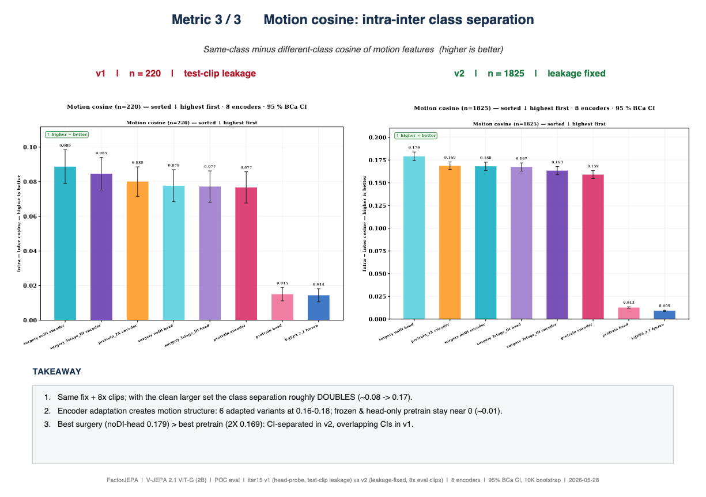
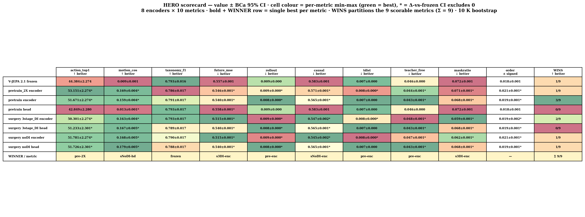
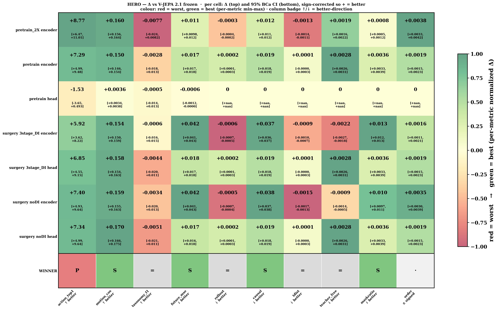
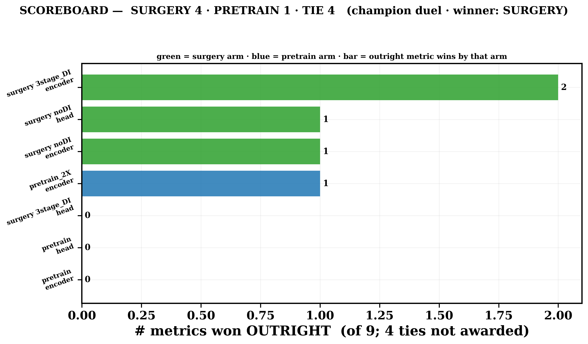
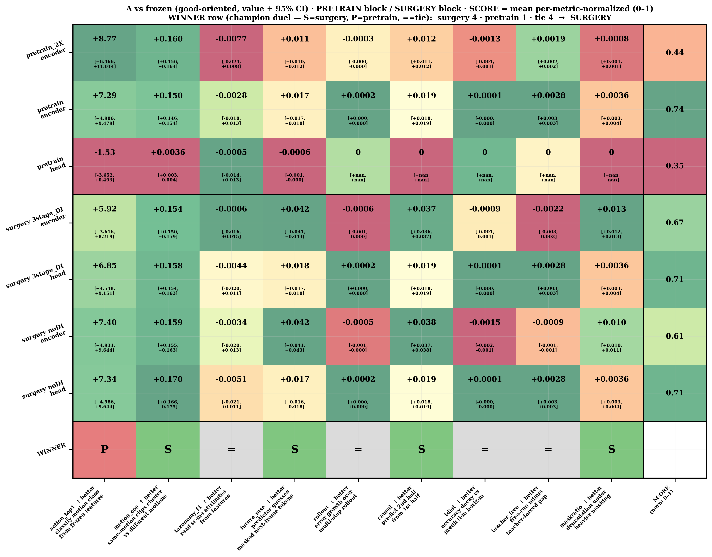
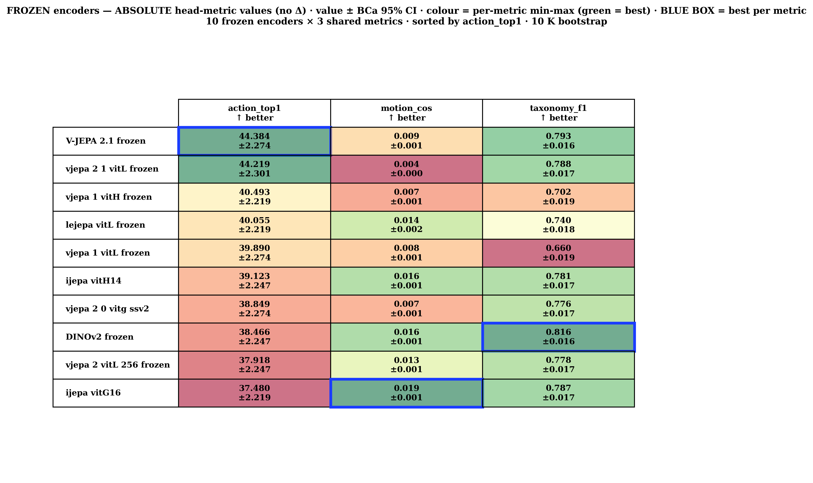
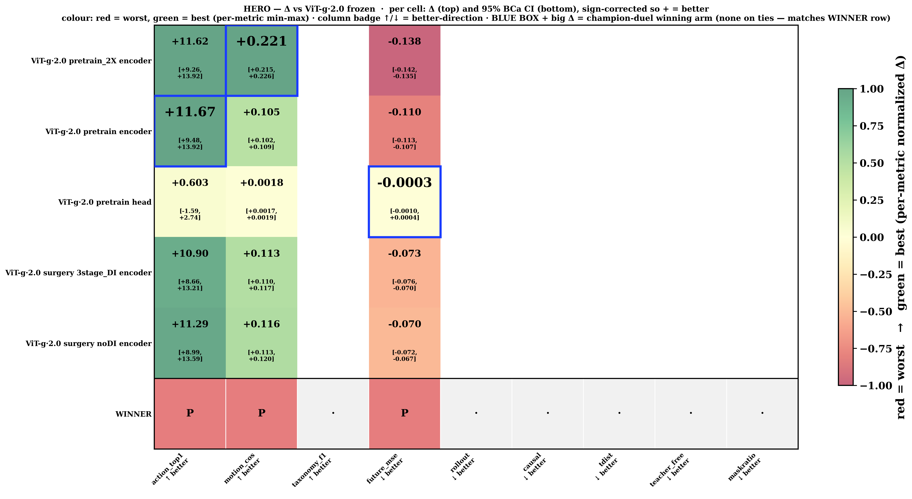
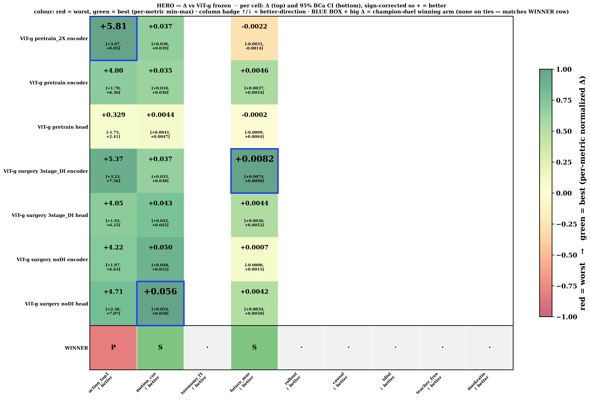

# 🎬 FactorJEPA — Surgery vs Pretrain vs Frozen

### The story so far: iter15 → iter16 → iter17 · POC eval · 2026-05-31

**The question:** does **surgery** (factor-targeted fine-tuning of the encoder) beat **continual-pretrain** and the raw **frozen** backbone on downstream video understanding — with non-overlapping 95% confidence intervals?

**The arc, one line each:**

- **iter15** — fixed a data-leakage bug + grew the eval set 8× → numbers we can trust; adaptation clearly beats frozen.
- **iter16** — added 11 new **temporal** metrics → on the flagship ViT-G, surgery wins the duel 4–1.
- **iter17** — scaled to **3 backbones** → surgery's win is **backbone-dependent** (strong on 2.1, absent on 2.0).

**Plain-English glossary**

- **Frozen** = the pretrained model used as-is, no extra training.
- **Continual-pretrain** = keep training the encoder the original (generic) way.
- **Surgery** = our targeted training that injects **motion / factor** structure into the encoder.
- **95% CI** = the error bar; two bars that *don't* overlap = a real difference, not noise.
- **pp** = percentage points. **Δ vs frozen** = improvement over the un-trained baseline.

---

## 📍 iter15 — 1/3 · Action probe top-1 accuracy



**What it measures (plain English):** from the clip's features alone, can a simple classifier read the motion-action class? **Higher = better.**

**Data-scientist read:**

- **The bug fix that matters:** v1 (left, n=220) had **test-clip leakage** — eval clips overlapped training. v2 (right, n=1825) removed it and used 8× more clips.
- **Error bars shrank ~2.7×** (CI half-width 6.1pp → 2.3pp) — exactly the 1/√N law. Differences are now readable.
- **Adaptation beats frozen by +6 to +9pp:** trained encoders hit 50–53% vs frozen 44.4%, CI-separated (real).
- **Honest caveat:** surgery vs continual-pretrain — the top-six bars' CIs **overlap**. No winner on raw accuracy, in either version. The leakage fix did **not** flip any conclusion.

---

## 📍 iter15 — 2/3 · Future-frame prediction error (L1)



**What it measures:** given the first frames, how well does the model's predictor guess the next frame? **Lower = better.**

**Data-scientist read:**

- Same leakage fix + 8× clips → **CI half-width 0.0024 → 0.0008 (~2.9× tighter).**
- **Cleanest win of the three:** **surgery-on-encoder** gives the **lowest** error (0.515), CI-separated *below* every pretrain arm (≥0.540) and frozen (0.557) — in BOTH versions.
- **The gain is encoder-specific:** surgery-on-**head** (~0.540) ≈ continual-pretrain. The benefit comes from changing the **encoder**, not just the read-out head.

---

## 📍 iter15 — 3/3 · Motion cosine (intra − inter class separation)



**What it measures:** do two clips of the *same* motion sit closer in feature space than two clips of *different* motions? **Higher = more motion structure.**

**Data-scientist read:**

- With the clean, larger set, separation **roughly doubles (~0.08 → 0.17).**
- **Adaptation literally creates motion structure:** 6 adapted variants land at 0.16–0.18; **frozen + head-only pretrain stay near zero (~0.01).**
- **Best surgery (noDI-head 0.179) > best pretrain (2X 0.169):** CI-separated in v2 (a real win), overlapping in the old noisy v1.

---

## 🆕 iter16 — 14 metrics on the champion ViT-G (2.1, 2B)

**What changed:** iter15 had 3 "head" metrics. iter16 added **11 temporal / dynamics metrics** (6 from the predictor, 4 from the encoder) to test whether adaptation improves **time understanding**, not just static separability.

**Headline — champion duel (best surgery arm vs best pretrain arm, per metric):**

```text
┌────────────────────────────────────────────────┐
│   SURGERY 4   ·   PRETRAIN 1   ·   TIE 4         │
│   → winner: SURGERY   (decisive metrics 4–1)     │
└────────────────────────────────────────────────┘
```

**The 14 metrics in plain English (5–10 words each):**

```text
action_top1    read the motion class from features?
motion_cos     same-motion clips cluster closer than different?
taxonomy_f1    name scene tags (crowd, light, camera)?
future_mse     predict the next frame's content?
rollout        multi-step: how fast does error snowball?
causal         from first half, predict the second half?
tdist          stay accurate looking further ahead?
teacher_free   how much worse using its own predictions?
maskratio      degrade gracefully as more is hidden?
order          does scrambling frame order hurt it?
aot            tell forwards from backwards playback?
tov            re-order a few shuffled frames?
pace           tell normal from 2x / 4x fast-forward?
tcc_tau        matching moments align across two clips?
```

---

## 📍 iter16 — 1/4 · Hero table (value ± CI)



**How to read:** rows = metrics, columns = encoders, green = best in that row, `*` = significantly beats frozen, WINNER column = champion-duel winner.

**Data-scientist read:**

- **action_top1:** pretrain_2X wins (53.2%) — raw classification slightly favors generic pretraining.
- **motion_cos:** the frozen column "wins" in absolute terms only because all values are tiny; this is the metric surgery dominates in **relative (Δ)** terms (next slide).
- **future + temporal block:** surgery arms (3stage_DI encoder) take the dynamics metrics — the model's **predictor** improves most under surgery.

---

## 📍 iter16 — 2/4 · Δ vs frozen heatmap



**How to read:** each cell = improvement over the frozen baseline (green = better); WINNER row = S / P / tie per metric.

**Data-scientist read:**

- WINNER row: **surgery 4 · pretrain 1 · tie 4** (of 9 head+predictor metrics shown).
- Surgery's wins concentrate in **motion + future / temporal** — exactly the dynamics it was designed to inject.
- The 4 ties are mostly predictor-internal metrics where both adaptations move together.

---

## 📍 iter16 — 3/4 · Scoreboard



**Data-scientist read:**

- Counts only **outright** metric wins (ties not awarded): surgery 4, pretrain 1.
- The single strongest arm is **surgery 3stage_DI encoder** (2 outright wins).
- Confirms the headline without cherry-picking a single metric.

---

## 📍 iter16 — 4/4 · Grouped winner (pretrain block vs surgery block)



**Data-scientist read:**

- Same data, grouped: top = pretrain arms, bottom = surgery arms; right **SCORE** column = mean normalized performance (0–1).
- Surgery block carries the higher SCORE on the temporal columns; pretrain edges only raw action_top1.
- Verdict banner: **SURGERY**.

---

## 🚀 iter17 v1a — Frozen baselines (the starting line)



**What it is:** 10 **un-trained** encoders (image + video foundation models) ranked on the 3 shared head metrics — the level field **before** any adaptation.

**Data-scientist read:**

- **action_top1:** V-JEPA 2.1 frozen is the strongest video backbone out-of-the-box (44.4%), just ahead of vitL (44.2%).
- **motion_cos ≈ 0 for everyone (0.004–0.019):** the punchline — **no frozen model has motion structure.** This is the gap surgery fills (it lifts motion_cos to 0.16–0.18).
- **taxonomy_f1:** DINOv2, an **image** model, wins static scene tags (0.816) — expected; image models are strong on appearance, weak on motion.
- **Takeaway:** pick V-JEPA 2.1 as the backbone for action + motion; the whole point of surgery is to add the **motion axis** frozen models lack.

---

## 🚀 iter17 v1b — Train + Eval across 3 backbones · the key finding

**Surgery's advantage is backbone-dependent.** Same recipe, three backbones, each compared vs its OWN frozen:

```text
┌─────────────────────┬──────────────┬──────────────────────────────────────┐
│ backbone            │ surgery wins │ read                                 │
├─────────────────────┼──────────────┼──────────────────────────────────────┤
│ ViT-g 2.0 (1B, old) │   0 / 3      │ pretrain wins all; future regresses  │
│ ViT-g 2.1           │   2 / 3      │ surgery wins motion + future         │
│ ViT-G 2.1 (2B, champ)│  4 / 5 *    │ surgery dominates  (* excl. 4 ties)  │
└─────────────────────┴──────────────┴──────────────────────────────────────┘
  trend: the newer / bigger the 2.1 backbone, the more surgery helps.
```

---

## 📍 iter17 v1b — ViT-g·2.0 (older 1B) · surgery 0/3



**Data-scientist read:**

- WINNER row = **P · P · P** → pretrain wins all 3 head metrics.
- **action_top1:** pretrain-enc **+11.67** vs surgery **+11.29** — close, but pretrain edges it.
- **motion_cos:** pretrain_2X **+0.221** ≫ surgery **+0.116** — pretrain wins big here.
- **future_mse:** **all arms negative** (−0.07 to −0.14) → on this old backbone, adaptation actually **hurts** future prediction.
- **Conclusion:** on the legacy 2.0 encoder, continual-pretrain is the safer choice; surgery's factor-injection doesn't transfer.

---

## 📍 iter17 v1b — ViT-g (2.1) · surgery 2/3



**Data-scientist read:**

- WINNER row = **P · S · S** → surgery wins **motion_cos + future_mse**; pretrain keeps raw action_top1.
- Mirrors the iter15 finding on the same backbone: surgery's strength is **motion + dynamics**, not raw classification.
- This is the backbone where the recipe "switches on."

---

## 📍 iter17 v1b — ViT-G (2.1 champion, 2B) · surgery 4/5 (excl. ties)


**Data-scientist read:**

- The flagship: across the **decisive** metrics, **surgery 4 · pretrain 1** (4 ties excluded).
- Surgery's lead is **widest on the biggest, newest backbone** — consistent with the v1b trend.
- **Paper headline forming:** surgery's benefit **scales with backbone capability** — strongest on ViT-G 2.1, present on ViT-g 2.1, absent on ViT-g 2.0.

---

## 🧭 Bottom line for the meeting

- **Method is now trustworthy** — iter15 leakage fix + 8× clips → tight CIs; no conclusion flipped.
- **Surgery injects motion + temporal structure** that frozen models completely lack (motion_cos 0.01 → 0.17).
- **The win is backbone-dependent and scales up:** ViT-g 2.0 → 0/3, ViT-g 2.1 → 2/3, ViT-G 2.1 → 4/5.
- **Next:** finish the iter17 3-backbone run so all 14 metrics populate per backbone (predictor / encoder columns are still filling).
