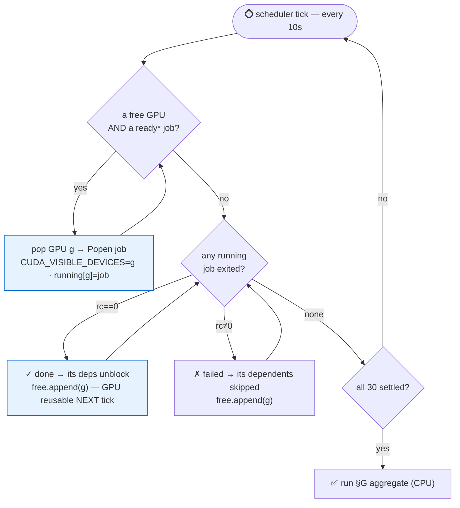
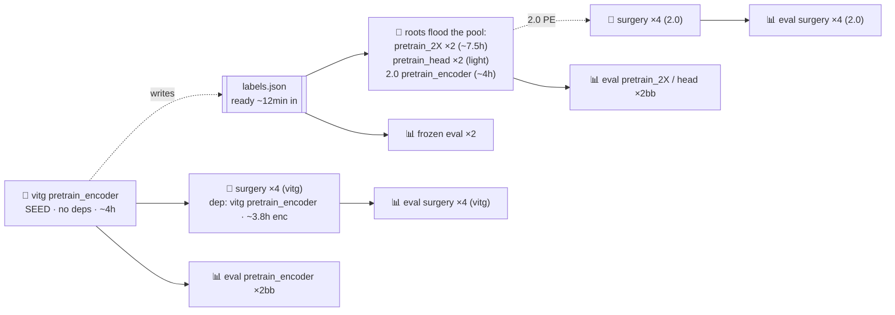

# iter17 — Runbook: cross-arch model ablation (V-JEPA 2.1 vitg + 2.0 vitg)

> **You run ONE script, twice: `--mode SANITY` then `--mode POC`.** It trains both backbones
> (14 arms), evals all 16 encoders, and builds the §G hero table — end to end. Everything under
> **Reference** is already DONE or a fallback you only touch if a job fails. Start at "▶ THE RUN".

---

## ▶ THE RUN — one script, SANITY then POC

```bash
# ── 0. ON THE CURRENT 1× NODE (BEFORE you tear it down) — push the results you already computed ──
# Carries the frozen-9 + vitG JSON metrics (+ student_encoder.pt) to HF so the new node's §G can reuse
# them. NOTE the upload policy DROPS m09_ckpt_best.pt (predictor) + *.npy → trained arms still re-run
# on the new node (free, parallel), but the eval-only frozen-9/vitG metrics transfer intact.
HF_UPLOAD_MODE=reuse python -u src/utils/hf_outputs.py upload outputs/poc 2>&1 | tee logs/upload_outputs_poc_$(date +%Y%m%d_%H%M%S).log
#   HF_UPLOAD_MODE=reuse is REQUIRED in a piped/tee'd run — without it the upload prompts on stdin and hangs.
#   reuse (mirror) is safe here: this node has all frozen-9 + the iter16 champion (vjepa_2_1_*) locally.
```

```bash
# ── ON THE NEW 4×/8× NODE ──
# 1. spin the node (8× RTX Pro 6000, ≥48 cores, ≥350G disk) · bash setup_env_uv.sh · git pull
# 2. fetch data + native ckpts + the outputs/poc you just uploaded (download outputs/poc is OPTIONAL —
#    only needed so the already-done frozen-9 + vitG metrics appear in the final §G hero table):
python -u src/utils/hf_outputs.py download-data data/eval_10k_local 2>&1 | tee logs/download_data_$(date +%Y%m%d_%H%M%S).log
python -u src/utils/hf_outputs.py download-data checkpoints       2>&1 | tee logs/download_ckpts_$(date +%Y%m%d_%H%M%S).log
python -u src/utils/hf_outputs.py download outputs/poc            2>&1 | tee logs/download_outputs_poc_$(date +%Y%m%d_%H%M%S).log   # optional, for §G completeness
#    → confirm checkpoints/{vjepa2_1_vitg_384.pt, vjepa2_0_vitg_384.pt} are present

# 3. SANITY — tiny-data smoke (~10 min). MUST end "all 30 jobs PASSED — running §3":
python -u scripts/iter17_poc_ngpu.py --mode SANITY --gpus 8 2>&1 | tee logs/ngpu_sanity_$(date +%Y%m%d_%H%M%S).log

# 3b. ONLY after you see "all 30 jobs PASSED" above — drop the throwaway SANITY output to reclaim disk
#     before POC. Disposable (tiny-data smoke, regenerable by re-running SANITY); POC writes a SEPARATE
#     outputs/poc/ and reads nothing from here. Literal path (no var) so it can't expand to outputs/.
rm -rf outputs/sanity/

# 4. POC — real 10k numbers (~10-11h on 8×). Auto-builds §G → outputs/poc/probe_plot/eval/:
python -u scripts/iter17_poc_ngpu.py --mode POC --gpus 8 2>&1 | tee logs/ngpu_POC_$(date +%Y%m%d_%H%M%S).log

# (validate on the 1× node first?  same step 3 with --gpus 1.   resume after a failure?  add --cache 1.
#  preview the schedule without launching?  add --dry-run.)
```

```bash
# ── VERIFY (that's it — these two checks) ──
grep -E "all 30 jobs PASSED|✗ " logs/ngpu_POC_*.log | tail     # want "all 30 jobs PASSED"; no ✗
ls outputs/poc/probe_plot/eval/m13_hero_table.{png,pdf}        # the §G hero table
# any ✗ → open logs/iter17_ngpu_poc_<train|eval>_<...>.log, fix, re-run step 4 with --cache 1.
```

```text
WALL 8×≈10-11h · 4×≈16-18h · 2×≈30h · 1×≈50h     (--gpus picks the node size; same script)
DISK ~240G at completion, peak ~270G → preflight ABORTS if free <250G → use a ≥350G-disk node
CPU  ≥ gpus×6 cores (≥48 for 8×) or TAR-decode contends (WARN, not fatal)
CKPT note: HF upload keeps ONLY *student_encoder.pt, NOT m09_ckpt_best.pt (predictor). So always run
the scheduler with --cache 2 (default) for complete predictor metrics — re-training is FREE on 8 GPUs
(vitg & 2.0 pretrain_2X run in parallel, no extra wall). --cache 1 is for resume-after-crash only.
```

---

## ⚙ How it stays fast — DESIGN (why the N GPUs barely idle)

It is a **greedy work-stealing dispatcher over an arm-level DAG** — NOT fixed waves. Every 10 s tick it
*launches* every ready job onto a free GPU **and** *reaps* finished ones, returning the GPU to the pool the
SAME tick. So a GPU freed by `reap` is re-filled by `launch` within one tick — there is no barrier where
fast GPUs wait for the slowest job in a "wave". `ready` = not done/failed/running · `deps ⊆ done` · labels
exist (if the job needs them).

```text
┌──────────────────────────────────────────────────────────────────────────────────────────┐
│ 🧩 mechanism                       │ idle it removes                                          │
├──────────────────────────────────────────────────────────────────────────────────────────┤
│ ① arm-level DAG (30 nodes) NOT     │ old 2gpu pinned 1 backbone/GPU → only 2-way ║ here every  │
│   backbone-level (2)               │ arm + eval is a node → ≥8 independent jobs to fill 8 GPUs │
│ ② greedy dispatch, NO wave barrier │ a freed GPU is refilled the SAME 10s tick if any job is   │
│   (loop L186-213)                  │ ready — never "wait for the wave's slowest job"           │
│ ③ reap → GPU back to pool instantly│ `del running[g]; free.append(g)` (L205) → reusable next tick │
│ ④ eval pipelined WITH train        │ E[arm] fires the INSTANT T[arm] ends (no all-train-then-  │
│   (no train/eval barrier)          │ all-eval barrier) → light evals backfill the draining tail │
└──────────────────────────────────────────────────────────────────────────────────────────┘
```



The DAG (per backbone, mirrored ×2 — both share the one GPU pool). 3 dependency levels → dry-run waves 8 → 14 → 8:



Critical path = SEED 4h → surgery_enc 3.8h → its eval ≈ **8.3h ≈ the wall**. The dispatcher packs GPUs as
tightly as the DAG allows; two idle sources remain that are **graph-bound, not scheduler bugs**:

```text
┌──────────────────────────────────────────────────────────────────────────────────────────┐
│ 🔴 idle source (DAG-bound)          │ scheduler mitigation                                     │
├──────────────────────────────────────────────────────────────────────────────────────────┤
│ ① cold-start: only the SEED runs    │ SEED emits labels at its FIRST val-checkpoint (~12min),  │
│   until labels exist                │ not at end-of-train → ramp bounded to ~12 min            │
│ ② all 8 surgery arms gate on the 2  │ the 2 LONGEST jobs (pretrain_2X, 7.5h) launch first &    │
│   pretrain_encoder (~4h) → hrs ~1-4 │ span the gap; eval pipelining backfills. On 8× ~4 GPUs   │
│   only ~4 GPUs have long work       │ idle hrs 1-4 (~66% occ 1st half), ~100% hrs 4-8          │
└──────────────────────────────────────────────────────────────────────────────────────────┘
→ net ~80-85% GPU occupancy on 8×. 4× packs TIGHTER (1st-half work is ~4-GPU-bound anyway): 8× buys
  wall-time (~10-11h vs ~16-18h), NOT efficiency. Pick 8× for the deadline, 4× for $/result.
```

Occupancy over time on an 8× node (illustrative · POC):

```text
┌────────────┬───────┬─────────────────────────────────────────────────┬─────────────────┐
│ phase      │ hrs   │ what runs across the 8 GPUs                      │ GPU occupancy   │
├────────────┼───────┼─────────────────────────────────────────────────┼─────────────────┤
│ cold-start │ 0–0.2 │ ONLY vitg pretrain_encoder (SEED) — writes labels│ 1/8  (~12 min)  │
│ roots ramp │ 0.2–2 │ 2×pretrain_encoder · 2×pretrain_2X ·             │ up to 8/8       │
│            │       │ 2×pretrain_head · 2 frozen evals                 │                 │
│ DAG bubble │ 2–4   │ pretrain_encoder + pretrain_2X still running;    │ ~4/8 — surgery  │
│            │       │ heads done, surgery BLOCKED until PE finishes    │ waits PE @ ~4h  │
│ surgery    │ 4–7.7 │ 8 surgery arms + pretrain_2X tail + evals flood  │ 8/8  (~100%)    │
│ eval tail  │7.7–8.3│ light per-encoder evals backfill the drain       │ draining        │
│ §G (CPU)   │ +0.25 │ paired-Δ + m13 plots — no GPU                     │ —               │
└────────────┴───────┴─────────────────────────────────────────────────┴─────────────────┘
```

The only idle is the cold-start (~12 min) and the DAG bubble (~hrs 2–4, where surgery is still blocked on
pretrain_encoder); after ~4h everything floods → ~100% to the tail. Real wall on 8× ≈ ~10-11h with margin.

---

## 📎 Reference — normally untouched (already DONE, or fallback only)

### A · Frozen-9 baselines — DONE → m13_frozen_scorecard.png

The 9 image-JEPA / non-JEPA / other-V-JEPA baselines are NOT in the scheduler (it only trains+evals the 2
trainable backbones). They are already evaluated; `download outputs/poc` (step 2) carries their metrics into §G.
Re-run ONLY if the eval registry changed:

```bash
FROZEN="dinov2 ijepa_vitH14 ijepa_vitG16 vjepa_2_0_vitg_ssv2 vjepa_1_vitL_frozen vjepa_1_vitH_frozen vjepa_2_vitL_256_frozen vjepa_2_1_vitL_frozen lejepa_vitL_frozen"
ENCODERS="$FROZEN" SKIP_STAGES="4,7,8,8b,8c,9,9b,9c,10,12,13" CACHE_POLICY_ALL=2 ./scripts/run_eval.sh --POC 2>&1 | tee logs/iter17_poc_frozen9_$(date +%Y%m%d_%H%M%S).log
```

### B · Manual §G rebuild — fallback only (the scheduler auto-runs this at the end of step 4)

Use only if you ran arms by hand, or want to re-plot without re-evaling. STEP 1 = rebuild by_encoder
aggregates over ALL encoders (the frozen-9 land here too); STEP 2 = combined m13 §G plots.

```bash
source venv_walkindia/bin/activate ; export PYTHONPATH=src ; \
python -u src/m12a_action_top1.py --POC --stage paired_delta --output-root outputs/poc/probe_action     --cache-policy 1 --no-wandb ; \
python -u src/m12b_motion_cos.py  --POC --stage paired_delta --output-root outputs/poc/probe_motion_cos --cache-policy 1 --no-wandb ; \
python -u src/m12c_taxonomy_f1.py --POC --stage paired_delta --features-root outputs/poc/probe_action --output-root outputs/poc/probe_taxonomy --cache-policy 1 --no-wandb ; \
python -u src/m13_eval_plot.py --POC \
--action-probe-root outputs/poc/probe_action --motion-cos-root outputs/poc/probe_motion_cos \
--future-mse-root outputs/poc/probe_future_mse --taxonomy-root outputs/poc/probe_taxonomy \
--predictor-temporal-root outputs/poc/predictor_temporal --encoder-temporal-root outputs/poc/encoder_temporal \
--output-dir outputs/poc/probe_plot --no-wandb 2>&1 | tee logs/iter17_poc_m13_plots_$(date +%Y%m%d_%H%M%S).log
```

### C · Roster + stage map (lookup)

```text
┌─────────────────────────────────────────────────────────────────────────────────────────┐
│ trainable (predictor → surgery)  vjepa_2_1_vitG (done iter16) · vjepa_2_1_vitg · vjepa_2_0_vitg │
│ frozen baselines (encoder mx · §G predictor cols N/A):                                  │
│   dinov2 · ijepa_vitH14 · ijepa_vitG16 · lejepa_vitL   (image JEPA / non-JEPA)          │
│   vjepa_2_0_vitg_ssv2 · vjepa_1_vitL · vjepa_1_vitH · vjepa_2_vitL_256 · vjepa_2_1_vitL │
│ NOT trainable  vjepa_2_1_vitL = distilled, no predictor    blocked  mc_jepa · d_jepa     │
└─────────────────────────────────────────────────────────────────────────────────────────┘
stage map: 1=labels 2=feat 3=action-probe 4=action-Δ 5/6=motion_cos 7=motion-Δ 8/8b/8c=predictor-fwd
9/9b/9c=predictor-Δ 10=action-plot 11=taxonomy-probe 12=taxonomy-Δ 13=taxonomy-plot
```
