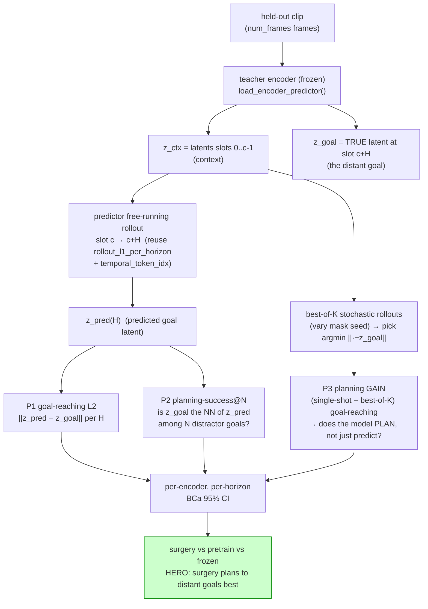
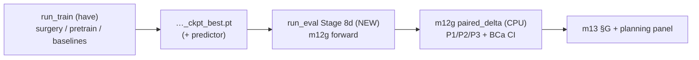

# iter18 · Plan B — Reward-free LATENT PLANNING eval (`m12g`) — AAAI novelty bump

> **Story lift:** turns the paper from *"surgery learns a better representation"* →
> *"surgery learns a better **world model for planning**."* Reward-free, env-free, action-free —
> runs on the SAME held-out passive video, reusing the existing predictor + rollout primitives.
> **Anchored to:** V-JEPA 2 planning (2506.09985), reward-free latent planning
> (latent-planning.github.io), TD-JEPA zero-shot RL (2510.00739).
> **Risk posture:** LOW — it is a *natural extension of `rollout_l1_per_horizon`*, NOT a new RL stack.

---

## 0 · Why this is "planning" and not just "rollout" (the reviewer question)

```text
rollout (have, m12e #1):  free-running 1-step-ahead latent prediction error per horizon.   = PREDICTION
planning (new, m12g):     given context + a DISTANT GOAL latent, the world model must (a) REACH the
                          goal latent over H steps and (b) be SELECTED-as-correct among distractors,
                          and (c) IMPROVE under best-of-K stochastic shooting.                = PLANNING
no actions in passive video → "control" = best-of-K stochastic latent rollouts (shooting/MPC-free);
the "plan" is the rollout that lands closest to the goal latent. This is the env-free analogue of
latent MPC used by V-JEPA 2 / reward-free latent planning.
```

---

## 1 · Pipeline



---

## 2 · New module `src/m12g_latent_planning.py` (reuses `predictor_eval`)

```text
reuse (NO duplication):  load_encoder_predictor, token_grid, temporal_token_idx,
                         rollout_l1_per_horizon (extend → return latents not just L1),
                         to_pixel, bootstrap_ci, CROP/NUM_FRAMES_DEFAULT.
stages (mirror m12e):    forward (GPU, per encoder) → paired_delta (CPU) → plot.
CLI:                     --variant <encoder> --encoder-ckpt <…> --model-config <backbone yaml>
                         --action-probe-root … --output-root outputs/<mode>/probe_planning
                         --horizons 2,4,8 --n-distractors 64 --k-shoot 8 --cache-policy {1,2}
```

```python
# ── core: goal-conditioned latent rollout (forward stage) ───────────────────────────
@torch.no_grad()
def plan_to_goal(encoder, predictor, pixel, num_frames, horizons, k_shoot):
    Tp, _, _, S = token_grid(num_frames)                       # temporal slots, spatial-per-slot
    z_all = encoder(pixel)                                     # (B, Tp*S, D) teacher latents
    out = {}
    for H in horizons:
        c = Tp - H                                             # context = first c slots, goal = slot c+H-1
        if c < 1: continue
        goal_idx = temporal_token_idx(num_frames, [Tp - 1])    # last-slot tokens = goal
        z_goal = gather(z_all, goal_idx)                       # (B, S, D)
        # single-shot free-running rollout c→Tp (reuse rollout machinery, return latent)
        z_pred = rollout_latents(encoder, predictor, pixel, c_slots=c, free_running=True)  # (B,S,D)
        p1 = (z_pred - z_goal).pow(2).mean(dim=(1,2)).sqrt()   # P1 goal-reaching L2 (B,)
        # best-of-K shooting: K stochastic rollouts (vary predictor mask seed), pick closest
        zs = torch.stack([rollout_latents(encoder, predictor, pixel, c, free_running=True,
                                          mask_seed=k) for k in range(k_shoot)])           # (K,B,S,D)
        p3 = (zs - z_goal).pow(2).mean(dim=(2,3)).sqrt().min(0).values                     # best-of-K (B,)
        out[H] = dict(p1=p1.cpu(), p3=p3.cpu(), z_pred=z_pred.cpu(), z_goal=z_goal.cpu())
    return out
# P2 (retrieval) computed in paired_delta over the corpus: for each clip, is its own z_goal the
# nearest neighbour of z_pred among N random distractor z_goal from other clips → success@1/@5.
```

```text
metrics emitted (per encoder, per horizon H ∈ {2,4,8}):
  P1  goal_reach_l2      ↓  open-loop endpoint distance to the true distant goal latent
  P2  plan_success@1/@5  ↑  retrieval: rolled latent identifies the correct goal vs N=64 distractors
  P3  plan_gain          ↑  (single-shot − best-of-K) L2  → evidence the model PLANS, not just predicts
all with BCa 95% CI (utils/bootstrap). Reuses the m12e paired_delta + m13 plot scaffolding.
```

---

## 3 · Wiring into the existing harness (minimal)

```text
run_eval.sh:   add Stage 8d (mirror 8b/8c gating: ENC_KIND==vjepa only — needs a predictor).
               python -u src/m12g_latent_planning.py --POC --stage forward --variant $ENC \
                 --encoder-ckpt $PCKPT --model-config $ENC_MCFG --horizons 2,4,8 …
probe roots:   outputs/<mode>/probe_planning/<encoder>/  (per-encoder, distinct → 2-GPU safe).
m13:           add a "planning" panel to the §G hero (3 metrics × horizons) — same _family_verdict.
SKIP guard:    frozen/ijepa/dinov2 = N/A (no trained predictor), exactly like Stage 8/8b.
```



---

## 4 · The figure that sells it

```text
x-axis: horizon H (2 → 4 → 8 slots ahead)     y-axis: goal-reaching L2 (↓) / plan-success (↑)
lines:  surgery (factor) · pretrain (raw) · frozen
claim:  surgery's curves degrade SLOWEST with horizon → its world model reaches DISTANT goals;
        the gap WIDENS with H (short-horizon prediction ties; long-horizon planning separates).
        + P3 plan_gain > 0 only for surgery → it genuinely plans (best-of-K helps), baselines don't.
```

---

## 5 · 2-week fit + decision gate

```text
┌──────┬────────────────────────────────────────────────────────────────────────────┐
│ day  │ task (runs AFTER Plan-A baselines exist — same ckpts)                          │
├──────┼────────────────────────────────────────────────────────────────────────────┤
│ 1    │ m12g.py forward stage (rollout_latents extension of rollout_l1_per_horizon)    │
│ 2    │ paired_delta (P2 retrieval + BCa) + 3-check + SANITY (20 clips, 1 encoder)     │
│ 3    │ run_eval Stage 8d wiring + m13 planning panel ; SANITY all-encoders            │
│ 4-6  │ POC forward on existing surgery/pretrain/frozen vitg ckpts (reuses ckpts!)     │
│ 7    │ figure + write-up paragraph                                                    │
└──────┴────────────────────────────────────────────────────────────────────────────┘
GATE (be honest): only ship Plan B if (a) Plan-A core is CI-clean with days to spare, AND
(b) the SANITY shows surgery's plan-gain (P3) is directionally > baselines. If P3 ≈ 0 for all
(model can't plan beyond predict), DROP the "planning" claim and keep P1/P2 as a "long-horizon
prediction" appendix metric — still useful, lower-risk framing. Never force a half-baked RL section.
```

## 6 · Why low-risk (Sr-engineer honesty)

```text
+ no env, no reward, no action labels, no new benchmark, no domain transfer → can't "go negative"
  the way a TD-JEPA/ExoRL probe (Option B) could on walking-video→robot.
+ reuses predictor_eval rollout primitives + m12e paired_delta + m13 scaffolding → ~1 new file.
+ runs on EXISTING ckpts → zero extra training.
− the only failure mode is "P3 plan_gain ≈ 0" (model predicts but doesn't plan) → then demote to a
  long-horizon-prediction metric (still publishable), not a separate planning claim.
DEFERRED stretch (post-AAAI): TD-JEPA zero-shot RL probe on OGBench (Option B) — high novelty,
  needs a real offline-RL pipeline; out of the 2-week scope.
```

Sources: V-JEPA 2 (2506.09985) · TD-JEPA zero-shot RL (2510.00739) · reward-free latent planning
(latent-planning.github.io) · Value-guided JEPA planning (2601.00844).
