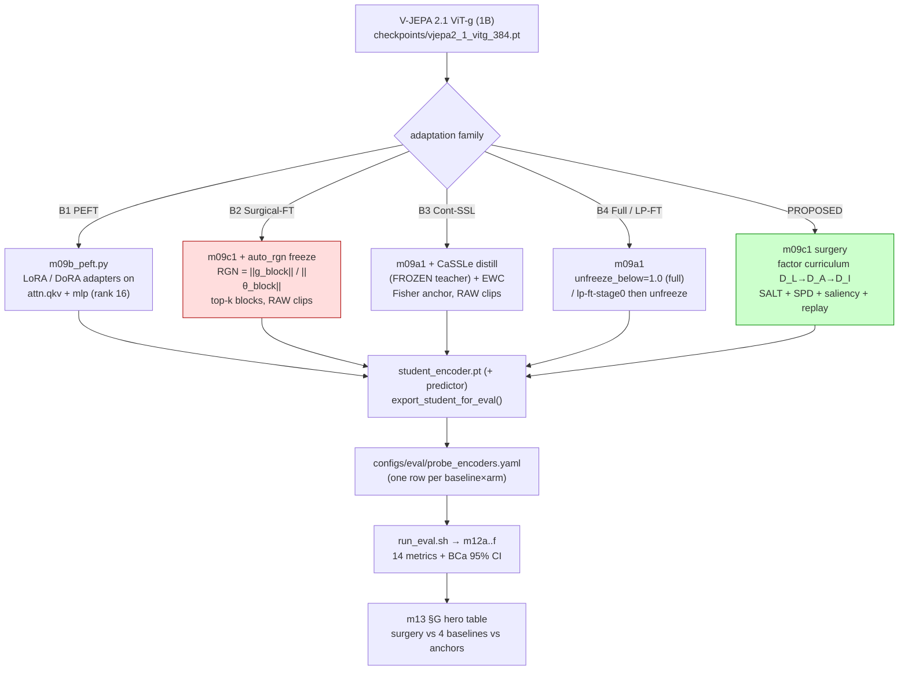
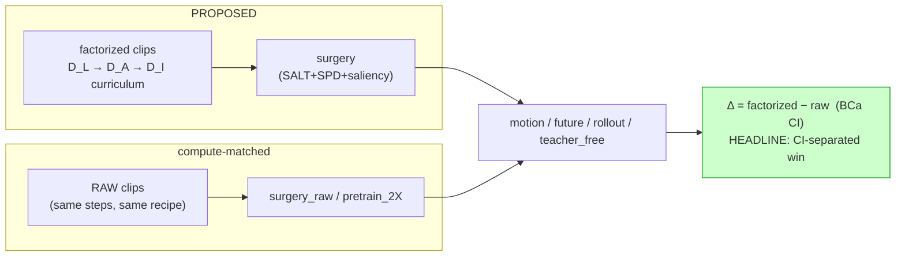

# iter18 · Plan A — 4 FT-technique baselines + RAW-vs-FACTORIZED control (AAAI core)

> **Claim under test (paper goal):** a *structured factor curriculum* continual-FT
> (`surgery`, D_L→D_A→D_I) beats every standard adaptation family AND a compute-matched
> RAW-clip control, on motion/temporal world-model metrics, with non-overlapping BCa CIs.
> **Why this file:** reviewers reject a "new fine-tuning method" that doesn't beat the
> obvious competitors (PEFT / Surgical-FT / continual-SSL / full-FT). Each baseline here is a
> *small delta* on the existing `m09` trainer — no new training loop.

---

## 0 · What we already have vs what to add

```text
HAVE (anchors, do NOT rebuild):
  frozen                         floor                         → probe_encoders row, no train
  m09a1 pretrain_encoder         continual SSL on RAW (1× cmp) → configs/train/pretrain_encoder.yaml
  m09a1 pretrain_2X_encoder      continual SSL on RAW (2× cmp) → compute-matched RAW control
  m09c1 surgery_3stage_DI        PROPOSED: factor curriculum   → configs/train/surgery_3stage_DI_encoder.yaml
  training.py hooks              teacher_mode{EMA,FROZEN}=SALT, SPD anchor, saliency, replay,
                                 lp-ft-stage0, export_student_for_eval(explora_enabled=…)
  src/legacy/m09b_explora.py     LoRA rank-16 (un-retired → baseline #1)

ADD (4 baselines = 4 train configs + 3 tiny code deltas):
  B1 PEFT      LoRA → DoRA          revive m09b + DoRA decomposition
  B2 Surgical  Auto-RGN block sel   1 freeze-rule fn in m09c1
  B3 ContSSL   CaSSLe (+EWC)        1 distill loss term + 1 Fisher reg (reuse FROZEN teacher + SPD slot)
  B4 FullFT / LP-FT                 config-only (unfreeze_below=1.0 ; lp-ft-stage0=on, no factors)
```

---

## 0.5 · ROI ranking — which baselines to build first

```text
ROI ladder  ( high reviewer-pull  x  easy for surgery to win  /  low build cost )
┌──────────────────────────────┬───────────────┬───────────────────────────────┬─────────┬─────┐
│ Technique                    │ Reviewer pull │ Can surgery beat it?          │ Build   │ ROI │
├──────────────────────────────┼───────────────┼───────────────────────────────┼─────────┼─────┤
│ B4 Full-FT (forget ceiling)  │ mandatory     │ YES - it forgets temporal     │ config  │ A+  │
│ B4 LP-FT (Kumar'22)          │ strong        │ YES - surgery minus factors   │ config  │ A+  │
│ B1 PEFT  LoRA -> DoRA        │ mandatory     │ YES on temporal; lose action  │ low     │ A   │
│ B3 CaSSLe + EWC              │ strong        │ likely; close on retention    │ low     │ A-  │
│ B2 Auto-RGN Surgical-FT      │ MANDATORY     │ HARD - the closest rival      │ ~15 ln  │ B   │
│ SSIAT (1 shared adapter)     │ venue/CITA    │ YES - lowest PET capacity     │ medium  │ B-  │
│ SAFE / SAPT / SEEKR (PET)    │ venue/CITA    │ YES on temporal (PET ceiling) │ HIGH    │ C   │
└──────────────────────────────┴───────────────┴───────────────────────────────┴─────────┴─────┘
```

> A+/A = build first (cheap, mandatory, surgery wins by mechanism) · B = mandatory but HARDEST
> (B2 Auto-RGN is the published namesake — budget-match trainable params exactly) · B-/C = defer
> to the PET iter (CITA #4).

---

## 1 · Architecture: where each baseline plugs in



---

## 2 · Per-baseline implementation (config + exact code delta)

### B1 · LoRA → DoRA (PEFT family) — *un-retire m09b_explora*

```text
files:   src/legacy/m09b_explora.py → src/m09b_peft.py   (mv out of legacy)
         configs/train/peft_lora.yaml , peft_dora.yaml   (clone configs/legacy2/explora.yaml)
delta:   LoRA already injects A·B into attn.qkv + mlp.fc1/fc2 (rank=16).
         DoRA = decompose pretrained W = m · (V/||V||); train magnitude m + direction ΔV via LoRA.
         → use peft>=0.12 LoraConfig(use_dora=True)  OR  custom 8-line wrapper (W_dora below).
export:  training.export_student_for_eval(student, …, explora_enabled=True)  ← MERGES adapters
         into the base weights so the eval loads a plain ViT-g (no PEFT dep at eval time).
arms:    run_train.sh add `peft_lora`, `peft_dora` cases → m09b_peft dispatch.
registry: vjepa_2_1_vitg_peft_lora , vjepa_2_1_vitg_peft_dora  {kind: vjepa, arch: vit_giant_xformers_2_1}
```

```python
# DoRA forward (custom, if not using peft use_dora) — magnitude-decomposed LoRA
# W_dir = W0 + (B @ A) * scaling ;  W = m * W_dir / W_dir.norm(dim=0, keepdim=True)
# trainable: m (per-output-dim), A, B.  ~0.3% params (matches ARD-LoRA regime).
```

### B2 · Surgical Fine-Tuning — Auto-RGN block selection (Lee et al. ICLR'23) ⚠️ NAMESAKE

```text
files:   src/m09c1_surgery_encoder.py  (add freeze-rule branch) ; configs/train/surgical_autorgn.yaml
delta:   surgery currently freezes via unfreeze_below (depth fraction). Add freeze_rule ∈
         {depth_fraction (current), auto_rgn}. auto_rgn:
           1. one fwd+bwd on a warmup batch (no optim step)
           2. per block b: RGN_b = ||grad(θ_b)||_2 / ||θ_b||_2     (Relative Gradient Norm)
           3. unfreeze top-k blocks by RGN; k = round(depth * surgery_trainable_frac)  ← budget-matched
           4. NO factor curriculum, NO SALT/SPD/saliency/replay, RAW clips, EMA teacher
key:     this is the method-vs-method differentiation. surgery picks blocks by a STRUCTURED
         factor schedule (layout=shallow, agent=mid, interaction=deep); Auto-RGN picks by a
         gradient heuristic. Headline: surgery > Auto-RGN, CI-separated, same trainable budget.
```

```python
def select_blocks_auto_rgn(model, batch, k):                      # ~15 lines in m09c1
    model.zero_grad(set_to_none=True)
    loss = jepa_forward_loss(model, batch); loss.backward()        # one pass, no step
    rgn = {b: blk_grad_norm(blk) / (blk_param_norm(blk) + 1e-8)
           for b, blk in enumerate(model.blocks)}
    keep = sorted(rgn, key=rgn.get, reverse=True)[:k]              # Lee'23 Auto-RGN
    for b, blk in enumerate(model.blocks):
        for p in blk.parameters(): p.requires_grad = (b in keep)
    model.zero_grad(set_to_none=True)
    return sorted(keep)
```

### B3 · CaSSLe (Fini CVPR'22) + EWC — continual-SSL anti-forgetting family

```text
files:   src/utils/training.py (add cassle_distill term + ewc_penalty) ; configs/train/cassle.yaml, ewc.yaml
CaSSLe:  you ALREADY hold a FROZEN teacher (teacher_mode=FROZEN / SALT). CaSSLe adds a distillation
         loss: g(student_feat) should predict the FROZEN-old-model feat under the SSL loss.
           L_cassle = jepa_loss( predictor_g(z_student), stop_grad(teacher_frozen_feat) )
         → reuse compute_jepa_loss; add a small projector g (2-layer MLP) + weight λ_cassle.
EWC:     reuse the SPD anchor SLOT but Fisher-weight it:
           F_i = E[ (∂L/∂θ_i)^2 ]  (one-epoch diagonal estimate)
           L_ewc = λ_ewc · Σ_i F_i (θ_i − θ*_i)^2          (θ* = pretrained init)
         SPD already anchors n_anchored=492 params to init; EWC = SPD with per-param Fisher weights.
clips:   RAW (continual SSL on the new domain; no factors).
arms:    cassle, ewc.   registry rows vjepa_2_1_vitg_{cassle,ewc}.
```

### B4 · Full continual FT (forgetting ceiling) + LP-FT (Kumar ICLR'22)

```text
files:   configs/train/full_ft.yaml , lpft.yaml   (CONFIG-ONLY, zero code)
full_ft: m09a1 with unfreeze_below=1.0 (all 40 blocks trainable), RAW clips → naive upper bound,
         expected to FORGET (worse temporal than frozen) — the cautionary baseline.
lp_ft:   m09c1 with lp-ft-stage0=on (linear-probe warmup) THEN unfreeze, NO factor curriculum, RAW.
         Kumar'22: LP-FT > FT-from-scratch because FT distorts pretrained features. You already
         run lp-ft-stage0 inside surgery → LP-FT is surgery minus the factor curriculum.
```

---

## 3 · Q1.1 · RAW vs FACTORIZED — the decisive control (built into your streaming flag)

```text
single knob:  ch11_surgery.yaml > factor_streaming  (D_L/D_A/D_I on)  vs  raw clips.
PROPOSED:     surgery + factor_streaming=ON   (curriculum over disentangled factors)
CONTROL:      surgery + factor_streaming=OFF  (SAME recipe/steps/compute, RAW clips)
              ≡ your existing pretrain_2X (compute-matched RAW continual SSL)
FIGURE 1:     Δ = (factorized − raw) on motion_cos / future_mse / rollout / teacher_free,
              BCa CI, → proves the factor curriculum is the CAUSAL driver, not extra compute.
framing:      call D_L/D_A/D_I a "structured curriculum over disentangled factors of variation
              (layout→agent→interaction)", NOT augmentation → compositional/causal generalization.
```



---

## 4 · The comparison grid (what the hero table must show)

```text
┌──────────────────────────┬───────────┬────────────────────────────────────────────┐
│ row (vjepa_2_1_vitg_…)   │ clips     │ role                                         │
├──────────────────────────┼───────────┼────────────────────────────────────────────┤
│ frozen                   │ —         │ floor (anchor, have)                         │
│ full_ft                  │ raw       │ forgetting ceiling (B4)                      │
│ pretrain_2X              │ raw       │ compute-matched continual SSL (anchor, have) │
│ lpft                     │ raw       │ LP-FT (B4)                                   │
│ peft_lora / peft_dora    │ raw       │ PEFT family (B1)                             │
│ surgical_autorgn         │ raw       │ Surgical-FT namesake (B2) ⚠️                  │
│ cassle / ewc             │ raw       │ continual-SSL anti-forgetting (B3)           │
│ surgery_3stage_DI ★      │ FACTOR    │ PROPOSED — must top all above, CI-separated  │
│ surgery_raw (=ablation)  │ raw       │ Q1.1 control (factor OFF)                    │
└──────────────────────────┴───────────┴────────────────────────────────────────────┘
metrics: 14 (action, motion_cos, taxonomy, future_mse, +6 predictor-temporal, +4 encoder-temporal).
scale:   POC 10k, leakage-safe split, 1B vitg backbone, BCa 95% CI. (validated, 2-wk-feasible)
```

---

## 5 · 2-week execution (single 1× GPU, ~$1.3/hr)

```text
┌──────┬────────────────────────────────────────────────────────────────────────────┐
│ day  │ task                                                                          │
├──────┼────────────────────────────────────────────────────────────────────────────┤
│ 1-2  │ B1 DoRA wrapper + revive m09b ; B2 auto_rgn freeze fn ; 3-check + SANITY each │
│ 3    │ B3 CaSSLe loss term + EWC Fisher reg (reuse FROZEN teacher + SPD slot); SANITY│
│ 4    │ B4 + raw/factor configs (config-only); registry rows; run_eval SANITY all     │
│ 5-10 │ POC train (vitg): full_ft, lpft, peft_lora, peft_dora, surgical_autorgn,      │
│      │   cassle, ewc, surgery_raw  (~2-6h each on 1B) + per-arm eval                  │
│ 11-12│ §G aggregate (m13) ; Figure-1 factorized-vs-raw Δ ; CI-separation check        │
│ 13-14│ write-up: baseline table, ablation, statistical rigor paragraph                │
└──────┴────────────────────────────────────────────────────────────────────────────┘
all baselines reuse run_train.sh BACKBONE=vjepa_2_1_vitg <arm> --POC + run_eval. No new loop.
```

## 6 · Risks / reviewer-proofing

```text
• B2 (Auto-RGN) is the one that MUST be beaten — if surgery only ties it, reposition the
  contribution as "factor curriculum > gradient-heuristic block selection" + the planning
  capability (Plan B). Budget-match k EXACTLY (same trainable param count) or the comparison
  is attackable.
• PEFT may LOOK competitive on action_top1 (capacity) but should lose on temporal/world-model
  metrics — that asymmetry IS the story (PEFT adapts features, surgery adapts dynamics).
• Report factorization preprocessing cost (SAM masks) as amortized/streaming, else "expensive
  augmentation" critique. Cite the streaming ~40GB@10k number.
• Keep POC↔FULL parity: every baseline byte-identical scaled-down except subset size + epochs.
```

Sources: Surgical-FT (Lee et al. ICLR'23 arXiv 2210.11466) · DoRA (2402.09353) / ARD-LoRA (2506.18267) ·
CaSSLe (Fini et al. CVPR'22, 2112.04215) · EWC (Kirkpatrick'17) · LP-FT (Kumar et al. ICLR'22, 2202.10054).
