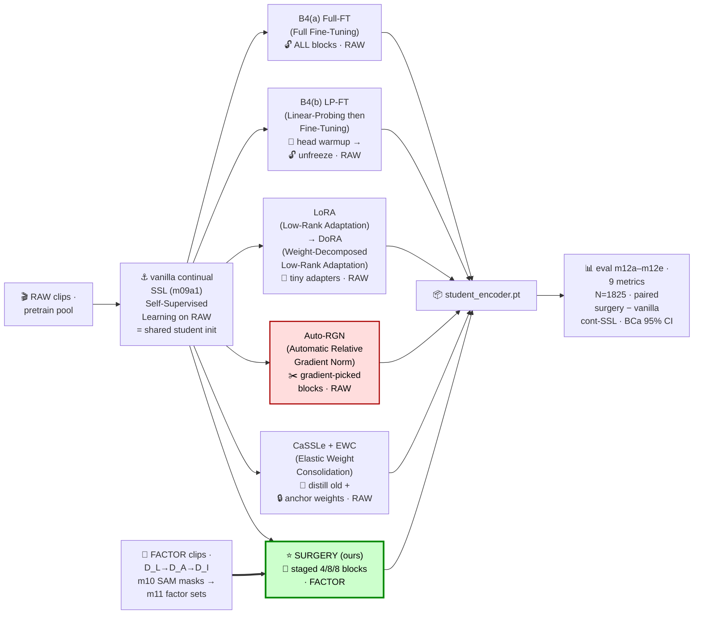
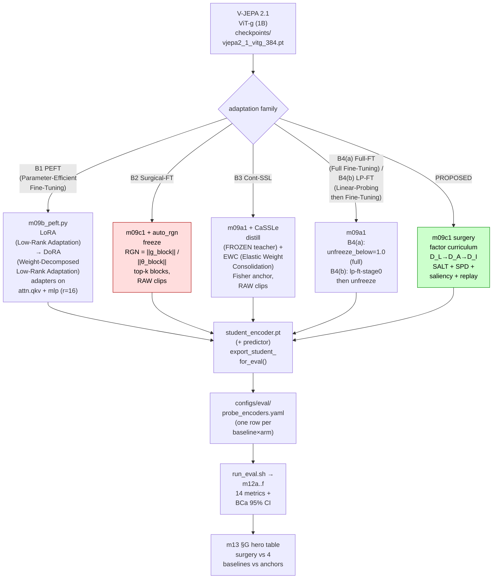
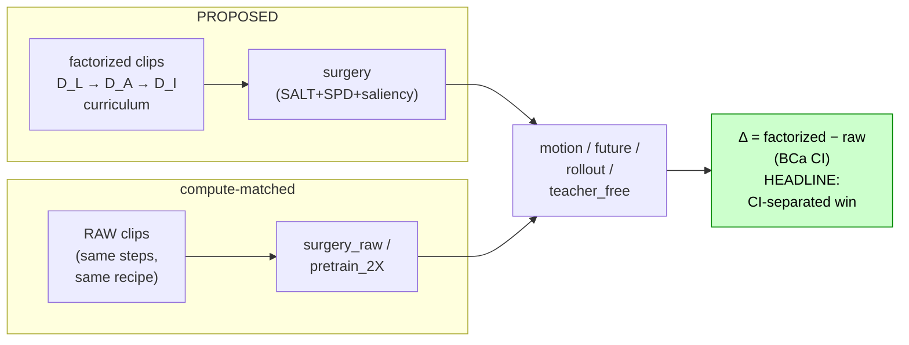

# iter18 · Plan A — 4 FT-technique baselines + RAW-vs-FACTORIZED control (AAAI core)

> **Claim under test (paper goal):** a *structured factor curriculum* continual-FT
> (`surgery`, D_L→D_A→D_I) beats every standard adaptation family AND a compute-matched
> RAW-clip control, on motion/temporal world-model metrics, with non-overlapping BCa CIs.
> **Why this file:** reviewers reject a "new fine-tuning method" that doesn't beat the
> obvious competitors (PEFT (Parameter-Efficient Fine-Tuning) / Surgical-FT / continual-SSL /
> Full-FT (Full Fine-Tuning)). Each baseline here is a
> *small delta* on the existing `m09` trainer — no new training loop.

---

## 📖 Glossary — abbrev → FULL FORM (repeated EVERYWHERE on purpose; re-read = remember)

```text
┌ abbrev ──┬ FULL FORM   (+ source) ─────────────────────────────────────────────────────┐
│ Auto-RGN │ Automatic Relative Gradient Norm      (Surgical-FT, Lee et al. ICLR'23)     │
│ RGN      │ Relative Gradient Norm = ||grad(theta_blk)|| / ||theta_blk||                │
│ EWC      │ Elastic Weight Consolidation          (Kirkpatrick et al. PNAS'17)          │
│ LoRA     │ Low-Rank Adaptation                   (Hu et al. 2021)                      │
│ DoRA     │ Weight-Decomposed Low-Rank Adaptation (Liu et al. 2024)                     │
│ PEFT     │ Parameter-Efficient Fine-Tuning                                             │
│ LP-FT    │ Linear-Probing then Fine-Tuning       (Kumar et al. ICLR'22)                │
│ Full-FT  │ Full Fine-Tuning                                                            │
│ CaSSLe   │ continual self-supervised distillation (stylized name; Fini et al. CVPR'22) │
│ SSL      │ Self-Supervised Learning                                                    │
│ SPD      │ Selective Projection Decay            (Tian et al. NeurIPS'24)              │
│ SALT     │ Self-Anchored Latent Teacher          (Apple 2025)                          │
│ m09a1    │ vanilla continual SSL  (vanilla continual-FT anchor; OURS)                  │
│ surgery  │ staged factor-curriculum continual-FT    (OURS)                             │
└──────────┴─────────────────────────────────────────────────────────────────────────────┘
```
> CONVENTION for this iter — write every abbrev as `abbrev (FULL FORM)` at EVERY mention, in *.md /
> *.sh / *.py / *.yaml / logs / configs — NEVER the bare abbrev alone. CaSSLe is a STYLIZED method name
> (not a strict initialism); every other row is a real acronym. Auto-RGN = Automatic Relative Gradient
> Norm. EWC = Elastic Weight Consolidation. (Repeated on purpose — that is the point.)

---

## 0 · What we already have vs what to add

```text
HAVE (anchors, do NOT rebuild):
  frozen                      floor                                → probe_encoders row, no train
  m09a1 pretrain_encoder      vanilla continual SSL · RAW (1× cmp) → configs/train/pretrain_encoder.yaml
  m09a1 pretrain_2X_encoder   vanilla continual SSL · RAW (2× cmp) → compute-matched RAW control
  m09c1 surgery_3stage_DI     PROPOSED: factor curriculum          → configs/train/surgery_3stage_DI_encoder.yaml
  training.py hooks           teacher_mode{EMA,FROZEN}=SALT, SPD anchor, saliency, replay,
                              lp-ft-stage0, export_student_for_eval(explora_enabled=…)
  src/legacy/m09b_explora.py  LoRA (Low-Rank Adaptation) rank-16 (un-retired → baseline #1)

ADD (4 baseline families = 4 train configs + 3 tiny code deltas · every abbrev is spelled out in
     the 📖 Glossary, § 0.5 BUILD ORDER, and the § 0.6 pipeline — read the full forms there):
  B1  PEFT (Parameter-Efficient Fine-Tuning):  LoRA (Low-Rank Adaptation) → DoRA (Weight-Decomposed
      Low-Rank Adaptation)              code → revive m09b_peft + DoRA decomposition
  B2  Surgical-FT:  Auto-RGN (Automatic Relative Gradient Norm) block selection  [KILL-SHOT, build FIRST]
      code → 1 freeze-rule fn in m09c1 (~15 lines)
  B3  Continual-SSL:  CaSSLe + EWC (Elastic Weight Consolidation)
      code → 1 distill loss + 1 Fisher reg (reuse FROZEN teacher + SPD slot)
  B4  config-only PAIR (zero new code) — TWO distinct methods, ONE family:
      B4(a) Full-FT (Full Fine-Tuning)               code → unfreeze_below=1.0 (the forgetting ceiling)
      B4(b) LP-FT (Linear-Probing then Fine-Tuning)  code → lp-ft-stage0=on, no factors (= surgery minus factors)
```

---

## 0.5 · ROI ranking — which baselines to build first

```text
ROI ladder  ( high reviewer-pull  x  easy for surgery to win  /  low build cost )
┌───────────────────────────────────────────────────┬──────────────────┬──────────────────────────────┬────────┬─────┐
│ Technique  (abbrev + FULL FORM)                   │ Reviewer pull    │ Can surgery beat it?         │ Build  │ ROI │
├───────────────────────────────────────────────────┼──────────────────┼──────────────────────────────┼────────┼─────┤
│ B4(a) Full-FT (Full Fine-Tuning) — forget ceiling │ mandatory        │ YES - it forgets temporal    │ config │ A+  │
│ B4(b) LP-FT (Linear-Probing then Fine-Tuning)     │ strong           │ YES - surgery minus factors  │ config │ A+  │
│ B1 PEFT (Parameter-Efficient Fine-Tuning):        │ mandatory        │ YES on temporal; lose action │ low    │ A   │
│    LoRA (Low-Rank Adaptation) →                   │                  │                              │        │     │
│    DoRA (Weight-Decomposed Low-Rank Adaptation)   │                  │                              │        │     │
│ B3 CaSSLe +                                       │ strong           │ likely; close on retention   │ low    │ A-  │
│    EWC (Elastic Weight Consolidation)             │                  │                              │        │     │
│ B2 Auto-RGN                                       │ MANDATORY        │ HARD - the closest rival     │ ~15 ln │ B   │
│    (Automatic Relative Gradient Norm)             │                  │                              │        │     │
│ SAFE (Slow-and-Fast Parameter-Efficient           │ low · class-incr │ YES - PET capacity ceiling   │ HIGH   │ C   │
│    tuning, NeurIPS'24) · vision ViT               │                  │                              │        │     │
│ SSIAT (Semantically-Shifted Incremental           │ low · class-incr │ YES - lowest PET capacity    │ medium │ B-  │
│    Adapter-Tuning, CVPR'24) · vision ViT          │                  │                              │        │     │
│ SAPT (Shared Attention fwk for Parameter-         │ low · LLM-CL     │ YES - wrong domain           │ HIGH   │ C   │
│    efficient CL, ACL'24) · LLM                    │                  │                              │        │     │
│ SEEKR (Selective attEntion-guided                 │ low · LLM-CL     │ YES - wrong domain           │ HIGH   │ C   │
│    Knowledge Retention, EMNLP'24) · LLM           │                  │                              │        │     │
└───────────────────────────────────────────────────┴──────────────────┴──────────────────────────────┴────────┴─────┘
```

> A+/A = build first (cheap, mandatory, surgery wins by mechanism) · B = mandatory but HARDEST
> (B2 = Auto-RGN (Automatic Relative Gradient Norm), the published namesake — budget-match trainable
> params exactly) · B-/C = DEFER — these target a DIFFERENT setting (class-incremental / LLM continual-learning),
> not our single-session adaptation; see the detailed reason below.
> NOTE: ROI rank ≠ BUILD ORDER. The build order is de-risk-first (below).
>
> **Why these 4 are `low` reviewer-pull (the actual reason, vs the B1-B4 we selected) — PET = Parameter-Efficient Tuning:**
>
> The selected B1-B4 — Full-FT (Full Fine-Tuning) · LoRA (Low-Rank Adaptation) / DoRA (Weight-Decomposed Low-Rank
> Adaptation) · Auto-RGN (Automatic Relative Gradient Norm) / Surgical-FT · CaSSLe + EWC (Elastic Weight
> Consolidation) — ARE the canonical *single-domain adaptation* families. They answer the question every world-model
> reviewer actually asks: "you adapt a pretrained encoder to a new domain — did you beat the obvious ways to do
> that?" → real reviewer-pull (mandatory / strong).
>
> SAFE / SSIAT / SAPT / SEEKR answer a DIFFERENT question — *multi-session continual learning* — so a reviewer would
> NOT expect them as the comparison for our setup. Concretely (our setup = ONE continual-SSL step: pretrain → adapt a
> VIDEO world-model to a new domain; no class labels, no task sequence, no sessions; the head is a JEPA predictor):

```text
┌────────┬─────────────────────────────────────────────────────────────┬────────────────────────────────────────────────┐
│ method │ what it NEEDS (its native setting)                          │ why it MISMATCHES our single-session video-SSL │
├────────┼─────────────────────────────────────────────────────────────┼────────────────────────────────────────────────┤
│ SAFE   │ class-incremental img classification (ViT): slow/fast PET + │ needs class labels + SESSIONS we don't have    │
│        │ cross-CLASSIFICATION loss + entropy aggregation / SESSIONS  │                                                │
│ SSIAT  │ class-incremental (ViT): 1 shared adapter + PROTOTYPE       │ prototypes / sessions don't exist in           │
│        │ semantic-shift estimation across SESSIONS                   │ single-domain SSL                              │
│ SAPT   │ LLM continual learning: shared-PET + per-INPUT routing      │ LLM modality + a TASK SEQUENCE we don't have   │
│        │ over a TASK SEQUENCE of instructions (T5/LLaMA)             │                                                │
│ SEEKR  │ LLM continual learning: selective attention-head KD +       │ LLM modality; its win is replay-DATA           │
│        │ replay to retain old TASKS                                  │ efficiency — NOT our bottleneck                │
└────────┴─────────────────────────────────────────────────────────────┴────────────────────────────────────────────────┘
```
> They are not *wrong* baselines — just from an adjacent subfield (class-incremental / LLM-CL) → revision-tier /
> nice-to-have, NOT desk-reject. Re-assessed pull among them (websearch June'26): **SAFE > SSIAT > SAPT ≈ SEEKR**
> (vision-ViT is nearer to V-JEPA than LLM-CL). Build ONE only if a CL-leaning reviewer appears — SAFE (most pull)
> or SSIAT (cheapest); else defer. Full table → plan_SAFE_SSIAT_SAPT_SEEKR.md § 1.5.

### 🚦 BUILD ORDER (de-risk-first) — run the kill-shot FIRST

```text
┌──────┬─────────────────────────────────────────────────────────────┬───────────────────────────┐
│ wave │ build                                                       │ why                       │
├──────┼─────────────────────────────────────────────────────────────┼───────────────────────────┤
│ 1    │ B2 Auto-RGN (Automatic Relative Gradient Norm) — ~15-line   │ KILL-SHOT: the ONLY arm   │
│      │ freeze rule in m09c1 ; train on vitg 1B, budget-matched, vs │ that can invalidate the   │
│      │ surgery AND vs pretrain_2X (RAW control, already computed)  │ thesis. Learn worst news  │
│      │ ‖ parallel (near-free): Full-FT (Full Fine-Tuning) + LP-FT  │ in week 1. Also the desk- │
│      │ (Linear-Probing then Fine-Tuning) — config-only             │ reject namesake.          │
│ 2    │ B3 CaSSLe + EWC (Elastic Weight Consolidation) · B1 LoRA    │ confirmatory; reuse SALT  │
│      │ (Low-Rank Adaptation) → DoRA (Weight-Decomposed Low-Rank    │ (Self-Anchored Latent     │
│      │ Adaptation)                                                 │ Teacher) + SPD slots      │
│ 3    │ expand B2 Auto-RGN (Automatic Relative Gradient Norm) +     │ headline-matched          │
│      │ the A+ set to vitG 2B (headline backbone)                   │ namesake                  │
│ 4    │ STOP for AAAI · PET (Parameter-Efficient Tuning):           │ scope-creep guard vs      │
│      │ SAFE/SAPT/SEEKR → later revision (different setting)        │ July 25                   │
└──────┴─────────────────────────────────────────────────────────────┴───────────────────────────┘
```
> 🚩 Run the Auto-RGN (Automatic Relative Gradient Norm) kill-shot on vitg 1B / vitG 2B — NOT on vJEPA
> 2.0, where surgery already loses 0/5/4 (a 2.0 run gives a FALSE kill signal). Budget-match the
> trainable-param count EXACTLY. Read it next to the RAW control (pretrain_2X) so a win is attributable
> to the factor curriculum, not just "more aggressive adaptation". Decide the 2.0 framing now = honest
> scope boundary (surgery > pretrain where the pretrained dynamics are already good).

---

## 0.6 · 🗺️ Data + model pipeline (all baselines at a glance)

> Every node is `abbrev (FULL FORM)`. Green = surgery (OURS). Red = B2 Auto-RGN (Automatic Relative
> Gradient Norm) = the must-beat namesake. Dotted/thick = RAW vs FACTOR data.



---

## 1 · Architecture: where each baseline plugs in



---

## 2 · Per-baseline implementation (config + exact code delta)

> 🔗 **Official code** (verified Jun 2026 — each repo's core file was READ to ground every
> implementation in `plan_baselines_CODE.md`):

```text
┌───────────────┬───────────────────────────────────────────────────────────────────────────────┐
│ baseline      │ official code repo  ·  key file(s)  ·  arXiv  (verified Jun 2026)             │
├───────────────┼───────────────────────────────────────────────────────────────────────────────┤
│ B1 · LoRA     │ github.com/microsoft/LoRA  (loralib/layers.py)  ·  HF                         │
│               │ github.com/huggingface/peft  (peft/tuners/lora/layer.py, config.py)           │
│               │ ·  arXiv 2106.09685                                                           │
│ B1 · DoRA     │ github.com/NVlabs/DoRA  ·  github.com/nbasyl/DoRA  (dora.py)  ·  HF           │
│               │ use_dora=True  (peft/tuners/lora/dora.py, variants.py)                        │
│               │ ·  arXiv 2402.09353                                                           │
│ B2 · Auto-RGN │ github.com/anniesch/surgical-finetuning                                       │
│               │ (main.py: get_lr_weights / get_grad_norms)  ·  arXiv 2210.11466               │
│               │ [!] official = SOFT per-tensor LR (lr proportional to RGN/maxRGN),            │
│               │     NOT hard top-k block freeze (see plan_baselines_CODE.md B2)               │
│ B3 · CaSSLe   │ github.com/DonkeyShot21/cassle                                                │
│               │ (cassle/distillers/predictive.py, cassle/losses/byol.py)  ·  arXiv 2112.04215 │
│ B3 · EWC      │ github.com/moskomule/ewc.pytorch  (utils.py)  ·                               │
│               │ github.com/GMvandeVen/continual-learning                                      │
│               │ (models/cl/continual_learner.py)  ·  arXiv 1612.00796                         │
│ B4 · LP-FT    │ github.com/AnanyaKumar/transfer_learning                                      │
│               │ (run_adaptation_experiments.py, baseline_train.py)  ·  arXiv 2202.10054       │
│               │ Full-FT = standard end-to-end FT (no special repo)                            │
└───────────────┴───────────────────────────────────────────────────────────────────────────────┘
```

### B1 · LoRA (Low-Rank Adaptation) → DoRA (Weight-Decomposed Low-Rank Adaptation) — PEFT (Parameter-Efficient Fine-Tuning) family — *un-retire m09b_explora*

```text
files:   src/legacy/m09b_explora.py → src/m09b_peft.py   (mv out of legacy)
         configs/train/peft_lora.yaml , peft_dora.yaml   (clone configs/legacy2/explora.yaml)
delta:   LoRA (Low-Rank Adaptation) already injects A·B into attn.qkv + mlp.fc1/fc2 (rank=16).
         DoRA (Weight-Decomposed Low-Rank Adaptation) = decompose pretrained W = m · (V/||V||);
         train magnitude m + direction ΔV via LoRA (Low-Rank Adaptation).
         → use peft>=0.12 LoraConfig(use_dora=True)  OR  custom 8-line wrapper (W_dora below).
export:  training.export_student_for_eval(student, …, explora_enabled=True)  ← MERGES adapters
         into the base weights so the eval loads a plain ViT-g (no PEFT (Parameter-Efficient
         Fine-Tuning) dep at eval time).
arms:    run_train.sh add `peft_lora`, `peft_dora` cases → m09b_peft dispatch.
registry: vjepa_2_1_vitg_peft_lora , vjepa_2_1_vitg_peft_dora  {kind: vjepa, arch: vit_giant_xformers_2_1}
```

```python
# DoRA forward (custom, if not using peft use_dora) — magnitude-decomposed LoRA
# W_dir = W0 + (B @ A) * scaling ;  W = m * W_dir / W_dir.norm(dim=0, keepdim=True)
# trainable: m (per-output-dim), A, B.  ~0.3% params (matches ARD-LoRA regime).
```

### B2 · Surgical Fine-Tuning — Auto-RGN (Automatic Relative Gradient Norm) block selection (Lee et al. ICLR'23) ⚠️ NAMESAKE

```text
files:   src/m09c1_surgery_encoder.py  (add freeze-rule branch) ; configs/train/surgical_autorgn.yaml
delta:   surgery currently freezes via unfreeze_below (depth fraction). Add freeze_rule ∈
         {depth_fraction (current), auto_rgn}. auto_rgn:
           1. one fwd+bwd on a warmup batch (no optim step)
           2. per block b: RGN_b = ||grad(θ_b)||_2 / ||θ_b||_2     (Relative Gradient Norm)
           3. unfreeze top-k blocks by RGN; k = round(depth * surgery_trainable_frac)  ← budget-matched
           4. NO factor curriculum, NO SALT/SPD/saliency/replay, RAW clips, EMA teacher
key:     this is the method-vs-method differentiation. surgery picks blocks by a STRUCTURED
         factor schedule (layout=shallow, agent=mid, interaction=deep); Auto-RGN (Automatic Relative
         Gradient Norm) picks by a gradient heuristic. Headline: surgery > Auto-RGN (Automatic Relative
         Gradient Norm), CI-separated, same trainable budget.
```

```python
def select_blocks_auto_rgn(model, batch, k):                      # ~15 lines in m09c1
    model.zero_grad(set_to_none=True)
    loss = jepa_forward_loss(model, batch); loss.backward()        # one pass, no step
    rgn = {b: blk_grad_norm(blk) / (blk_param_norm(blk) + 1e-8)
           for b, blk in enumerate(model.blocks)}
    keep = sorted(rgn, key=rgn.get, reverse=True)[:k]              # Lee'23 Auto-RGN (Automatic Relative Gradient Norm)
    for b, blk in enumerate(model.blocks):
        for p in blk.parameters(): p.requires_grad = (b in keep)
    model.zero_grad(set_to_none=True)
    return sorted(keep)
```

### B3 · CaSSLe (continual self-supervised distillation, Fini CVPR'22) + EWC (Elastic Weight Consolidation) — continual-SSL anti-forgetting family

```text
files:   src/utils/training.py (add cassle_distill term + ewc_penalty) ; configs/train/cassle.yaml, ewc.yaml
CaSSLe:  you ALREADY hold a FROZEN teacher (teacher_mode=FROZEN / SALT). CaSSLe adds a distillation
         loss: g(student_feat) should predict the FROZEN-old-model feat under the SSL loss.
           L_cassle = jepa_loss( predictor_g(z_student), stop_grad(teacher_frozen_feat) )
         → reuse compute_jepa_loss; add a small projector g (2-layer MLP) + weight λ_cassle.
EWC (Elastic Weight Consolidation):  reuse the SPD (Selective Projection Decay) anchor SLOT but Fisher-weight it:
           F_i = E[ (∂L/∂θ_i)^2 ]  (one-epoch diagonal estimate)
           L_ewc = λ_ewc · Σ_i F_i (θ_i − θ*_i)^2          (θ* = pretrained init)
         SPD (Selective Projection Decay) already anchors n_anchored=492 params to init; EWC (Elastic
         Weight Consolidation) = SPD (Selective Projection Decay) with per-param Fisher weights.
clips:   RAW (continual SSL on the new domain; no factors).
arms:    cassle, ewc.   registry rows vjepa_2_1_vitg_{cassle,ewc}.
```

### B4 · config-only pair — B4(a) Full-FT (Full Fine-Tuning, the forgetting ceiling) + B4(b) LP-FT (Linear-Probing then Fine-Tuning, Kumar ICLR'22)

```text
files:   configs/train/full_ft.yaml , lpft.yaml   (CONFIG-ONLY, zero code)
full_ft: m09a1 with unfreeze_below=1.0 (all 40 blocks trainable), RAW clips → naive upper bound,
         expected to FORGET (worse temporal than frozen) — the cautionary baseline.
lp_ft:   m09c1 with lp-ft-stage0=on (linear-probe warmup) THEN unfreeze, NO factor curriculum, RAW.
         Kumar'22: LP-FT (Linear-Probing then Fine-Tuning) > FT-from-scratch because FT distorts
         pretrained features. You already run lp-ft-stage0 inside surgery → LP-FT (Linear-Probing
         then Fine-Tuning) is surgery minus the factor curriculum.
```

---

## 3 · Q1.1 · RAW vs FACTORIZED — the decisive control (built into your streaming flag)

```text
single knob:  ch11_surgery.yaml > factor_streaming  (D_L/D_A/D_I on)  vs  raw clips.
PROPOSED:     surgery + factor_streaming=ON   (curriculum over disentangled factors)
CONTROL:      surgery + factor_streaming=OFF  (SAME recipe/steps/compute, RAW clips)
              ≡ your existing pretrain_2X (compute-matched RAW continual SSL)
FIGURE 1:     Δ = (factorized − raw) on motion_cos / future_mse / rollout / teacher_free,
              BCa CI, → proves the factor curriculum is the CAUSAL driver, not extra compute.
framing:      call D_L/D_A/D_I a "structured curriculum over disentangled factors of variation
              (layout→agent→interaction)", NOT augmentation → compositional/causal generalization.
```



---

## 4 · The comparison grid (what the hero table must show)

```text
┌─────────────────────────┬────────┬───────────────────────────────────────────────────────┐
│ row (vjepa_2_1_vitg_…)  │ clips  │ role                                                  │
├─────────────────────────┼────────┼───────────────────────────────────────────────────────┤
│ frozen                  │ —      │ floor (anchor, have)                                  │
│ full_ft                 │ raw    │ forgetting ceiling (B4(a) Full-FT = Full Fine-Tuning) │
│ pretrain_2X             │ raw    │ compute-matched continual SSL (anchor, have)          │
│ lpft                    │ raw    │ LP-FT (Linear-Probing then Fine-Tuning) (B4(b))       │
│ peft_lora / peft_dora   │ raw    │ PEFT (Parameter-Efficient Fine-Tuning) family (B1):   │
│                         │        │ LoRA (Low-Rank Adaptation) / DoRA (Weight-            │
│                         │        │ Decomposed Low-Rank Adaptation)                       │
│ surgical_autorgn        │ raw    │ Surgical-FT namesake (B2 Auto-RGN =                   │
│                         │        │ Automatic Relative Gradient Norm)                     │
│ cassle / ewc            │ raw    │ continual-SSL anti-forgetting (B3 CaSSLe +            │
│                         │        │ EWC = Elastic Weight Consolidation)                   │
│ surgery_3stage_DI  *    │ FACTOR │ PROPOSED — must top all above, CI-separated           │
│ surgery_raw (=ablation) │ raw    │ Q1.1 control (factor OFF)                             │
└─────────────────────────┴────────┴───────────────────────────────────────────────────────┘
metrics: 14 (action, motion_cos, taxonomy, future_mse, +6 predictor-temporal, +4 encoder-temporal).
scale:   POC 10k, leakage-safe split, 1B vitg backbone, BCa 95% CI. (validated, 2-wk-feasible)
```

---

## 5 · Day-level schedule (build ORDER = § 0.5 BUILD ORDER waves — Auto-RGN (Automatic Relative Gradient Norm) FIRST; this is just the calendar · single 1× GPU ~$1.3/hr)

```text
┌───────┬───────────────────────────────────────────────────────────────────────────┐
│ day   │ task                                                                      │
├───────┼───────────────────────────────────────────────────────────────────────────┤
│ 1-2   │ B1 DoRA (Weight-Decomposed Low-Rank Adaptation) wrapper + revive m09b ;   │
│       │ B2 auto_rgn (Auto-RGN = Automatic Relative Gradient Norm) freeze fn ;     │
│       │ 3-check + SANITY each                                                     │
│ 3     │ B3 CaSSLe loss term + EWC (Elastic Weight Consolidation) Fisher reg       │
│       │ (reuse FROZEN teacher + SPD = Selective Projection Decay slot) ; SANITY   │
│ 4     │ B4 + raw/factor configs (config-only); registry rows; run_eval SANITY all │
│ 5-10  │ POC train (vitg): full_ft, lpft, peft_lora, peft_dora, surgical_autorgn,  │
│       │ cassle, ewc, surgery_raw  (~2-6h each on 1B) + per-arm eval               │
│ 11-12 │ §G aggregate (m13) ; Figure-1 factorized-vs-raw Δ ; CI-separation check   │
│ 13-14 │ write-up: baseline table, ablation, statistical rigor paragraph           │
└───────┴───────────────────────────────────────────────────────────────────────────┘
all baselines reuse run_train.sh BACKBONE=vjepa_2_1_vitg <arm> --POC + run_eval. No new loop.
```

## 6 · Risks / reviewer-proofing

```text
• B2 = Auto-RGN (Automatic Relative Gradient Norm) is the one that MUST be beaten — if surgery only ties it, reposition the
  contribution as "factor curriculum > gradient-heuristic block selection" + the planning
  capability (Plan B). Budget-match k EXACTLY (same trainable param count) or the comparison
  is attackable.
• PEFT (Parameter-Efficient Fine-Tuning) may LOOK competitive on action_top1 (capacity) but should lose on temporal/world-model
  metrics — that asymmetry IS the story (PEFT adapts features, surgery adapts dynamics).
• Report factorization preprocessing cost (SAM masks) as amortized/streaming, else "expensive
  augmentation" critique. Cite the streaming ~40GB@10k number.
• Keep POC↔FULL parity: every baseline byte-identical scaled-down except subset size + epochs.
```

Sources (papers): LoRA (Low-Rank Adaptation, Hu et al. 2021, arXiv 2106.09685) · Surgical-FT / Auto-RGN
(Automatic Relative Gradient Norm) (Lee et al. ICLR'23, arXiv 2210.11466) · DoRA (Weight-Decomposed
Low-Rank Adaptation, 2402.09353) / ARD-LoRA (Low-Rank Adaptation, 2506.18267) · CaSSLe (continual
self-supervised distillation, Fini et al. CVPR'22, 2112.04215) · EWC (Elastic Weight Consolidation,
Kirkpatrick'17, arXiv 1612.00796) · LP-FT (Linear-Probing then Fine-Tuning, Kumar et al. ICLR'22,
2202.10054).  Official CODE repos for every baseline → the § 2 "Official code" table above.
