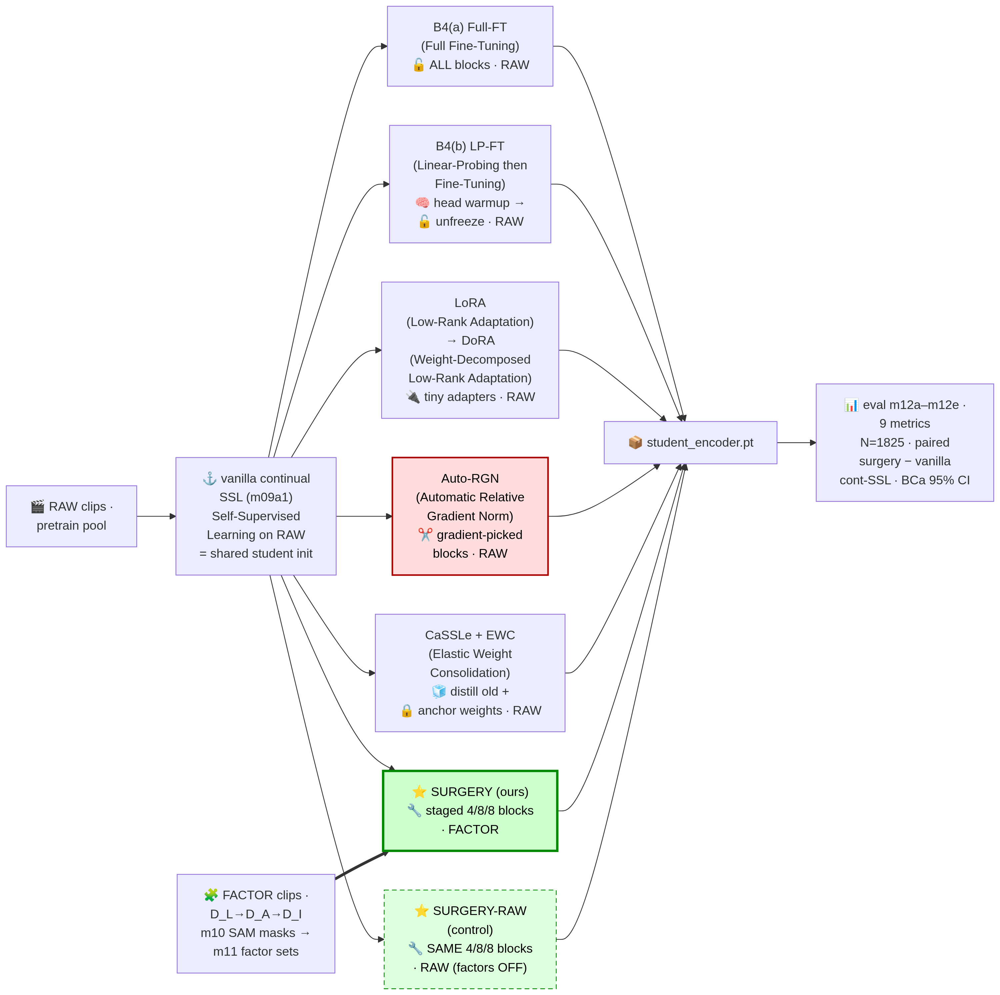
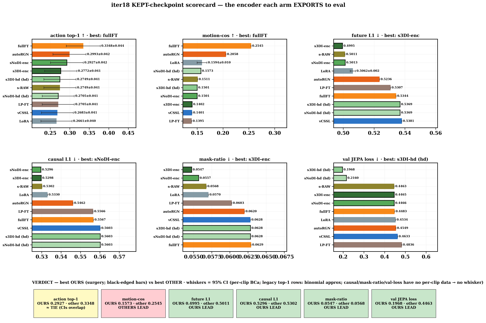
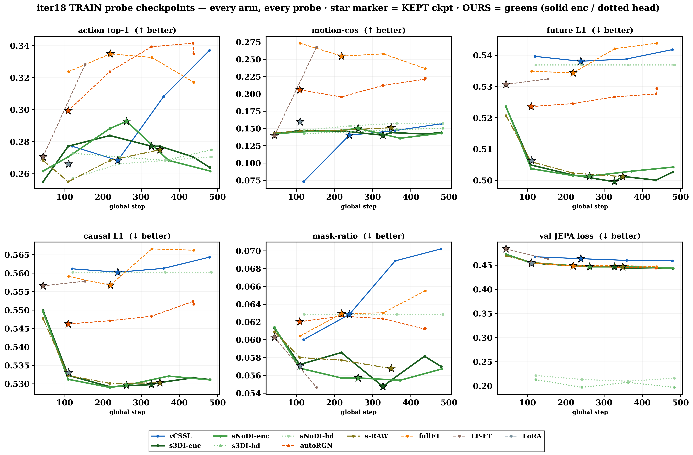
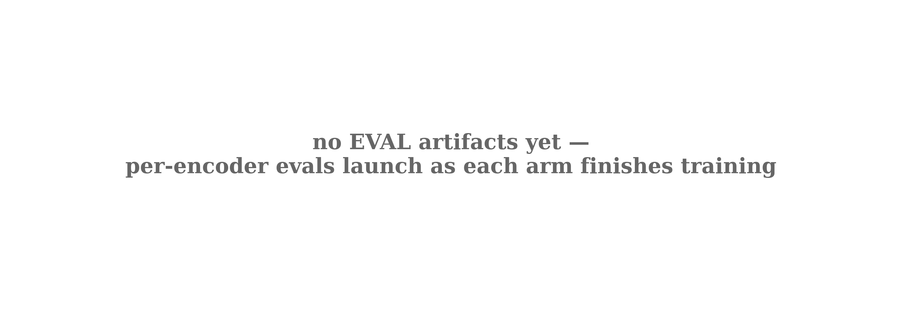
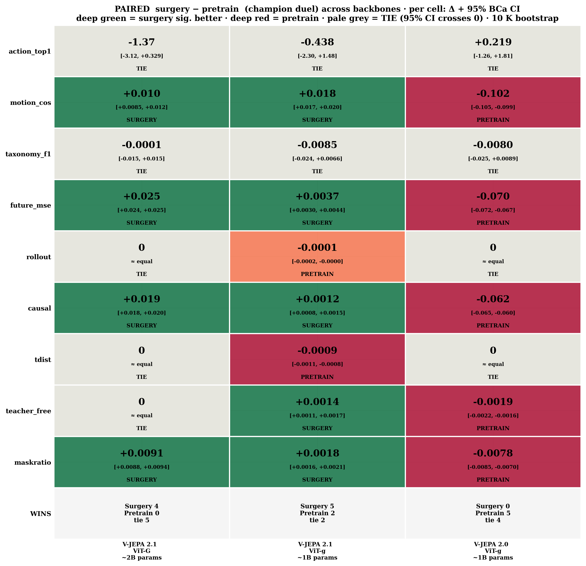

# iter18 — Surgery vs FT-techniques (POC = paper run) · slide pack

## Plot → source files

| Plot | Source files (read live by `scripts/iter18_poc_metrics.py` / `src/m13_eval_plot.py`) |
|---|---|
| kept_scorecard.png · train_trajectories.png | `outputs/poc/vjepa_2_1_vitG/<arm>/probe_history.jsonl` (13 arms) + `training_summary.json` + `data/eval_10k_local/{train_pool,val_split,test_split}.json` |
| eval_scorecard.png | `outputs/poc/{probe_action,probe_taxonomy}/<enc>/test_metrics.json` + `probe_motion_cos/<enc>/intra_inter_ratio.json` + `probe_future_mse/<enc>/aggregate_mse.json` + `predictor_temporal/<enc>/aggregate_{rollout,causal,tdist,maskratio,order,teacher_free}.json` |
| m13_frozen_scorecard.png (iter17) | `v17a_frozen_eval/poc/probe_action/<enc>/test_metrics.json` + `probe_motion_cos/<enc>/intra_inter_ratio.json` + `probe_future_mse/<enc>/aggregate_mse.json` |
| m13_hero_raw_values.png · m13_paired_diff_heatmap.png (iter17) | `v17b_train_eval/poc/probe_action/probe_paired_delta.json` + `probe_motion_cos/probe_motion_cos_paired.json` + `probe_future_mse/probe_future_mse_per_variant.json` + `predictor_temporal/<enc>/aggregate_causal.json` |

---

## 0 · Experiment map — 13 arms, one backbone (ViT-G 2B)

| technique | FULL FORM (📖 glossary, plan_baselines_roadmap.md) | like you're 5 (≤10 words) |
|---|---|---|
| frozen | frozen backbone (no adaptation) | Don't touch the brain; just test what it knows. |
| pretrain (vCSSL) | vanilla continual SSL (Self-Supervised Learning) — OURS anchor | Keep practicing videos the same old way. |
| surgery 3stage-DI (OURS) | staged factor-curriculum continual-FT, with D_I interaction tubes | Special lesson clips; unlock brain slowly; includes things-touching clips. |
| surgery noDI (OURS) | staged factor-curriculum continual-FT, without D_I | Same slow unlocking; skip the things-touching clips. |
| surgery heads (OURS) | staged factor-curriculum continual-FT, head-only | Brain stays locked; only a tiny helper learns. |
| surgery RAW (control) | staged factor-curriculum continual-FT on raw clips | Surgery's slow unlocking, but with plain videos. |
| Auto-RGN | Automatic Relative Gradient Norm (Surgical-FT, Lee et al. ICLR'23) | Layers that pull harder get bigger learning steps. |
| Full-FT | Full Fine-Tuning | Unlock the whole brain; change everything at once. |
| LP-FT | Linear-Probing then Fine-Tuning (Kumar et al. ICLR'22) | First teach the helper, then unlock everything. |
| LoRA | Low-Rank Adaptation (Hu et al. 2021) | Stick tiny add-on notes; never rewrite the book. |
| DoRA | Weight-Decomposed Low-Rank Adaptation (Liu et al. 2024) | Sticky notes plus a volume knob per page. |
| CaSSLe | continual self-supervised distillation (stylized name; Fini et al. CVPR'22) | New learning must still match the old teacher. |
| EWC | Elastic Weight Consolidation (Kirkpatrick et al. PNAS'17) | Important old memories get glued — hard to change. |

---

## 1 · HERO — kept-checkpoint scorecard

- Surgery sweeps all three prediction metrics; full-FT sweeps semantics (top-1, motion-cos).
- Semantic gaps sit inside N=451 noise; surgery's prediction lead is consistent across variants.

---

## 2 · Training — every probe checkpoint, every arm

- Only surgery improves prediction metrics stage-by-stage; pretrain stays flat — progressive unfreeze works.
- Selector keeps each arm's future-L1 minimum, not its last checkpoint — mid-training peaks matter.

---

## 3 · Upcoming — per-encoder TEST eval scorecard

- TEST verdicts (n=1,825, 95% BCa CIs) auto-fill as evals finish; val trends need confirmation.
- Paired-Δ finale decides significance — val-probe leads above are directional only.

---

## 4 · Previous work (iter17)

### 4a · Frozen scorecard — backbone selection

- V-JEPA 2.1 ViT-G is the strongest frozen backbone — justified as iter18's sole backbone.
- Every frozen model is motion-blind (motion-cos ≈ 0) — adaptation is necessary, not optional.

### 4b · Hero raw values — ViT-G family after training

- Any continual training beats frozen by +6-7pp top-1; gains are not surgery-specific.
- Only surgery moves future-MSE and causal — encoder updates drive temporal gains, heads don't.

### 4c · Paired-diff heatmap — surgery deltas with 95% CI

- Surgery beats frozen significantly on action and motion-cos — CIs exclude zero.
- Versus pretrain: action ties; motion/prediction edge persists — surgery's value is temporal, not semantic.
