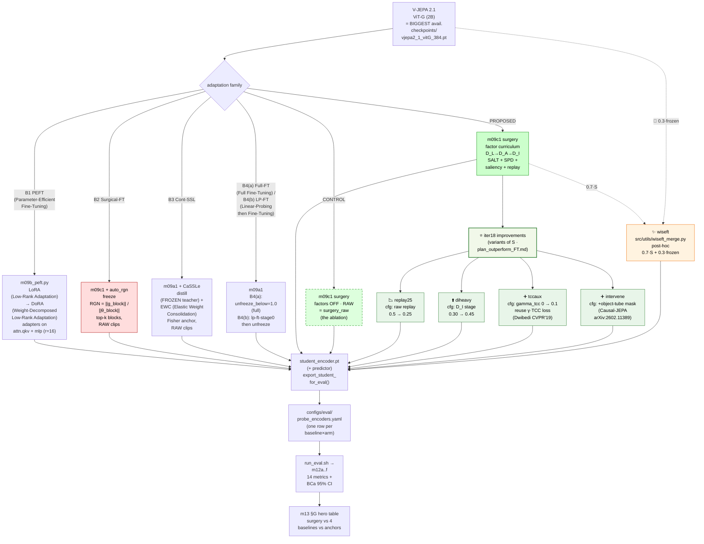
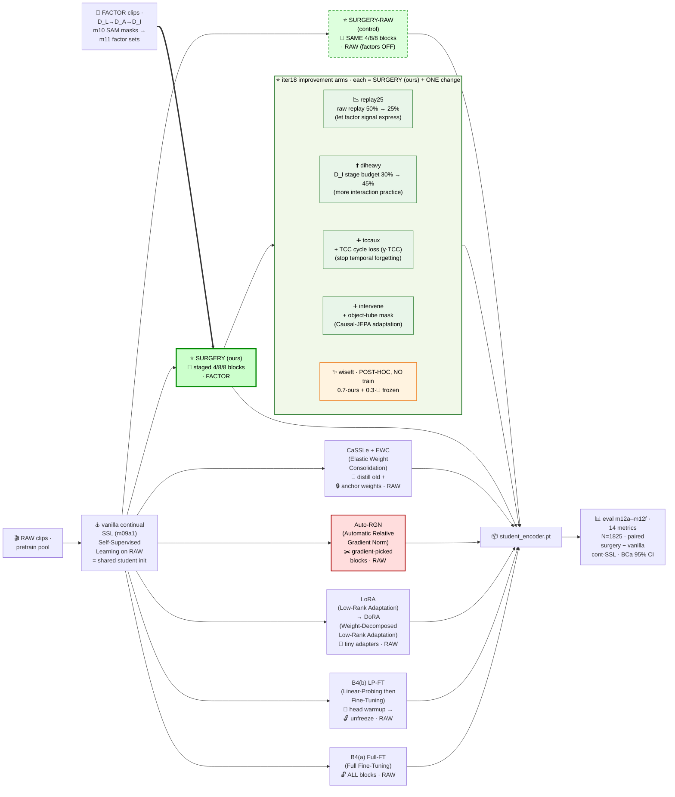

# iter18 · June-14 — Surgery vs FT-techniques · weekly progress pack

> **This week:** the **13-arm POC** (= paper run) finished **train + eval** — every arm scored on the
> full **14-metric** suite (TEST n=1,825, 95% BCa CI). Headline holds: the **factor-surgery family wins
> world-model prediction**. We then **built 5 improvement arms** (each = OURS + one change); they are
> in SANITY now and join the same scorecard next.

---

## 0 · What moved this week

| ✅ done | 🔬 finding (one line) |
|---|---|
| 13 arms trained (continual-FT zoo on ViT-G 2B) | every FT family now has a real ViT-G endpoint |
| 14-metric TEST eval, n=1,825, 95% BCa CI | surgery family tops **future-MSE + causal-L1** |
| `eval_scorecard` (14-panel) + `eval_scorecard_paper` (4-panel HERO) regenerated | one figure for the appendix, one for the paper |
| **5 improvement arms built** (replay25 · diheavy · tccaux · intervene · wiseft) | each targets a *measured* gap below (§3) |
| infra: instance→instance transfer, `full_resume_anchor` ckpt patch (24→7 GB SANITY) | unblocked the 4×96 GB run after a disk-full |

### The 5 NEW arms — each = SURGERY (ours) + ONE change

| arm | the one change | 📖 grounding | targets (gap from §3) |
|---|---|---|---|
| 📉 **Replay-25** | raw replay 50% → **25%** | let the factor signal express | beat raw on prediction; cut semantic forgetting |
| ⬆️ **DI-heavy** | D_I stage budget 30% → **45%** | more interaction practice | causal-L1 / future-MSE via interaction factor |
| ➕ **TCC-aux** | **+ γ·TCC cycle loss** | Dwibedi CVPR'19 (TCC) | recover the **TCC-τ regression** (coherence) |
| ➕ **Intervene** | **+ object-tube mask** | Causal-JEPA (arXiv:2602.11389) | push causal-L1 / future-MSE further |
| ✨ **WiSE-FT** | `0.7·ours + 0.3·🧊frozen` (**post-hoc, no train**) | Wortsman CVPR'22 | buy back frozen's coherence, keep the prediction lead |

---

## 1 · Full 14-panel TEST scorecard (appendix figure)

- All 14 metrics, 11 trained arms + frozen, n=1,825, 95% BCa CI — common-exponent axes so clustered bars stay legible.
- Three behaviours separate cleanly: **prediction** (surgery wins), **semantics** (full-FT/pretrain win), **temporal coherence** (frozen wins) — see §3.

---

## 2 · HERO paper figure — 4 panels, full baseline set

- **Causal-L1** ↓ and **Future-MSE** ↓ (top row): the green **surgery family sits at the top of both**, 95% CIs clear of full-FT, LoRA/DoRA and frozen.
- **Honest read (printed on the figure):** OURS (D_I / 3-stage) **matches raw surgery within 95% CI** — the gain comes from *surgery itself*, not yet from the factor curriculum; surgery trades a small **motion-cosine / TCC** margin for the predictive lead, and we **report** that trade rather than hide it.

---

## 2b · KEPT-checkpoint scorecard — train-side leading indicator (live)

- Each bar = the **SELECTED (lowest future-L1) checkpoint** each arm exports to eval — so this **previews the 5 new arms' standing before their held-out eval finishes**. OURS (incl. the 5 improvement arms) = black-edged green; verdict strip = best-OURS vs best-OTHER per metric.
- **Data-source note (Sr DS):** `scripts/iter18_poc_metrics.py` writes two flat dumps beside the figures. `train_metrics.{csv,json}` — one row **per in-training probe checkpoint per arm** (with the kept-selector verdict) — drives **this** kept scorecard + the trajectories; `eval_metrics.{csv,json}` — one row **per encoder** (held-out TEST mean ± 95% BCa CI, N=1,825) — drives the **eval** scorecards (§1/§2). So §1/§2 are the held-out verdict; **this is its train-time leading indicator** while the new arms still train.

---

## 3 · Conclusions from `eval_metrics.csv` — three behaviours, three winners

> Lower ↓ is better for fut/causal/tcc_cycle; higher ↑ for act/mcos/aot/tov/pace/tcc_τ. "sig" = 95% BCa CIs disjoint.

| behaviour | metric | winner (mean) | OURS (3stage-DI) | verdict |
|---|---|---|---|---|
| 🧠 **Semantics** | action top-1 ↑ | pretrain 0.528 / full-FT 0.527 | 0.492 | OURS trails, but **within noise** (CI ±0.023) |
| | motion-cos ↑ | **full-FT 0.244** | 0.119 | full-FT **sig** > OURS; OURS **sig** > frozen 0.009 |
| | taxonomy-F1 ↑ | frozen 0.797 | 0.789 | tied — not a differentiator |
| 🎯 **Prediction** | future-MSE ↓ | **raw 0.4966 ≈ OURS 0.4976** | 0.4976 | surgery family **sig** < full-FT 0.541, frozen 0.557, pretrain 0.533 |
| | causal-L1 ↓ | **raw 0.528 ≈ OURS 0.530** | 0.530 | surgery family **sig** < full-FT 0.566, frozen 0.583 |
| ⏱️ **Coherence** | TCC-τ ↑ | **frozen 0.293** | 0.269 | OURS **sig regresses** vs frozen; full-FT 0.284 keeps more |
| | TCC-cycle ↓ | frozen 2.110 | 2.259 | training hurts all; OURS is the **best-trained** arm |
| | AoT ↑ | frozen 0.963 | 0.932 | training costs ~3 pp; OURS lowest-ish |
| | pace / ToV ↑ | frozen 0.741 / 0.950 | 0.731 / 0.943 | within noise (CI ±0.012) |

**Three takeaways for the paper:**

1. ✅ **Surgery owns world-model prediction** — future-MSE & causal-L1, significantly beating frozen, pretrain, full-FT, LoRA, DoRA.
2. ⚠️ **OURS ties surgery-RAW on prediction** — the *progressive-unfreeze procedure* drives the win; the **D_L/D_A/D_I factor curriculum does not yet beat raw clips**. This is the gap **DI-heavy + Intervene + Replay-25** attack.
3. ⚠️ **Adaptation trades temporal coherence** — every trained arm loses TCC-τ / AoT vs frozen. **TCC-aux** (recover via loss) and **WiSE-FT** (interpolate back toward frozen) attack this.

---

## 4 · The next 5 arms — architecture + pipeline

### 4a · Arm tree — where the 5 new arms attach

> 🆕 iter18 (2026-06-13): the light-green **IMP** cluster hangs off PROPOSED (S) = the 5 improvement arms; each box names its ONE diff from `surgery_3stage_DI` (4 = m09c1 + a config change · wiseft = post-hoc weight merge). Amber = wiseft.

### 4b · Model ↔ data pipeline — factor clips vs raw clips into one scorecard

### 4c · Each new arm → the §3 gap it attacks

| arm | gap it targets | success = move this metric | 🧒 Explain like I'm 5 | 📖 Official definition | 🧮 Mathematical formula |
|---|---|---|---|---|---|
| 📉 Replay-25 | OURS ties raw (factor not expressing) | future-MSE / causal-L1 **below raw**, CI-clear | Show the robot **fewer plain clips** so it studies the special factor-edited ones harder | Halve the CLEAR raw-replay interleave probability so factor-view gradients dominate the update | $p_{\text{raw}}:\ 0.5 \to 0.25$ (per-clip Bernoulli draw of raw vs factor) |
| ⬆️ DI-heavy | interaction factor under-used | causal-L1 ↓ (perturbation sensitivity) | Spend **more of the lesson** on "how objects interact" instead of layout/agent | Reweight the 3-stage curriculum step budget toward the D_I (interaction) stage | $w_{D_I}:\ 0.30 \to 0.45$ of total steps; $\sum_s w_s = 1$ |
| ➕ TCC-aux | TCC-τ regression (0.269 vs 0.293) | TCC-τ ↑ toward frozen **without** losing prediction | Add a rule: **same-action clips must line up in time-order** | Add a γ-weighted TCC cycle-consistency auxiliary loss to the JEPA objective (Dwibedi CVPR'19) | $\mathcal{L}=\mathcal{L}_{\text{JEPA}}+\gamma\,\mathcal{L}_{\text{TCC}},\ \ \gamma=0.1$ |
| ➕ Intervene | predictive lead can go further | future-MSE / causal-L1 ↓ past current surgery floor | **Hide a moving object's whole path** and make the robot predict it | Mask a spatio-temporal **object tube** as the JEPA prediction target (Causal-JEPA) | target $M=\mathrm{tube}(o)$ over frames $t$; predict $\hat z$ on $M$ |
| ✨ WiSE-FT | adaptation lost frozen's coherence | AoT / ToV / pace / TCC ↑ while keeping ~70% of the prediction lead | **Average the trained brain with the original frozen brain** | Post-hoc weight-space interpolation of the surgery and frozen encoders — **no training** (Wortsman CVPR'22) | $\theta=\alpha\,\theta_{\text{ours}}+(1-\alpha)\,\theta_{\text{frozen}},\ \ \alpha=0.7$ |

## § 5 — 📚 Metric reference · all 15 eval metrics (9 suite + signed `order` + 5 iter18 m12f encoder-temporal)

> Sources: per-module docstrings (`src/m12{a-f}_*.py`, `src/utils/pt_*.py`, `src/utils/et_*.py`) + gold-standard papers:
> [Arrow of Time — Wei et al. CVPR'18](https://openaccess.thecvf.com/content_cvpr_2018/html/Wei_Learning_and_Using_CVPR_2018_paper.html) ·
> [Shuffle & Learn — Misra et al. ECCV'16](https://www.researchgate.net/publication/308277657_Shuffle_and_Learn_Unsupervised_Learning_Using_Temporal_Order_Verification) ·
> [Pace Prediction — Wang et al. ECCV'20](https://jianbojiao.com/pdfs/ECCV_pace.pdf) ·
> [TCC — Dwibedi et al. CVPR'19](https://arxiv.org/abs/1904.07846). Every value ships with a 95% BCa bootstrap CI (N=1825 held-out test clips).

| 📐 Metric (module · ↑/↓) | 🧒 Explain like I'm 5 | 📖 Official definition | 🧮 Mathematical formula | 💻 Source code |
|---|---|---|---|---|
| 🎯 **action_top1** (m12a · ↑) | The robot watches a clip and picks 1 of 11 answers for "which way is stuff moving, and how fast?" — score = how often it's right | Top-1 accuracy of an attentive probe trained on frozen encoder features to classify each clip's dominant motion (speed × direction) | $\mathrm{Acc}=\frac{1}{N}\sum_q \mathbb{1}[\arg\max_c f_\theta(z_q)=y_q]$ over 11 optical-flow motion classes | `src/m12a_action_top1.py` |
| 🏷️ **taxonomy_f1** (m12c · ↑) | 15 little quizzes about the scene ("rainy? market? night?") — take the average grade | Macro average over 15 scene-taxonomy dimensions (weather, road type, crowding, …) of per-dimension probe test scores | $\frac{1}{15}\sum_{d=1}^{15}s_d$, $s_d$ = top-1 acc (single-label dims) or sample-F1 (multi-label dims) | `src/m12c_taxonomy_f1.py` |
| 🧭 **motion_cos** (m12b · ↑) | Clips that move the same way should "look alike" to the robot — score = how much more alike friends are than strangers | Intra-minus-inter class cosine margin: mean similarity to same-motion-class clips minus different-class clips | $\frac{1}{N}\sum_q[\overline{\cos}(z_q,z_{same})-\overline{\cos}(z_q,z_{diff})]$ | `src/m12b_motion_cos.py` |
| 🔮 **future_mse** (m12d · ↓) | Cover the next picture in the flip-book and ask the robot to draw it — score = how wrong the drawing is | Mean squared error of the predictor reconstructing held-out future latent tokens from visible context | $\frac{1}{N}\sum_q\|\hat z_{t+\Delta}-z_{t+\Delta}\|_2^2$ (predictor vs teacher latents, masked future block) | `src/m12d_future_mse.py` |
| 📉 **rollout** (pt#1 · ↓) | A whisper game the robot plays with itself — how fast does the story get garbled? | Free-running iterated rollout drift: error growth rate when the predictor consumes its own outputs (V-JEPA-2-AC rollout) | per-clip OLS slope of $L_1(\hat h_k,h_k)$ vs horizon $k$, predictions fed back as context | `src/m12e_predictor_temporal.py` + `src/utils/pt_rollout.py` |
| ⏪ **causal** (pt#2 · ↓) | Hide the whole second half of the movie — can the robot guess it from the first half? | Strictly causal future-half prediction error (past→future masking, no bidirectional leak) | $\overline{L_1}$ predicting temporal slots $[T_p/2,T_p)$ from $[0,T_p/2)$ only | `src/m12e_predictor_temporal.py` + `src/utils/pt_causal.py` |
| 📏 **tdist** (pt#3 · ↓) | Guessing 1 second ahead is easy, 8 seconds is hard — how quickly does the robot's guessing get worse? | Predictability-horizon scaling: how fast single-shot prediction degrades with temporal distance (CPC-style long-horizon test) | per-clip OLS slope of single-shot $L_1$ vs $\Delta t\in\{1,2,4,8\}$ from a 1-slot context | `src/m12e_predictor_temporal.py` + `src/utils/pt_tdist.py` |
| 🧩 **maskratio** (pt#5 · ↓) | A jigsaw with more and more pieces missing — how fast does the robot's picture fall apart? | Graceful degradation under sparse context (VideoMAE high-masking robustness) — error growth as more tokens are hidden | per-clip OLS slope of $L_1$ vs mask ratio $r\in\{0.3,0.5,0.7,0.9\}$ | `src/m12e_predictor_temporal.py` + `src/utils/pt_maskratio.py` |
| 🔀 **order** (pt#6 · signed) | Mix up the comic panels — does the robot even notice? | Temporal-order reliance: extra error when context frames are shuffled (>0 = order-dependent; ≈0 = order-blind). Diagnostic, not win/loss | $\Delta L_1 = L_1^{shuffled}-L_1^{ordered}$ (last-slot prediction, same mask) | `src/m12e_predictor_temporal.py` + `src/utils/pt_order.py` |
| 🎓 **teacher_free** (pt#4 · ↓) | Riding without training wheels vs with — how much wobblier? | Exposure bias: error inflation when the predictor consumes its own mistakes vs re-grounded real context (Scheduled Sampling) | $\overline{L_1^{free}-L_1^{teacher}}$ over horizons (free-run minus teacher-forced rollout) | `src/m12e_predictor_temporal.py` + `src/utils/pt_teacher_free.py` |
| ⏩ **aot** (m12f/et · ↑) | Is the movie playing forwards or backwards? (Spilled milk doesn't jump back into the glass) | [Arrow-of-Time (Wei CVPR'18)]: classify temporal direction from encoder features — does the representation preserve time's arrow? | binary head acc on $\bar z$: forward vs time-reversed clip, $\frac{1}{2}$(fwd ✓ + rev ✓) per clip | `src/m12f_encoder_temporal.py` + `src/utils/et_aot.py` |
| 🔢 **tov** (m12f/et · ↑) | We scramble the photo album 4 different ways — can the robot tell which scramble it got? | [Temporal Order Verification / VCOP (Misra ECCV'16, Xu CVPR'19)]: identify WHICH frame ordering the clip has | $n$-way head top-1 over frame-permutation classes {identity + 3 shuffles}, avg over $n$ variants per clip | `src/m12f_encoder_temporal.py` + `src/utils/et_tov.py` |
| 🏃 **pace** (m12f/et · ↑) | Is the video normal speed, fast-forward, or super-fast? | [Pace Prediction (Wang ECCV'20)]: classify the playback speed — rate-sensitive representations beat appearance-only ones | 3-way head top-1 over playback strides $\{1,2,4\}$ (oversampled source decode) | `src/m12f_encoder_temporal.py` + `src/utils/et_pace.py` |
| 🔁 **tcc_cycle** (m12f/et · ↓) | Walk from your frame to the matching frame in a friend's video and back — do you land where you started? | [TCC (Dwibedi CVPR'19) eq.1]: cycle-back alignment error between same-action clip pairs — training-free temporal correspondence | $\frac{1}{T}\sum_i\|i-\mathrm{cyc}(i)\|$, $\mathrm{cyc}$ = soft-NN $A\!\to\!B\!\to\!A$, $\mathrm{soft}_i=\sum_j\mathrm{softmax}_j(\langle a_i,b_j\rangle/\tau)\cdot j$ | `src/m12f_encoder_temporal.py` + `src/utils/et_tcc.py` |
| 🔗 **tcc_tau** (m12f/et · ↑) | When we match moments across two videos of the same action, do they stay in story order? | Rank correlation of the cross-clip frame alignment with monotonic time order (NaN for degenerate/static pairs, excluded + reported) | Kendall $\tau_b=\frac{P-Q}{\sqrt{(n_0-n_1)(n_0-n_2)}}$ between $\mathrm{arange}(T)$ and hard-NN alignment indices | `src/m12f_encoder_temporal.py` + `src/utils/et_tcc.py` |

> 🗂️ Column key: `pt#` = `src/utils/pt_*.py` (predictor-temporal, Stage 8b) · `et` = `src/utils/et_*.py` (encoder-temporal, Stage 8c) · ↑ higher better · ↓ lower better.
---

