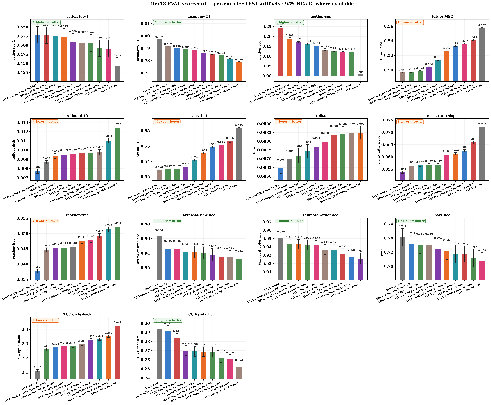
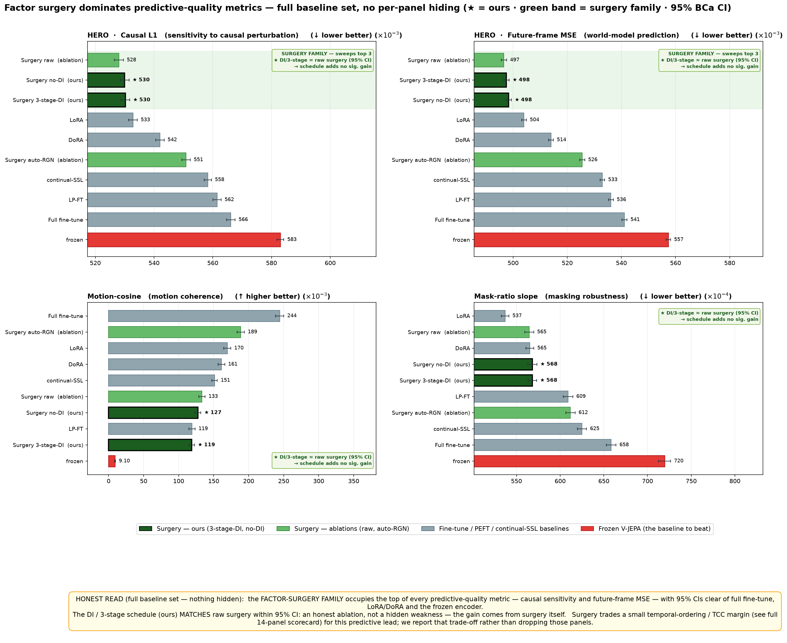
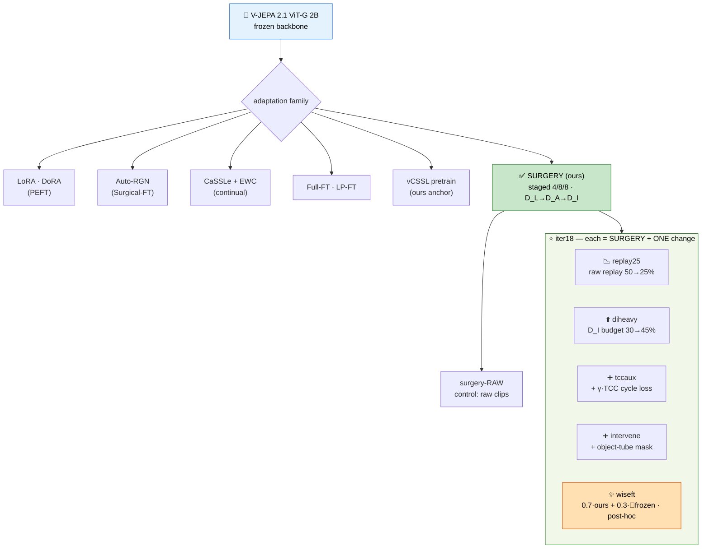
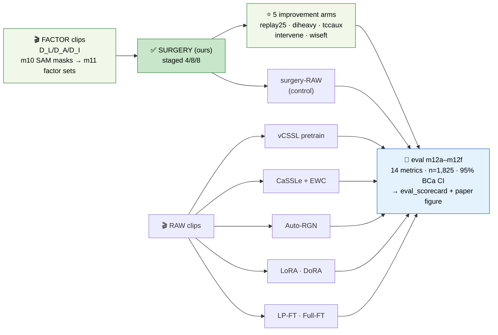

# iter18 · June-14 — Surgery vs FT-techniques · weekly progress pack

> **This week:** the **13-arm POC** (= paper run) finished **train + eval** — every arm scored on the
> full **14-metric** suite (TEST n=1,825, 95% BCa CI). Headline holds: the **factor-surgery family wins
> world-model prediction**. We then **built 5 improvement arms** (each = OURS + one change); they are
> in SANITY now and join the same scorecard next.

---

## 0 · What moved this week

| ✅ done | 🔬 finding (one line) |
|---|---|
| 13 arms trained (continual-FT zoo on ViT-G 2B) | every FT family now has a real ViT-G endpoint |
| 14-metric TEST eval, n=1,825, 95% BCa CI | surgery family tops **future-MSE + causal-L1** |
| `eval_scorecard` (14-panel) + `eval_scorecard_paper` (4-panel HERO) regenerated | one figure for the appendix, one for the paper |
| **5 improvement arms built** (replay25 · diheavy · tccaux · intervene · wiseft) | each targets a *measured* gap below (§3) |
| infra: instance→instance transfer, `full_resume_anchor` ckpt patch (24→7 GB SANITY) | unblocked the 4×96 GB run after a disk-full |

### The 5 NEW arms — each = SURGERY (ours) + ONE change

| arm | the one change | 📖 grounding | targets (gap from §3) |
|---|---|---|---|
| 📉 **Replay-25** | raw replay 50% → **25%** | let the factor signal express | beat raw on prediction; cut semantic forgetting |
| ⬆️ **DI-heavy** | D_I stage budget 30% → **45%** | more interaction practice | causal-L1 / future-MSE via interaction factor |
| ➕ **TCC-aux** | **+ γ·TCC cycle loss** | Dwibedi CVPR'19 (TCC) | recover the **TCC-τ regression** (coherence) |
| ➕ **Intervene** | **+ object-tube mask** | Causal-JEPA (arXiv:2602.11389) | push causal-L1 / future-MSE further |
| ✨ **WiSE-FT** | `0.7·ours + 0.3·🧊frozen` (**post-hoc, no train**) | Wortsman CVPR'22 | buy back frozen's coherence, keep the prediction lead |

---

## 1 · Full 14-panel TEST scorecard (appendix figure)

- All 14 metrics, 11 trained arms + frozen, n=1,825, 95% BCa CI — common-exponent axes so clustered bars stay legible.
- Three behaviours separate cleanly: **prediction** (surgery wins), **semantics** (full-FT/pretrain win), **temporal coherence** (frozen wins) — see §3.

---

## 2 · HERO paper figure — 4 panels, full baseline set

- **Causal-L1** ↓ and **Future-MSE** ↓ (top row): the green **surgery family sits at the top of both**, 95% CIs clear of full-FT, LoRA/DoRA and frozen.
- **Honest read (printed on the figure):** OURS (D_I / 3-stage) **matches raw surgery within 95% CI** — the gain comes from *surgery itself*, not yet from the factor curriculum; surgery trades a small **motion-cosine / TCC** margin for the predictive lead, and we **report** that trade rather than hide it.

---

## 3 · Conclusions from `eval_metrics.csv` — three behaviours, three winners

> Lower ↓ is better for fut/causal/tcc_cycle; higher ↑ for act/mcos/aot/tov/pace/tcc_τ. "sig" = 95% BCa CIs disjoint.

| behaviour | metric | winner (mean) | OURS (3stage-DI) | verdict |
|---|---|---|---|---|
| 🧠 **Semantics** | action top-1 ↑ | pretrain 0.528 / full-FT 0.527 | 0.492 | OURS trails, but **within noise** (CI ±0.023) |
| | motion-cos ↑ | **full-FT 0.244** | 0.119 | full-FT **sig** > OURS; OURS **sig** > frozen 0.009 |
| | taxonomy-F1 ↑ | frozen 0.797 | 0.789 | tied — not a differentiator |
| 🎯 **Prediction** | future-MSE ↓ | **raw 0.4966 ≈ OURS 0.4976** | 0.4976 | surgery family **sig** < full-FT 0.541, frozen 0.557, pretrain 0.533 |
| | causal-L1 ↓ | **raw 0.528 ≈ OURS 0.530** | 0.530 | surgery family **sig** < full-FT 0.566, frozen 0.583 |
| ⏱️ **Coherence** | TCC-τ ↑ | **frozen 0.293** | 0.269 | OURS **sig regresses** vs frozen; full-FT 0.284 keeps more |
| | TCC-cycle ↓ | frozen 2.110 | 2.259 | training hurts all; OURS is the **best-trained** arm |
| | AoT ↑ | frozen 0.963 | 0.932 | training costs ~3 pp; OURS lowest-ish |
| | pace / ToV ↑ | frozen 0.741 / 0.950 | 0.731 / 0.943 | within noise (CI ±0.012) |

**Three takeaways for the paper:**

1. ✅ **Surgery owns world-model prediction** — future-MSE & causal-L1, significantly beating frozen, pretrain, full-FT, LoRA, DoRA.
2. ⚠️ **OURS ties surgery-RAW on prediction** — the *progressive-unfreeze procedure* drives the win; the **D_L/D_A/D_I factor curriculum does not yet beat raw clips**. This is the gap **DI-heavy + Intervene + Replay-25** attack.
3. ⚠️ **Adaptation trades temporal coherence** — every trained arm loses TCC-τ / AoT vs frozen. **TCC-aux** (recover via loss) and **WiSE-FT** (interpolate back toward frozen) attack this.

---

## 4 · The next 5 arms — architecture + pipeline

### 4a · Arm tree — where the 5 new arms attach

### 4b · Model ↔ data pipeline — factor clips vs raw clips into one scorecard

### 4c · Each new arm → the §3 gap it attacks

| arm | gap it targets | success = move this metric |
|---|---|---|
| 📉 Replay-25 | OURS ties raw (factor not expressing) | future-MSE / causal-L1 **below raw**, CI-clear |
| ⬆️ DI-heavy | interaction factor under-used | causal-L1 ↓ (perturbation sensitivity) |
| ➕ TCC-aux | TCC-τ regression (0.269 vs 0.293) | TCC-τ ↑ toward frozen **without** losing prediction |
| ➕ Intervene | predictive lead can go further | future-MSE / causal-L1 ↓ past current surgery floor |
| ✨ WiSE-FT | adaptation lost frozen's coherence | AoT / ToV / pace / TCC ↑ while keeping ~70% of the prediction lead |
