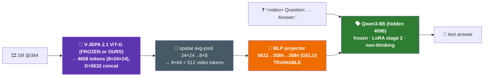

# 🏗️ iter20 · §E1 — VLM-head BUILD SPEC (OURS-VLM vs FROZEN-VLM)

> Detailed spec for the two-VLM build. Overview lives in `plan_v2_visual_demo.md` §E1. **Runs on the 96 GB
> box** (Qwen3-8B + V-JEPA-G). Precondition: **§E0 PASSED** (OURS's edge survives a trained MLP head — see
> `plan_v2` §E0 result). Goal: a `demo_cosmos`-format video where OURS-VLM answers a MOTION/ACTION question
> right and FROZEN-VLM wrong, on a **measured, gated** temporal benchmark.

## 🎯 §1 — Preconditions & decision gates (in-build)

| gate | condition to continue | else |
|---|---|---|
| §E0 (done ✅) | OURS-head > FROZEN-head under MLP | — (passed: +8.7–15.7pp) |
| STAGE-1 sanity | projector-aligned VLM produces coherent captions on a few clips | fix data/LR before stage-2 |
| GATE (§E1 end) | VLM_OURS **>** VLM_FROZEN on TempCompass/TemporalBench/EK100, non-overlapping CIs | ⛔ truthful negative → forest plots |

## 🧱 §2 — Architecture (concrete)

| piece | value | source |
|---|---|---|
| encoder | native V-JEPA 2.1 ViT-G/384 (frozen) | `utils.predictor_eval.load_encoder_only` (existing) |
| tokens | 4608 → **512** after spatial avg-pool (k≈3, 24×24→8×8), temporal kept (temporal matters most) | LLaVA-Video / Qwen2-VL recipe |
| projector | `Linear(5632→3584) · GELU · Linear(3584→3584)` (2-layer, LLaVA-1.5 style) | trainable, per-arm |
| LLM | **Qwen3-8B** (hidden 4096, **non-thinking** gate), frozen + **LoRA r=32** in stage 2; projector out-dim dynamic from the loaded LLM | HF `transformers` + `peft` |
| fusion | non-tokenized early fusion: `[proj(video) ; embed(prompt)]` → LLM | V-JEPA 2 paper recipe |

## 🧩 §3 — New code to build (repo convention `src/m18_*`)

| module | responsibility |
|---|---|
| `src/utils/vlm_model.py` | `VJepaLlavaVLM(nn.Module)`: frozen encoder → pool → projector → prepend to Qwen2 input-embeds; forward = causal-LM loss; `.generate()` for eval. Handles the `<video>` placeholder-token expansion. |
| `src/m18_vlm_data.py` | build instruction-JSONL: stage-1 captions + stage-2 motion QA (download via HF `datasets`, format as `{video, prompt, answer}`); shared collator (decode 16f via `utils.demo_video`, encoder-agnostic). |
| `src/m18_vlm_train.py` | 2-stage trainer, `--encoder {frozen,ours}` (the ONLY arm difference), `--stage {align,instruct}`; freezes per §4; saves `projector.pt` + `lora/`. |
| `src/m18_vlm_eval.py` | run VLM on a benchmark, `--arm`, emit per-clip predictions + accuracy + BCa CI; dump `heroes_vlm.json` (OURS-right/FROZEN-wrong). |
| `configs/vlm.yaml` | LLM id, projector dims, pool, LoRA r/α, stage LRs/epochs/BS, data mix, benchmark list — **NO hardcoded values in .py** (CLAUDE.md). |

## 📚 §4 — Training (LLaVA 2-stage · identical both arms except `--encoder`)

| stage | frozen | trained | data | hparams (start) |
|---|---|---|---|---|
| **1 · align** | encoder + LLM | **projector only** | video captions ~200–500K (LLaVA-Video-178K subset / WebVid subset) | LR 1e-3, cosine, 1 epoch, BS 32 (grad-accum), bf16 |
| **2 · instruct** | encoder | **projector + LLM-LoRA (r=32, α=64)** | **motion/action QA**: TempCompass · Something-Something-v2 (→QA) · **EK100 anticipation** · **Diving48** (→"what dive?") | LR 2e-5, 1–3 epochs, BS 16 (grad-accum), warmup 3% |

> 🚫 **No scene/appearance QA** in stage 2 (OURS loses scene 0/15 → would dilute/invert). Motion/temporal only.
> **Fairness:** same data, seeds, schedule, LoRA config for both arms; only `load_encoder_only(FROZEN|OURS)` differs.

## 🚦 §5 — GATE / eval (the honesty check)

- Benchmarks (temporal, multiple-choice / open): **TempCompass**, **TemporalBench**, **EK100-anticipation**, **Diving48-test**.
- For each arm → accuracy + BCa 95% CI (`utils.bootstrap`). **PASS = VLM_OURS > VLM_FROZEN, non-overlapping CIs.**
- Dump per-clip `(clip, question, GT, frozen_ans, ours_ans)` → select OURS-right/FROZEN-wrong → `heroes_vlm.json`.
- **If FAIL** → truthful negative, do NOT render; ship the forest plots.

## 🎬 §6 — Render — reuse `m17_vqa_demo.py`

`heroes_vlm.json` has the same shape m17 consumes (`question · true · frozen · ours · path`). Add a `vlm` question
entry in `configs/demo.yaml m17.questions`; render → `demo_vqa_vlm.mp4`; honest footer "OURS-VLM X% vs FROZEN-VLM
Y% on TempCompass". Then visual-audit **C10** (gate-backed) + layman blind → user sign-off.

## 🖥️ §7 — Compute plan (96 GB box)

| item | VRAM (bf16) | note |
|---|---|---|
| V-JEPA-G encoder (frozen, no-grad) | ~3 GB | precompute+cache features to skip re-encode across epochs |
| Qwen3-8B + LoRA | ~16 GB weights + optimizer(LoRA only) | full-frozen base, tiny LoRA optimizer state |
| projector + activations + 512 video-tokens/clip | ~rest | BS via grad-accum |
| **fits in 96 GB** | ✅ | stage-1 can even run on 48 GB (projector-only); stage-2 wants 96 GB |

> ⚡ **Speed lever:** encoder is frozen → **pre-extract + cache the 512 pooled tokens per clip once**, then train
> the projector/LoRA on cached tokens (no encoder in the loop). Both arms cache separately. Cuts training ~3–5×.

## ⚠️ §8 — Risks & the honest posture

| risk | mitigation |
|---|---|
| OURS-VLM ≈ FROZEN-VLM (LLM absorbs the edge) | §E0 already refuted this on probes; real gate at §5 confirms on the LLM stack. FAIL → forest plots. |
| out-of-domain edge loss (kitchen/diving) | the OOD §E0 (Diving48, running) pre-answers this; if OOD-weak, keep stage-2 data + benchmark IN-domain (WalkIndia-derived QA) |
| token count / context blow-up | spatial pool to 512; temporal kept (perf sensitive to temporal, not spatial) |
| aligned V-JEPA-2 MLLM not public | build from parts (this spec); do NOT wait on a checkpoint |
| framework friction | **custom harness** (native V-JEPA + HF Qwen2 + peft) over forking LLaVA-NeXT-Video (its CLIP vision-tower interface ≠ V-JEPA spatiotemporal tokens) — more control, matches V-JEPA 2's own recipe |
