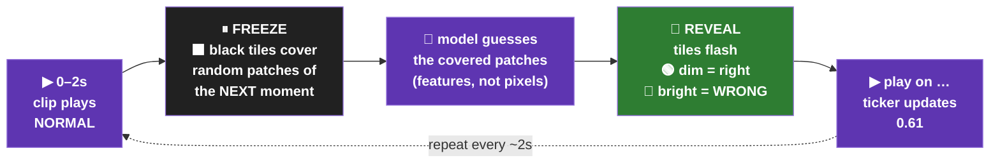
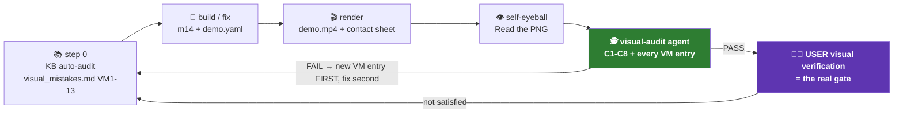

# 🎬 iter20 — VISUAL DEMO plan · the 4 headline metrics, shown on real video

| 🎯 | |
|---|---|
| **Goal** | a video a **stranger** understands: *what does V-JEPA predict, how does each metric catch it being right/wrong, what do the numbers mean* |
| **Scope NOW** | 🧊 **FROZEN V-JEPA 2.1 (1B) only** — iterate until the **user visually signs off** |
| **Parked** | 🥊 multi-model comparison (🏆 OURS-75%-of-116k vs 🧊 frozen 2.1-1B · 2.1-2B · 2.0-1B · 1.0) — staged rollout in **§2b**, unlocks after sign-off |
| **Format verdict** | 📹 **video editing, not slides** — the `driving1.png` 4-panel synchronized style (user 2026-07-12) |

## ⚖️ Pixel-generation face-off: 🪶 m15 (this plan, §0b) vs 🚀 SDXL→Cosmos LoRA (`plan_pixel_generation.md`)

| metric | 🪶 **m15 tubelet-inversion** (this plan) | 🚀 **SDXL→Cosmos LoRA** (`plan_pixel_generation.md`) |
|---|---|---|
| 🧠 idea | 1408-dim token → MLP → its own 2×16×16 patch pixels | latent → projector → LoRA-adapted pretrained diffusion → full frame |
| ⚙️ trainable params | ~5-10 M (tiny MLP) | ~100-300 M (projector + LoRA) |
| 🖥️ GPU needed | ✅ RTX 3060 12 GB (this box) | ❌ 24-80 GB (SDXL), more for Cosmos |
| ⏱️ time to first demo | ~3-4 h total | days-weeks (integration + train) |
| 🎞️ data needed | 2 shards already on disk (~4 k clips) | 10k-100k+ clip-frame pairs |
| 🖼️ output quality | 😶‍🌫️ blurry, structure + motion visible | 📸 photorealistic, physically plausible (Cosmos) |
| 🎬 multi-frame future | ✅ native (per-tubelet = video) | SDXL ❌ single frame → Cosmos ✅ |
| 💥 reviewer wow | 💥💥 | 💥💥💥💥 |
| ⚠️ honesty risk | low — blur honestly shows what the latent kept/dropped | HIGH — SDXL/Cosmos hallucinate texture V-JEPA never predicted; must caption "diffusion prior" |
| 🧗 engineering risk | minimal (one module) | high (2 ecosystems, conditioning-space mismatch, LoRA tuning) |
| 🔬 science value | sanity proof latents→pixels | real research: WHAT is recoverable from world-model latents |
| 🪜 relationship | **stage 1.5 stepping stone** — SAME frozen V-JEPA + projector interface; m15's feature-extraction code is reused as the projector's input side | **stage 5 destination** — starts from m15's plumbing, swaps the MLP for projector + LoRA-diffusion |

---

## 🗣️ §0 — The demo in PLAIN WORDS (user QQ1/QQ2 · 2026-07-12)

### QQ1 — "future-frame MSE" = a fortune teller for video

| step | 🎬 | what happens |
|---|---|---|
| 1 | 👀 | the model watches the **start** of the clip |
| 2 | ⬛ | we **cover up** a piece of what comes next |
| 3 | 🤔 | it **guesses** what's under the cover — not pixels, its internal *description* ("car moving right, road below, trees above") |
| 4 | 🔍 | we lift the cover, let it *look* at the real thing, compare **guess-description vs real description** |
| 5 | 🔢 | score = how wrong the guess was · **lower = better fortune teller** |

| ⚠️ honest catch | the model **never draws a picture** — a demo can't show "the frame it imagined"; it can only paint **where** the guess was right/wrong on the REAL video |
|---|---|
| 📏 "MSE / L1" | just *how the gap* between guess and truth is measured |

### QQ2 — demo it ON the actual 10s clip → the `driving1.png` 4-panel look

```text
┌─────────────────────────┬─────────────────────────┐
│ Original                │ What the model SEES     │
│ clip plays normally ▶   │ same clip, but the      │
│                         │ "covered" patches are   │
│                         │ BLACK tiles ▶           │
├─────────────────────────┼─────────────────────────┤
│ Model's report card     │ score ticker            │
│ same clip, hidden       │ 0.61 ▂▃▅ error grows    │
│ patches painted:        │ as more is hidden /     │
│ 🟢 dim  = guessed right │ further ahead           │
│ 🔴 bright = guessed WRONG│                        │
└─────────────────────────┴─────────────────────────┘
        all four panels = the SAME 10s driving clip, in sync
```

| 🔑 key idea | **the mask IS the edit** — black out real patches (that is *genuinely* what the model receives), paint its per-patch report card back onto the same frames; a "predicted picture" never appears (the model predicts *descriptions*, not pixels) |
|---|---|


### 🌐 How similar demos look in the wild (WEBSEARCH 2026-07-12)

| project | demo format we borrow |
|---|---|
| [MCG-NJU/VideoMAE](https://github.com/MCG-NJU/VideoMAE) | README GIF triptych **original ∥ masked ∥ reconstruction**, one row per clip (`vis.sh`) — our panels 1-2-3, with "reconstruction" honestly replaced by the report-card overlay |
| [facebookresearch/jepa](https://github.com/facebookresearch/jepa) · [arXiv 2404.08471](https://arxiv.org/pdf/2404.08471) | feature-space predictions become pixels **only via an extra diffusion decoder** — confirms the raw model can't draw; overlay-on-real-frames is the honest visualization |
| [facebookresearch/vjepa2](https://github.com/facebookresearch/vjepa2) | PCA→RGB dense-feature GIFs ("temporally consistent dense features") — our Scene A |

---

## 💥 §0b — WOW track: FUTURE-FRAME **PIXELS** decoded from V-JEPA's predicted latents (user 2026-07-12)

### QQ1 — how V-JEPA turns raw pixels into "latent space" (⚠️ it is NOT text)

| step | 🎬 | what happens |
|---|---|---|
| 1 | 🎞️ | the clip is cut into 3-D bricks — **tubelets** = 2 frames × 16×16 pixels |
| 2 | 🔢 | each tubelet is flattened and linearly mapped to a **1408-number vector** (1B model) — this vector IS the "latent"; **no text anywhere** (V-JEPA never produces words) |
| 3 | 🧭 | 3D-RoPE stamps each vector with *where + when* its tubelet lives |
| 4 | 🧠 | the ViT encoder lets all tubelet-vectors talk to each other → each becomes a context-aware **description-in-numbers** of its patch |
| 5 | 🔮 | the predictor writes the SAME kind of vectors for tubelets it never saw (the hidden future) |


### QQ2 — reverse-engineering latents → PIXELS (WEBSEARCH 2026-07-12): the known techniques

| # | technique | how | wow 💥 | cost on our 3060 | honesty risk |
|---|---|---|---|---|---|
| 1 | 🥇 **conditional diffusion decoder** — the V-JEPA paper's own protocol ([arXiv 2404.08471](https://arxiv.org/pdf/2404.08471) · [facebookresearch/jepa](https://github.com/facebookresearch/jepa)) | train a diffusion model conditioned ONLY on the predicted latents of the hidden region (encoder+predictor stay frozen) → sharp plausible frames | 💥💥💥 | ❌ days of training, needs a bigger GPU — **not this box** | paper itself warns: "samples do not exactly match the input" — MUST caption "extra generative decoder" |
| 2 | 🥈 **lightweight tubelet-inversion decoder** (classic feature inversion — OUR pick, new `m15`) | small MLP/deconv head: 1408-dim token → its own 2×16×16×3 pixels; trained on REAL walkindia frames w/ frozen encoder; at demo time fed the **predictor's** latents for the hidden future | 💥💥 (blurry but *real* imagined frames) | ✅ hours: features precomputed once, decoder ≈ 5-10 M params; 2 shards (~4 k clips) already on disk | same caption required; blur is honest — it shows latents keep *semantics/motion*, discard texture |
| 3 | PCA→RGB feature video ([facebookresearch/vjepa2](https://github.com/facebookresearch/vjepa2)) — already Scene A | project tokens on 3 principal axes → false-colour video | 💥 (abstract) | ✅ zero training (in v1) | none — clearly not pixels |
| 4 | 🎨 report-card overlay (current §0 default) | paint right/wrong on the real frames | 💥 (analytic) | ✅ zero | none — the most honest |

| 🔑 verdict | ship **#2 (m15 decoder)** for the wow panel now + keep #4 as the metric panel; **#1 diffusion** = optional stage 5 (bigger GPU, only if reviewers demand photorealism) |
|---|---|
| ⚠️ non-negotiable caption on every generated frame | *"pixels from an EXTRA decoder trained by us — V-JEPA predicts descriptions, not pictures"* (exactly how the V-JEPA paper frames its own decoder demo) |

### 📹 The WOW scene (extends Scene C: causal future-block)

```text
┌────────────────────┬────────────────────┬────────────────────┐
│ REAL past ▶        │ 🎨 IMAGINED future │ REAL future        │
│ first 5s plays     │ decoder(predicted  │ (ground truth,     │
│ (model sees this)  │ latents) — blurry  │ revealed after)    │
│                    │ but moving RIGHT   │                    │
├────────────────────┴────────────────────┴────────────────────┤
│ ticker: "imagined vs real" gap · caption: pixels via EXTRA    │
│ decoder — V-JEPA itself predicts descriptions, not pictures   │
└───────────────────────────────────────────────────────────────┘
```

### 🛠️ m15 decoder — build card

| item | value |
|---|---|
| module | `src/m15_pixel_decoder.py` (train) + a `--wow` panel hook in the v2 demo renderer |
| input → output | final-layer token (1408) → its tubelet's 2×16×16×3 pixels (per-token MLP 1408→2048→1536 + 1 conv-smooth pass over the assembled frame) |
| training data | walkindia shards 0 + 25 already on disk (~4 k clips → ~18 M token/pixel pairs) |
| loss | L1 on pixels (+ optional edge-weighted term) |
| schedule | precompute features (frozen 1B encoder, ~1 h) → train decoder (~2-3 h, 12 GB-safe) |
| eval gate | decode REAL latents first (sanity: recognizable frames?) → only then decode PREDICTED latents |

---

## 📚 §1 — The 4 headline metrics: math + VIDEO storyboard per metric

| 📐 | `forest_plot_best_ci` separation (FULL eval, N=23,106) |
|---|---|
| 🧩 mask-ratio robustness slope | **43.3×** |
| 🔮 future-frame MSE | **33.2×** |
| 🧭 motion-cosine separation | **20.0×** |
| ⏪ causal future-block L1 | **13.9×** |

| shared fact | all 4 live in **latent (feature) space** — the model predicts the **encoder's own features** for hidden patches; $\lVert\cdot\rVert_1$ = mean absolute gap between predicted and true feature vectors |
|---|---|

### 🔮 1. Future-frame MSE (`fut` · ↓ lower better) — 33.2×

| | |
|---|---|
| 🧒 ELI5 | cover patches of the flip-book, ask the model to describe them — how wrong is the description? |
| 📖 Definition | predictor error reconstructing hidden spatio-temporal blocks from the visible context (the V-JEPA training objective, used as an eval) |
| 🧮 Math | random 3-D blocks split tokens into context $C$ and hidden $P$; encoder embeds $C \to z$; predictor outputs $\hat h_p,\ p \in P$; truth = full-clip encoder features $h_p$; metric $= \frac{1}{\|P\|}\sum_{p \in P} \lVert \hat h_p - h_p \rVert_1$ |
| 💻 Code | `utils/predictor_eval.py::masked_predict_l1` + `build_mask_gen` (same path as `m12d_future_mse.py`) |



### ⏪ 2. Causal future-block L1 (`causal` · ↓) — 13.9×

| | |
|---|---|
| 🧒 ELI5 | hide the WHOLE second half of the movie — can the model guess it from the first half? |
| 📖 Definition | strictly causal prediction: past→future only, no bidirectional leak (vs metric 1's direction-agnostic random blocks) |
| 🧮 Math | slots $[0, T_p/2)$ = context, $[T_p/2, T_p)$ = ALL hidden; metric $= \frac{2}{T_p S}\sum_{t \ge T_p/2}\sum_{s} \lVert \hat h_{t,s} - h_{t,s} \rVert_1$ |
| 💻 Code | `utils/pt_causal.py::compute` (masks via `temporal_token_idx`) |

```text
 0s                          5s                                    10s
 ├── first half plays NORMAL ─┼── second half starts FULLY BLACK ───┤
 │   (the model watches this) │  ⬛ lifts into 🟢/🔴 report card     │
 │                            │  as the model predicts it           │
 ticker: error grows the further ahead it must guess  ▂▃▅▆
```

### 🧩 3. Mask-ratio robustness slope (`maskratio` · ↓) — 43.3×

| | |
|---|---|
| 🧒 ELI5 | a jigsaw with more and more missing pieces — how fast does the model's picture fall apart? |
| 📖 Definition | graceful degradation under sparse context (VideoMAE high-masking robustness): error growth as more patches are hidden |
| 🧮 Math | for $r \in \{0.3, 0.5, 0.7, 0.9\}$ hide $r \cdot N$ tokens (ONE fixed shuffle, seed 0), get $L_1(r)$; metric = per-clip **OLS slope** $= \frac{\sum_r (r-\bar r)(L_1(r)-\bar L_1)}{\sum_r (r-\bar r)^2}$ |
| 💻 Code | `utils/pt_maskratio.py::compute` (sweep from `pipeline.yaml eval.predictor_temporal.mask_ratios`) |

```text
 pass 1         pass 2         pass 3         pass 4      (same 10s clip ×4)
 30% tiled ▶    50% tiled ▶    70% tiled ▶    90% tiled ▶
 🟢🟢🟡         🟢🟡🔴         🟡🔴🔴         🔴🔴🔴
 err 0.57  →    0.59  →        0.60  →        0.63
                     └────── line through the 4 dots · its SLOPE = the metric ──────┘
```

### 🧭 4. Motion-cosine separation (`mcos` · ↑ higher better) — 20.0×

| | |
|---|---|
| 🧒 ELI5 | clips that move the same way should "look alike" to the model — are friends closer than strangers? |
| 📖 Definition | intra-class minus inter-class cosine margin of clip embeddings (classes = motion type) |
| 🧮 Math | pool each clip → $z_q$, unit-norm; margin $= \overline{\cos}(z_q, z_{\text{same}}) - \overline{\cos}(z_q, z_{\text{diff}})$; FULL eval: 11 optical-flow classes · demo: tour type (walk vs drive) |
| 💻 Code | `m12b_motion_cos.py` (full eval) · demo analog in `m14::scene_motion_cos` |

```text
┌ walking #1 ▶ ┐═══ THICK line (alike) ═══┌ walking #2 ▶ ┐
│              │                          │              │
└──────┬───────┘ ~ ~ thin line ~ ~        └──────┬───────┘
       ~                                         ~
┌ driving #1 ▶ ┐═══ THICK line (alike) ═══┌ driving #2 ▶ ┐
└──────────────┘                          └──────────────┘
 4 clips play together · line thickness = how "alike" the model finds them
 metric = (avg of THICK pairs) − (avg of thin pairs)
```

| 🔗 full 15-metric reference | `iter/utils/high_level_mermaid_SD.md` §14 |
|---|---|

---

## 🎬 §2 — Demo v2 design (video-editing format · rebuild of `src/m14_metric_demo.py` rendering)

| | v1 (rendered 2026-07-12) | ✅ v2 (user-approved direction) |
|---|---|---|
| format | matplotlib slides + numbers | 📹 **4-panel synchronized VIDEO** (`driving1.png` style) |
| frame rate | 6 fps stills held | native clip fps, real playback |
| masks | shown per time-slot stills | the **edit itself**: black tiles animate on the playing clip |
| errors | static heatmap panels | 🟢/🔴 report card painted on the playing clip |
| audit verdict | 🕵️ FAIL (8 findings → VM7-VM13) | must pass 🕵️ + **user visual sign-off** |

| scene | panels (all = the SAME clip, in sync) | metric |
|---|---|---|
| 🅰️ | Original ∥ PCA→RGB feature video | context ("what the model sees") |
| 🅱️ | Original ∥ ⬛ tiles cover next moment ∥ 🎨 report card ∥ ticker | 🔮 future-frame MSE |
| 🅲️ | first half normal → second half ⬛→🎨 | ⏪ causal future-block L1 |
| 🅳️ | same clip ×4 passes (30→90 % tiled) + slope chart | 🧩 mask-ratio robustness slope |
| 🅴️ | 4 clips playing together + alike-lines | 🧭 motion-cosine separation |
| ✅ | verdict card: numbers, full names, paper tie-back (each × attributed to its metric) | all |

## 🥊 §2b — Multi-model VIDEO comparison: 🏆 OURS vs the 4 frozen V-JEPA generations

### 🧬 The roster (user 2026-07-12) — mapped to what actually exists

| # | label in demo | reality check | params | checkpoint | on box? | loader |
|---|---|---|---|---|---|---|
| 🏆 | **OURS diheavy** — surgery on 2.1(1B), trained on the 116k run's **train pool ≈ 75%** (val+test held out) | ✅ exists | 1B | `outputs/full/…/m09c_surgery_3stage_DI_diheavy_encoder/m09c_ckpt_best.pt` (own predictor) | ✅ 4.27 GB | ✅ `load_encoder_predictor` |
| 🧊 | FROZEN V-JEPA **2.1 (1B)** — OURS' own base | ✅ exists | 1B ViT-g | `checkpoints/vjepa2_1_vitg_384.pt` | ✅ | ✅ same |
| 🧊 | FROZEN V-JEPA **"2.2 (2B)"** → ⚠️ **no 2.2 exists** — mapped to **2.1 ViT-G (2B)**, the champion backbone | ⚠️ mapped | 2B ViT-G | `vjepa2_1_vitG_384.pt` (Meta) | ⬇️ download | ✅ same (`configs/model/vjepa2_1.yaml`) |
| 🧊 | FROZEN V-JEPA **2.0 (1B)** | ✅ exists | 1B ViT-g (no deep-sup) | `vjepa2_vitg_384.pt` (Meta 2.0) | ⬇️ download | ✅ same (`configs/model/vjepa2_0.yaml`) |
| 🧊 | FROZEN V-JEPA **1.0** ([facebookresearch/jepa](https://github.com/facebookresearch/jepa) 2024) | ⚠️ stretch | **0.63B ViT-H** (largest 1.0) | `vith16-384` (Meta jepa) | ⬇️ download | ❌ **different arch/repo** → new loader (~2-3 h) + own predictor schema |

### ⚖️ Honesty rules — which metrics may be compared ACROSS models

| metric | cross-model comparable? | why / what the demo shows |
|---|---|---|
| 🧭 motion-cosine separation | ✅ **directly** | cosine is unit-free — one margin number per model, same scale |
| 🧩 mask-ratio robustness slope | ⚠️ **normalized only** | each model's latent scale differs → show $\text{slope}/L_1(r{=}0.3)$ (relative degradation, unit-free) |
| 🔮 future-frame MSE | ⚠️ **normalized only** | raw L1 lives in each model's OWN feature space (1280/1408/1664-dim) → show error ÷ that model's own mean-feature magnitude, or rank only |
| ⏪ causal future-block L1 | ⚠️ **normalized only** | same reason — raw values across models = 🚫 manufactured confound |
| rule of thumb | | 🟰 **same feature space (OURS vs its 2.1-1B base) → raw values comparable; different spaces → normalize or rank** — same reason the paper's forests compare *within* backbone |

### 📹 Comparison-video layout (per metric scene · `driving1.png` grid grown to 2×3)

```text
┌──────────────────┬──────────────────┬──────────────────┐
│ Original ▶       │ 🏆 OURS diheavy  │ 🧊 2.1 (1B) base │
│ + ⬛ mask preview │ 🎨 report card ▶ │ 🎨 report card ▶ │
├──────────────────┼──────────────────┼──────────────────┤
│ 🧊 2.1 ViT-G 2B  │ 🧊 2.0 (1B)      │ 🏁 live ranking  │
│ 🎨 report card ▶ │ 🎨 report card ▶ │ 1 🏆 .58 ▂▂▂     │
│                  │                  │ 2 🧊2B .61 ▂▃▅   │
│                  │                  │ … lower = better │
└──────────────────┴──────────────────┴──────────────────┘
   SAME clip · SAME mask · SAME moment in all panels — only the model differs
   (V-JEPA 1.0 joins as a 7th tile when its loader lands)
```



```mermaid
flowchart LR
    %% one render pass per model, sequential on the 12 GB box, then composite
    CLIP["🎬 one clip +<br>ONE shared mask"] --> M1["🏆 OURS 1B<br>report card"]
    CLIP --> M2["🧊 2.1 1B<br>report card"]
    CLIP --> M3["🧊 2.1 ViT-G 2B<br>report card"]
    CLIP --> M4["🧊 2.0 1B<br>report card"]
    CLIP --> M5["🧊 1.0 ViT-H 0.6B<br>report card (stretch)"]
    M1 --> G["🎞️ 2×3 grid mp4<br>+ 🏁 live ranking ticker<br>(normalized where required)"]
    M2 --> G
    M3 --> G
    M4 --> G
    M5 -.-> G
    style CLIP fill:#5e35b1,color:#fff,font-weight:bold
    style M1 fill:#2e7d32,color:#fff,font-weight:bold
    style M2 fill:#455a64,color:#fff,font-weight:bold
    style M3 fill:#455a64,color:#fff,font-weight:bold
    style M4 fill:#455a64,color:#fff,font-weight:bold
    style M5 fill:#78909c,color:#fff,font-weight:bold
    style G fill:#5e35b1,color:#fff,font-weight:bold
```

### 🖥️ Feasibility on the 12 GB box (sequential loading — one model resident at a time)

| model | bf16 weights on GPU | fits 12 GB @ 16 frames, B=1? |
|---|---|---|
| OURS 1B / 2.1-1B / 2.0-1B | ~2.5 GB + predictor | ✅ measured (v1 demo ran) |
| 2.1 ViT-G **2B** | ~4.4 GB + predictor | 🔶 expected yes — **verify with a 1-clip smoke before committing**; if OOM → only THEN the RTX 6000 question returns |
| 1.0 ViT-H 0.63B | ~1.4 GB | ✅ trivially — the blocker is the loader, not VRAM |

### 🪜 Staged rollout (each stage = render → 🕵️ audit → user sign-off)

| stage | roster | new work |
|---|---|---|
| 1️⃣ **now** | 🧊 2.1 (1B) solo | v2 video-editing rebuild (§2) |
| 2️⃣ | + 🏆 OURS diheavy (2-way, same feature space → raw values honest) | ckpt already local — 1 CLI flag |
| 3️⃣ | + 🧊 2.1 ViT-G 2B + 🧊 2.0 (1B) (4-way, normalized ticker) | 2 ckpt downloads + 2B VRAM smoke + normalization in ticker |
| 4️⃣ | + 🧊 V-JEPA 1.0 ViT-H (5-way) | new loader for the 2024 jepa repo arch (~2-3 h) — go/no-go with user |

---

### 🧷 Non-negotiables (carry over from v1, already enforced)

| rule | how |
|---|---|
| 🧮 metric parity | demo imports `utils.pt_causal` / `utils.pt_maskratio` / `masked_predict_l1`; `np.allclose` guards are FATAL |
| 🖼️ preprocessing parity | `resize_and_normalize` (exact eval recipe) · `pipeline.yaml probe.num_frames`(16) forwards; display frames may be full-fps, model input stays eval-identical |
| ⚙️ no hardcodes | paths via required CLI · rendering knobs `configs/demo.yaml` · sweep/seed from `pipeline.yaml` |
| 🗣️ VM7 one-name rule | every displayed metric name comes from ONE constant (title = unit label = verdict row = JSON key) |

---

## 🖥️ §3 — Infra (measured, not assumed)

| item | value | evidence |
|---|---|---|
| box | RTX 3060 · 12 GB · `venv_walkindia` | frozen demo v1 ran end-to-end ~4 min |
| model | V-JEPA 2.1 ViT-g 1B bf16, encoder+predictor | `checkpoints/vjepa2_1_vitg_384.pt` (~3 GB on GPU) |
| ❌ RTX 6000 96 GB | **NOT needed for the current tracker (E/W/S2)** — escalation triggers in **§3b** | 1B inference @ 16 frames fits 12 GB; A/B loads models **sequentially** |
| A/B ckpt (parked) | `m09c_ckpt_best.pt` 4.27 GB (diheavy, own predictor) | downloaded from HF `factorjepa-outputs` ✔️ |

### 🚀 §3b — WHEN to move to the RTX 6000 96 GB (spin-up triggers · ~$1.5/hr)

> 💰 rule of thumb: spin up when the job would take **> ~6-8 h on the 3060** — the 96 GB box gives ~5-8×
> throughput via big batches (B=8-16 vs B=1), so break-even beats the ~1 h env-setup + ckpt/data transfer.
> Below that, the 3060 overnight is cheaper. GPU-util ≥85% rule applies on EITHER box.

| # | trigger | measured basis (3060) | verdict |
|---|---|---|---|
| T1 | 🥊 **2B ViT-G 1-clip smoke OOMs** (S3) | 2B bf16 ≈ 4.4 GB weights + 16-frame activations — *expected* to fit B=1; smoke decides | 🔶 move ONLY if the smoke OOMs |
| T2 | 🎞️ **batch demo rendering ≥100 clips × multi-model** | v1 measured ~20 s GPU/clip/model → 100 clips × 5 models ≈ **~3 h** @ B=1 → still 3060-OK overnight; **≥300 clips or same-day iteration loops → move** (B=16 batching cuts it ~6×) | 🔶 move at ≥300 clips or when iteration cadence < 1 day matters |
| T3 | 💥 **m15 v2 decoder upgrade** — conv/temporal refiner >100 M params, perceptual/GAN loss, full-frame batches | tiny 5-10 M MLP trains fine in 12 GB; a frame-level decoder with VGG-perceptual loss at batch ≥8 will not | ✅ move when m15 graduates beyond the per-token MLP |
| T4 | 🚀 **stage 5: SDXL→Cosmos projector + LoRA** (`plan_pixel_generation.md`) | SDXL LoRA fine-tune needs 24-80 GB; Cosmos more | ✅ move — REQUIRED, no 3060 path |
| T5 | 🏋️ **any encoder training / fine-tune ≥100 clips** (new arms, probe retrains at scale) | repo-standard: training lives on 96 GB boxes (iter18/19 precedent — 24 GB was the floor for heads-only) | ✅ move — 1B backward pass does not fit 12 GB |
| T6 | 🧊 V-JEPA 1.0 ViT-H loader work (S4) | 0.63 B inference ≈ 1.4 GB — loader is the blocker, not VRAM | ❌ stay on 3060 |

| 🧾 spin-up checklist (when a trigger fires) | 1️⃣ pick RTX 6000 Blackwell (96 GB) per `hardware_split.md` · 2️⃣ `setup_env_uv.sh` (cu130 stack) — NOT venv_walkindia · 3️⃣ `download-data` ckpts + demo clips (complete, no --ext) · 4️⃣ re-run the 1-clip SANITY before the batch job · 5️⃣ tear-down gate = the 3-backup rule (code→GitHub, outputs→HF, sessions→Mac) |
|---|---|

---

## 🔁 §4 — The engineering loop (runs until the user is visually satisfied)



| .claude asset | role |
|---|---|
| 🕵️ `agents/visual-audit.md` | reads rendered PNGs at full res, verdicts C1-C8 + every VM entry, proposes new VM entries |
| 🔁 `skills/demo-loop/SKILL.md` | the loop protocol — no iteration limit, ends only on PASS |
| 📋 `commands/kb-audit.md` | step-0 KB auto-audit before ANY output reaches the user |
| 🪝 `hooks/demo-audit-gate.sh` | fires after every m14/cross-plots run: *"audit before presenting"* (settings.json PostToolUse:Bash) |
| 📚 `memory/visual_mistakes.md` | append-only VM1…VM13 KB — every mistake becomes a permanent checklist item |
| 🐛 `memory/bug_log.md` #D1-#D3 | demo pipeline bug classes (3-D grid slicing · tee masks exit codes · pkill self-match) |

---

## ✅ §5 — Status & next steps

| step | state |
|---|---|
| clips extracted (2 walk Goa + 2 drive Delhi) | ✅ |
| m14 module (FROZEN + A/B capable) · 3-check gate | ✅ |
| v1 slide-style demo rendered + 🕵️ audited | ✅ audit FAIL (8 findings → VM7-13 logged) |
| 📹 **v2 video-editing rebuild** (§2, `driving1.png` style) | ⏳ **NEXT** |
| 💥 stage 1️⃣·5: `m15` tubelet-inversion decoder → WOW panel "imagined future pixels" (§0b) | ⏳ after v2 skeleton (features precompute ~1 h + train ~2-3 h) |
| 🕵️ visual-audit PASS on v2 | ⏳ |
| **USER visual sign-off on FROZEN demo** | ⏳ **the gate** |
| 🥊 stage 2️⃣: + OURS diheavy (2-way, raw values honest) | 🚪 after sign-off — ckpt local, 1 CLI flag |
| 🥊 stage 3️⃣: + 2.1 ViT-G 2B + 2.0 1B (4-way, normalized ticker) | 🚪 2 downloads + 2B VRAM smoke (§2b) |
| 🥊 stage 4️⃣: + V-JEPA 1.0 ViT-H (5-way) | 🚪 needs new loader (~2-3 h) — user go/no-go |

## 📋 §5b — TASK TRACKER (engineering · code dev · testing · gates)

> legend: ✅ completed · 🔄 in progress · ⏳ pending (unblocked) · ⛔ blocked (by task) · 🚧 gate/decision · 🚪 parked until gate
> critical path: **E1 → E2 → E4 → E5 → E6(user) → S2 → S3** · W1-W3 run in parallel with E2-E5

| ID | task | type | est | status |
|---|---|---|---|---|
| D1 | demo clips extracted (2 walk Goa + 2 drive Delhi) | data | — | ✅ completed |
| D2 | m14 v1 (slide-style, FROZEN + A/B capable, parity guards FATAL) | code dev | — | ✅ completed |
| D3 | loop infra: 🕵️ visual-audit agent + demo-loop skill + VM1-18 KB + kb-audit cmd + audit-gate hook | infra | — | ✅ completed |
| D4 | forest panel-title consistency (C9 sweep, 8 fixes, VM14-18) | code dev | — | ✅ completed |
| **E1** | **v2 renderer core**: 4-panel synced compositor — full-fps decode, animated tile masks, 🟢/🔴 report-card overlay, ticker strip, ffmpeg assemble (`driving1.png` style) | code dev | ~2-3 h | ⏳ **NEXT** |
| E2 | scenes on the core: 🅰️ PCA-video · 🅱️ cover→reveal cycle · 🅲️ half-black lift · 🅳️ 4-pass jigsaw · 🅴️ alike-lines grid | code dev | ~2 h | ⛔ blocked by E1 |
| E3 | `configs/demo.yaml` v2 knobs (native fps, cycle length, overlay alphas) | config | 15 min | ⏳ pending |
| E4 | testing: 3-check gate + 1-clip SANITY render + parity asserts + pipefail + fresh-mtime check | testing | 30 min | ⛔ blocked by E1-E2 |
| E5 | 👁️ self-eyeball + 🕵️ visual-audit PASS (C1-C9 × VM1-18) | audit | ~30 min | ⛔ blocked by E4 |
| **E6** | 🧑‍⚖️ **USER visual sign-off on the FROZEN demo** | gate | — | 🚧 **THE GATE** |
| W1 | m15 feature precompute: frozen 1B encoder over shards 0+25 (~4 k clips) | code+GPU | ~1 h | ⏳ pending |
| W2 | `src/m15_pixel_decoder.py`: per-token MLP train + eval gate (decode REAL latents first, then PREDICTED) | code+GPU | ~2-3 h | ⛔ blocked by W1 |
| W3 | 💥 WOW panel hook in scene 🅲️ (imagined vs real future) + non-negotiable "EXTRA decoder" caption | code dev | ~1 h | ⛔ blocked by W2+E2 |
| S2 | 🥊 + OURS diheavy 2-way (ckpt local, 1 CLI flag) | run | 10 min | 🚪 parked until E6 |
| S3 | 🥊 + 2.1 ViT-G 2B + 2.0 1B (4-way): 2 downloads + 2B 1-clip VRAM smoke + normalized-ticker code (§2b honesty rules) | code+GPU | ~2 h | 🚪 parked until E6 |
| S4 | 🥊 + V-JEPA 1.0 ViT-H: new loader for the 2024 jepa arch | code dev | ~2-3 h | 🚧 user go/no-go |
| H1 | runbook: v2 + m15 operator commands | docs | 10 min | ⏳ pending |
| H2 | HF upload-additive after v2 artifacts land | ops | ~10 min | ⏳ pending |
| H3 | stale `frames_*` dirs → `outputs/demo/…/legacy/` (mv, never rm) | ops | 2 min | ⏳ pending |

| 🚀 operator commands | `iter/iter19_train_115kclips/runbook_train_115kclips.md` § *VISUAL DEMO* |
|---|---|
