# 🧪 iter15→17 — Surgery method (§3) + model-scale ablation results (§4) · paper figures
> ## 🎯 Paper goal:  `vjepa_surgery` [X_epochs(surgery) +X_epochs(pretrain)] ≫ `vjepa_pretrain` [2X epochs] ≫ `vjepa_frozen` on motion / temporal features
> 🎯 Claim: `head-only surgery` ≈ `encoder-update surgery` on motion features ⇒ 1/40× GPU.
> Diagrams only — paper-figure aesthetic. One concept per diagram.
> 🎨 Style: Deep Purple `#5e35b1` (Aggregate/Collect) · white bold 28px text · per `.claude/mermaid.md`.

---

## § 1 — 🔬 Research question

> 📌 iter17 added the MODEL-SCALE question — does surgery ≥ pretrain hold across backbone scale/version? Verdict in **§ 11**.

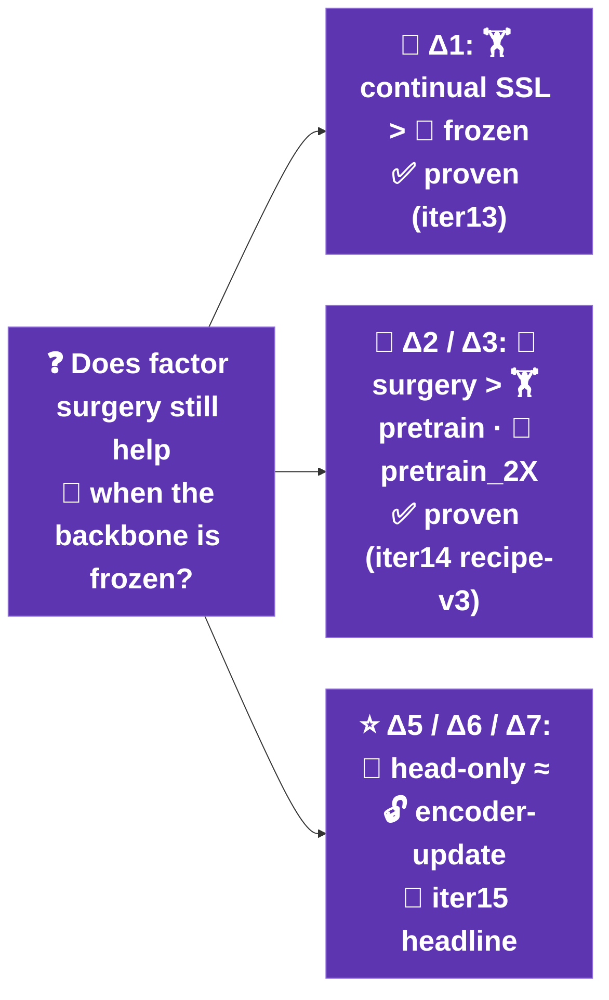

---

## § 2 — 🧬 Encoder zoo (8 arms · iter17: replicated ×3 backbones = 24 eval encoders)

> 📌 iter15 showed 1 backbone (ViT-G). iter17 runs the SAME 8 arms for 3 backbones (run_train.sh BACKBONE) → model-scale verdict in **§ 11**.

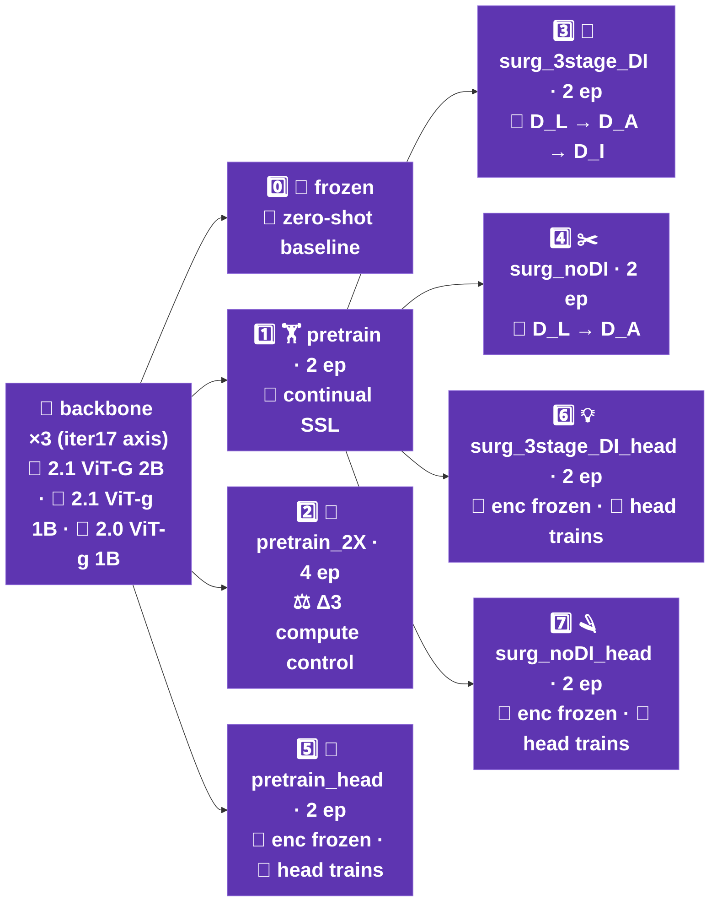

---

## § 2b — 🤗 Published checkpoints · 11 trained 2B (ViT-G) arms on Hugging Face (pushed + verified 2026-06-12)

> Each repo = `student_encoder.pt` (7.4 GB, inference-ready) + `m09*_ckpt_best.pt` (incl. predictor) + auto model card
> (training summary · probe trajectory · held-out 9-metric test table, N=1825, 95% BCa CI).
> Load: `hf_hub_download("<repo>", "student_encoder.pt")` → `get_vit_by_arch("vit_giant_xformers_rope").load_state_dict(...)`.

| 🧬 Arm | 🏷️ Role | 🤗 HF model repo |
|---|---|---|
| 🏋️ pretrain | continual-SSL anchor (every arm's init) | [factorjepa-pretrain-vjepa21-vitG-2B-poc](https://huggingface.co/anonymousML123/factorjepa-pretrain-vjepa21-vitG-2B-poc) |
| 🔧 surgery_3stage_DI | ⭐ novelty: 3-stage factor surgery | [factorjepa-surgery-3stage-DI-vjepa21-vitG-2B-poc](https://huggingface.co/anonymousML123/factorjepa-surgery-3stage-DI-vjepa21-vitG-2B-poc) |
| ✂️ surgery_noDI | novelty ablation (no D_I phase) | [factorjepa-surgery-noDI-vjepa21-vitG-2B-poc](https://huggingface.co/anonymousML123/factorjepa-surgery-noDI-vjepa21-vitG-2B-poc) |
| 🎬 surgery_raw | control: surgery recipe on RAW clips | [factorjepa-surgery-raw-vjepa21-vitG-2B-poc](https://huggingface.co/anonymousML123/factorjepa-surgery-raw-vjepa21-vitG-2B-poc) |
| 🎛️ surgical_autorgn | Auto-RGN adaptive-LR baseline | [factorjepa-surgical-autorgn-vjepa21-vitG-2B-poc](https://huggingface.co/anonymousML123/factorjepa-surgical-autorgn-vjepa21-vitG-2B-poc) |
| 💡 surgery_3stage_DI_head | head-only variant (encoder frozen) | [factorjepa-surgery-3stage-DI-head-vjepa21-vitG-2B-poc](https://huggingface.co/anonymousML123/factorjepa-surgery-3stage-DI-head-vjepa21-vitG-2B-poc) |
| 🪒 surgery_noDI_head | head-only variant (encoder frozen) | [factorjepa-surgery-noDI-head-vjepa21-vitG-2B-poc](https://huggingface.co/anonymousML123/factorjepa-surgery-noDI-head-vjepa21-vitG-2B-poc) |
| 🔥 full_ft | B1 baseline: full fine-tuning | [factorjepa-full-ft-vjepa21-vitG-2B-poc](https://huggingface.co/anonymousML123/factorjepa-full-ft-vjepa21-vitG-2B-poc) |
| 🪜 lpft | B2 baseline: LP-FT (Kumar ICLR'22) | [factorjepa-lpft-vjepa21-vitG-2B-poc](https://huggingface.co/anonymousML123/factorjepa-lpft-vjepa21-vitG-2B-poc) |
| 🧮 peft_lora | B3 baseline: LoRA adapters | [factorjepa-peft-lora-vjepa21-vitG-2B-poc](https://huggingface.co/anonymousML123/factorjepa-peft-lora-vjepa21-vitG-2B-poc) |
| 🧭 peft_dora | B3 baseline: DoRA adapters | [factorjepa-peft-dora-vjepa21-vitG-2B-poc](https://huggingface.co/anonymousML123/factorjepa-peft-dora-vjepa21-vitG-2B-poc) |

> ❌ not published: `cassle` / `ewc` (never trained — parked stragglers). Pusher: `src/utils/hf_finetuned_push.py`.

---

## § 3 — 🔗 Sequential composition + paired-Δ tests

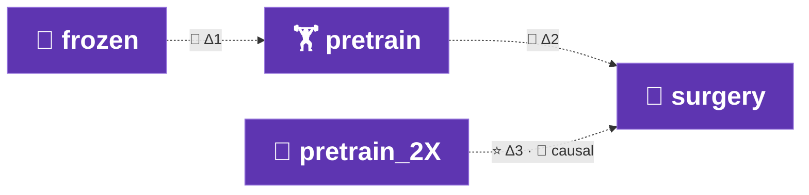

---

## § 4 — 🧬 Recipe-v3 winning recipe (iter14 R1 · 🏆 top-1 = 0.8456)

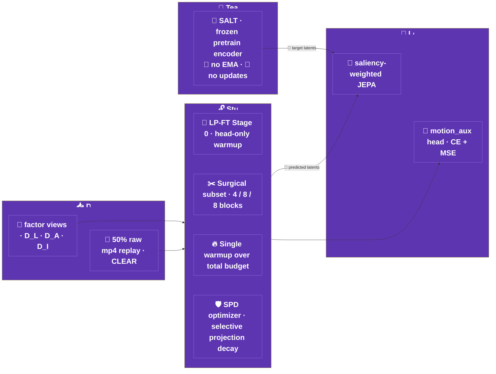

---

## § 5 — 🧪 iter15 7-cell paired-Δ matrix (iter15 Phase 8 + pret2X compute control)

> 📌 iter17: these 7 cells run for EACH of 3 backbones; the verdict is the champion-duel (paired surgery−pretrain CI per backbone), not the named Δ5/Δ6/Δ7 → **§ 11**.

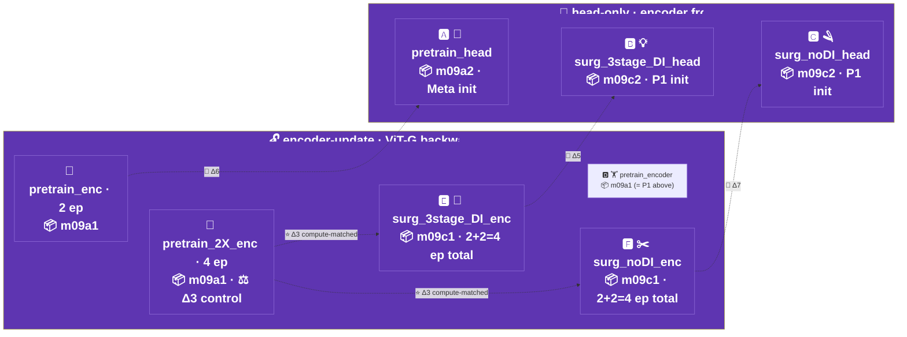

---

## § 6 — 📊 Paired-Δ tests · POC compute-matched verdicts (paper §4 Results)

> 📌 iter15 single-backbone slice (N=220). Superseded headline = **§ 11** model-scale ablation (3 backbones, N=1825).

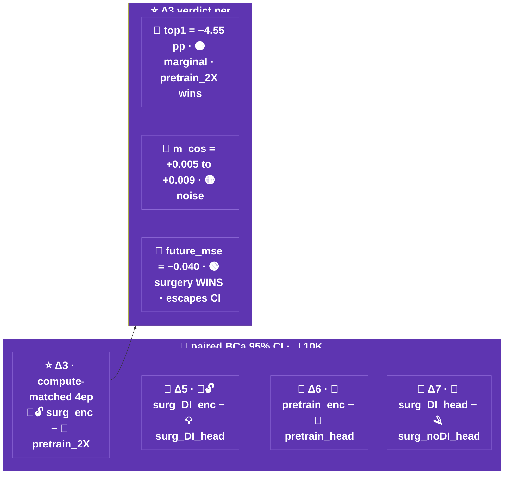

---

## § 7 — 🔭 Probe-SUITE evaluation protocol (iter17 · 9 scorable metrics · N=1825 held-out test)

> 📌 iter17 expanded the iter15 probe-TRIO (top1 / motion_cos / future_l1, N=1000) → a 9-metric SUITE; future_l1 → future_mse. iter18 (2026-06-12) REVIVED m12f encoder-temporal (aot/tov/pace/tcc — Stage 8c/9c, speedups #1-#8) → +5 ENC metrics; full reference table in **§ 7b**.

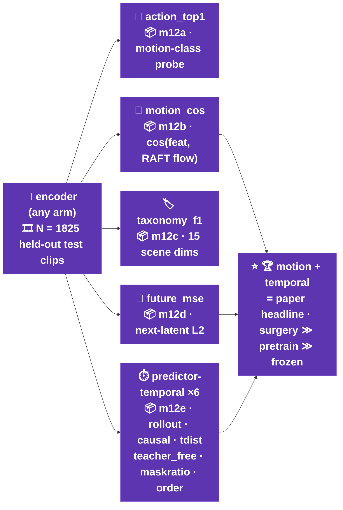

---

## § 7b — 📚 Metric reference · all 15 eval metrics (9 suite + signed `order` + 5 iter18 m12f encoder-temporal)

> Sources: per-module docstrings (`src/m12{a-f}_*.py`, `src/utils/pt_*.py`, `src/utils/et_*.py`) + gold-standard papers:
> [Arrow of Time — Wei et al. CVPR'18](https://openaccess.thecvf.com/content_cvpr_2018/html/Wei_Learning_and_Using_CVPR_2018_paper.html) ·
> [Shuffle & Learn — Misra et al. ECCV'16](https://www.researchgate.net/publication/308277657_Shuffle_and_Learn_Unsupervised_Learning_Using_Temporal_Order_Verification) ·
> [Pace Prediction — Wang et al. ECCV'20](https://jianbojiao.com/pdfs/ECCV_pace.pdf) ·
> [TCC — Dwibedi et al. CVPR'19](https://arxiv.org/abs/1904.07846). Every value ships with a 95% BCa bootstrap CI (N=1825 held-out test clips).

| 📐 Metric (module · ↑/↓) | 🧒 Explain like I'm 5 | 📖 Official definition | 🧮 Mathematical formula | 💻 Source code |
|---|---|---|---|---|
| 🎯 **action_top1** (m12a · ↑) | The robot watches a clip and picks 1 of 11 answers for "which way is stuff moving, and how fast?" — score = how often it's right | Top-1 accuracy of an attentive probe trained on frozen encoder features to classify each clip's dominant motion (speed × direction) | $\mathrm{Acc}=\frac{1}{N}\sum_q \mathbb{1}[\arg\max_c f_\theta(z_q)=y_q]$ over 11 optical-flow motion classes | `src/m12a_action_top1.py` |
| 🏷️ **taxonomy_f1** (m12c · ↑) | 15 little quizzes about the scene ("rainy? market? night?") — take the average grade | Macro average over 15 scene-taxonomy dimensions (weather, road type, crowding, …) of per-dimension probe test scores | $\frac{1}{15}\sum_{d=1}^{15}s_d$, $s_d$ = top-1 acc (single-label dims) or sample-F1 (multi-label dims) | `src/m12c_taxonomy_f1.py` |
| 🧭 **motion_cos** (m12b · ↑) | Clips that move the same way should "look alike" to the robot — score = how much more alike friends are than strangers | Intra-minus-inter class cosine margin: mean similarity to same-motion-class clips minus different-class clips | $\frac{1}{N}\sum_q[\overline{\cos}(z_q,z_{same})-\overline{\cos}(z_q,z_{diff})]$ | `src/m12b_motion_cos.py` |
| 🔮 **future_mse** (m12d · ↓) | Cover the next picture in the flip-book and ask the robot to draw it — score = how wrong the drawing is | Mean squared error of the predictor reconstructing held-out future latent tokens from visible context | $\frac{1}{N}\sum_q\|\hat z_{t+\Delta}-z_{t+\Delta}\|_2^2$ (predictor vs teacher latents, masked future block) | `src/m12d_future_mse.py` |
| 📉 **rollout** (pt#1 · ↓) | A whisper game the robot plays with itself — how fast does the story get garbled? | Free-running iterated rollout drift: error growth rate when the predictor consumes its own outputs (V-JEPA-2-AC rollout) | per-clip OLS slope of $L_1(\hat h_k,h_k)$ vs horizon $k$, predictions fed back as context | `src/m12e_predictor_temporal.py` + `src/utils/pt_rollout.py` |
| ⏪ **causal** (pt#2 · ↓) | Hide the whole second half of the movie — can the robot guess it from the first half? | Strictly causal future-half prediction error (past→future masking, no bidirectional leak) | $\overline{L_1}$ predicting temporal slots $[T_p/2,T_p)$ from $[0,T_p/2)$ only | `src/m12e_predictor_temporal.py` + `src/utils/pt_causal.py` |
| 📏 **tdist** (pt#3 · ↓) | Guessing 1 second ahead is easy, 8 seconds is hard — how quickly does the robot's guessing get worse? | Predictability-horizon scaling: how fast single-shot prediction degrades with temporal distance (CPC-style long-horizon test) | per-clip OLS slope of single-shot $L_1$ vs $\Delta t\in\{1,2,4,8\}$ from a 1-slot context | `src/m12e_predictor_temporal.py` + `src/utils/pt_tdist.py` |
| 🧩 **maskratio** (pt#5 · ↓) | A jigsaw with more and more pieces missing — how fast does the robot's picture fall apart? | Graceful degradation under sparse context (VideoMAE high-masking robustness) — error growth as more tokens are hidden | per-clip OLS slope of $L_1$ vs mask ratio $r\in\{0.3,0.5,0.7,0.9\}$ | `src/m12e_predictor_temporal.py` + `src/utils/pt_maskratio.py` |
| 🔀 **order** (pt#6 · signed) | Mix up the comic panels — does the robot even notice? | Temporal-order reliance: extra error when context frames are shuffled (>0 = order-dependent; ≈0 = order-blind). Diagnostic, not win/loss | $\Delta L_1 = L_1^{shuffled}-L_1^{ordered}$ (last-slot prediction, same mask) | `src/m12e_predictor_temporal.py` + `src/utils/pt_order.py` |
| 🎓 **teacher_free** (pt#4 · ↓) | Riding without training wheels vs with — how much wobblier? | Exposure bias: error inflation when the predictor consumes its own mistakes vs re-grounded real context (Scheduled Sampling) | $\overline{L_1^{free}-L_1^{teacher}}$ over horizons (free-run minus teacher-forced rollout) | `src/m12e_predictor_temporal.py` + `src/utils/pt_teacher_free.py` |
| ⏩ **aot** (m12f/et · ↑) | Is the movie playing forwards or backwards? (Spilled milk doesn't jump back into the glass) | [Arrow-of-Time (Wei CVPR'18)]: classify temporal direction from encoder features — does the representation preserve time's arrow? | binary head acc on $\bar z$: forward vs time-reversed clip, $\frac{1}{2}$(fwd ✓ + rev ✓) per clip | `src/m12f_encoder_temporal.py` + `src/utils/et_aot.py` |
| 🔢 **tov** (m12f/et · ↑) | We scramble the photo album 4 different ways — can the robot tell which scramble it got? | [Temporal Order Verification / VCOP (Misra ECCV'16, Xu CVPR'19)]: identify WHICH frame ordering the clip has | $n$-way head top-1 over frame-permutation classes {identity + 3 shuffles}, avg over $n$ variants per clip | `src/m12f_encoder_temporal.py` + `src/utils/et_tov.py` |
| 🏃 **pace** (m12f/et · ↑) | Is the video normal speed, fast-forward, or super-fast? | [Pace Prediction (Wang ECCV'20)]: classify the playback speed — rate-sensitive representations beat appearance-only ones | 3-way head top-1 over playback strides $\{1,2,4\}$ (oversampled source decode) | `src/m12f_encoder_temporal.py` + `src/utils/et_pace.py` |
| 🔁 **tcc_cycle** (m12f/et · ↓) | Walk from your frame to the matching frame in a friend's video and back — do you land where you started? | [TCC (Dwibedi CVPR'19) eq.1]: cycle-back alignment error between same-action clip pairs — training-free temporal correspondence | $\frac{1}{T}\sum_i\|i-\mathrm{cyc}(i)\|$, $\mathrm{cyc}$ = soft-NN $A\!\to\!B\!\to\!A$, $\mathrm{soft}_i=\sum_j\mathrm{softmax}_j(\langle a_i,b_j\rangle/\tau)\cdot j$ | `src/m12f_encoder_temporal.py` + `src/utils/et_tcc.py` |
| 🔗 **tcc_tau** (m12f/et · ↑) | When we match moments across two videos of the same action, do they stay in story order? | Rank correlation of the cross-clip frame alignment with monotonic time order (NaN for degenerate/static pairs, excluded + reported) | Kendall $\tau_b=\frac{P-Q}{\sqrt{(n_0-n_1)(n_0-n_2)}}$ between $\mathrm{arange}(T)$ and hard-NN alignment indices | `src/m12f_encoder_temporal.py` + `src/utils/et_tcc.py` |

> 🗂️ Column key: `pt#` = `src/utils/pt_*.py` (predictor-temporal, Stage 8b) · `et` = `src/utils/et_*.py` (encoder-temporal, Stage 8c) · ↑ higher better · ↓ lower better.

---

## § 8 — 🧠 motion_aux head (auxiliary supervision)

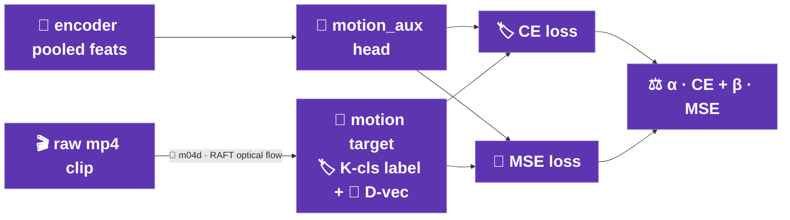

---

## § 9 — 🏗️ Training-loop schematic (m09a / m09c × encoder / head)

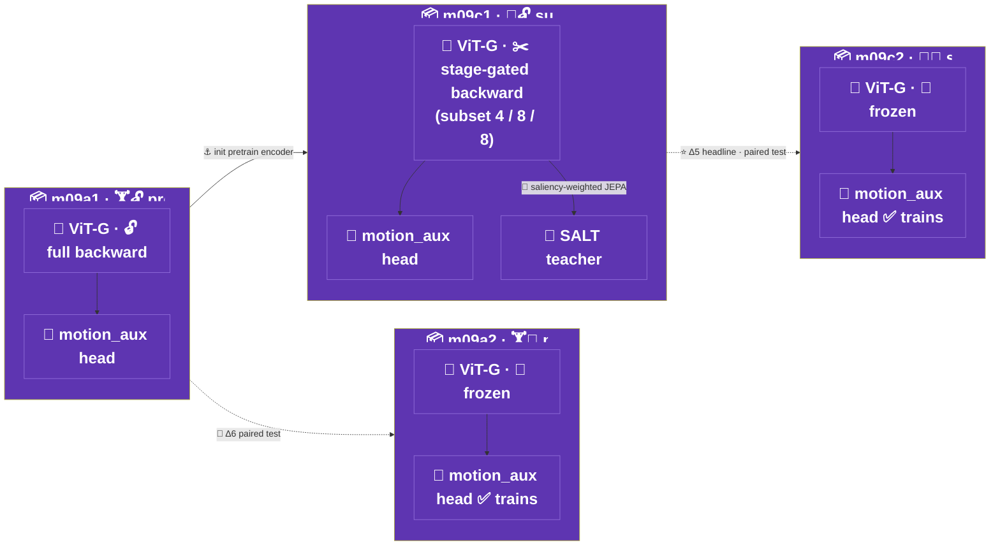

---

## § 10 — 🎲 Surgery per-step data mixing (CLEAR replay × stage mode_mixture)

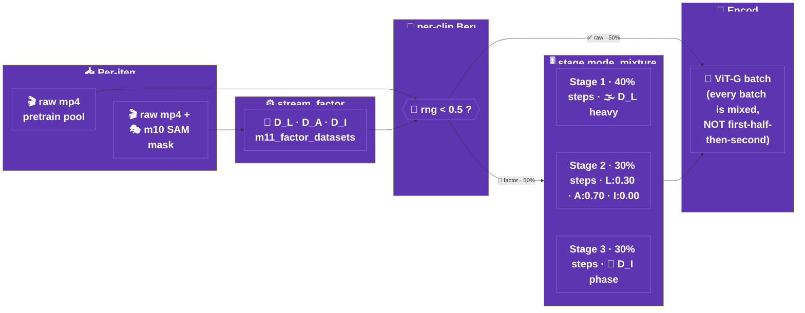

---

## § 11 — 📐 iter17 model-scale × version ablation · surgery vs pretrain across backbones (N=1825)

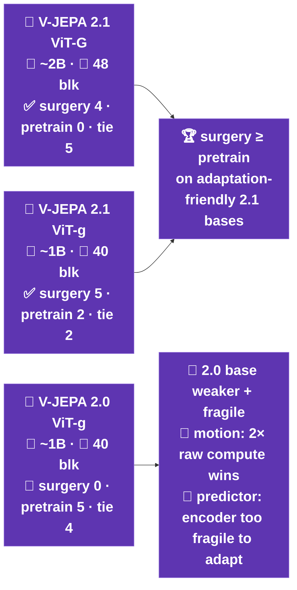
