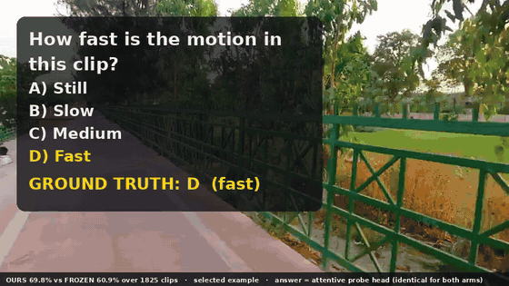
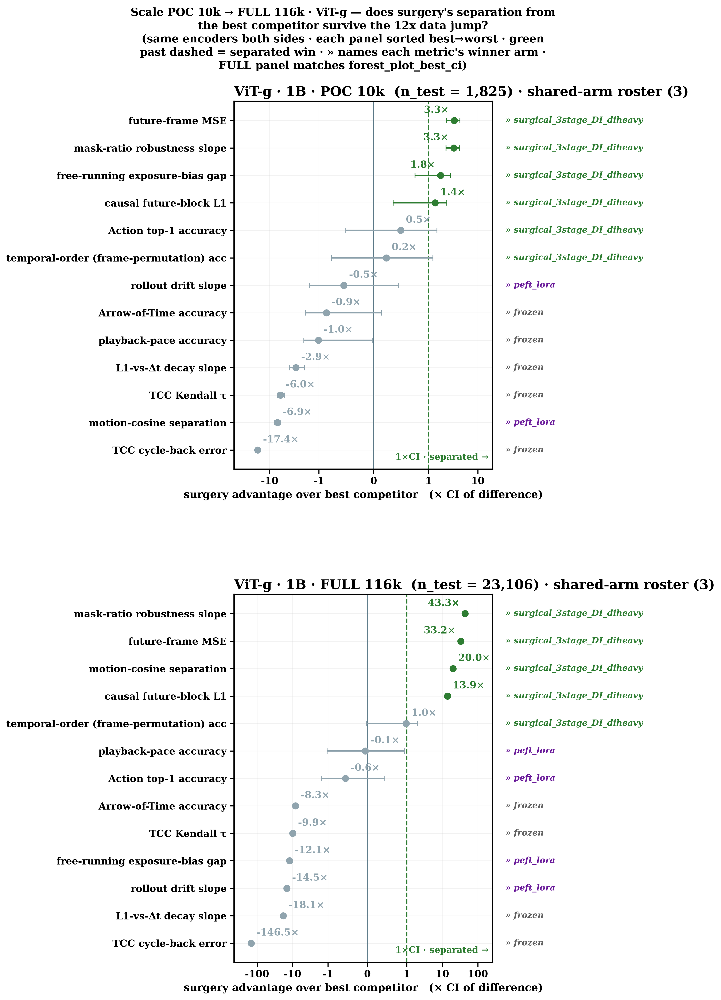
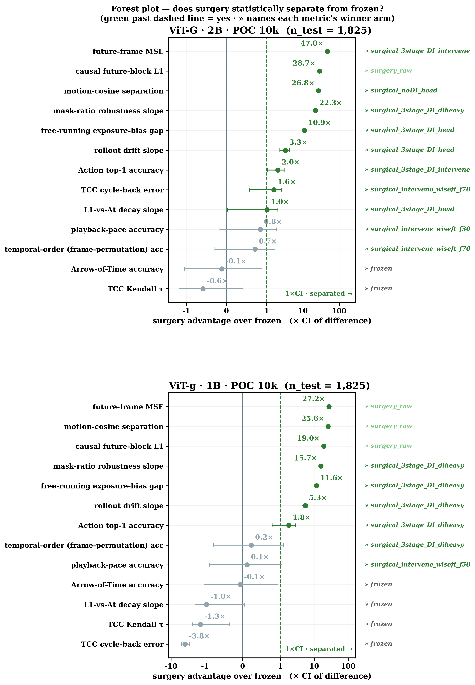
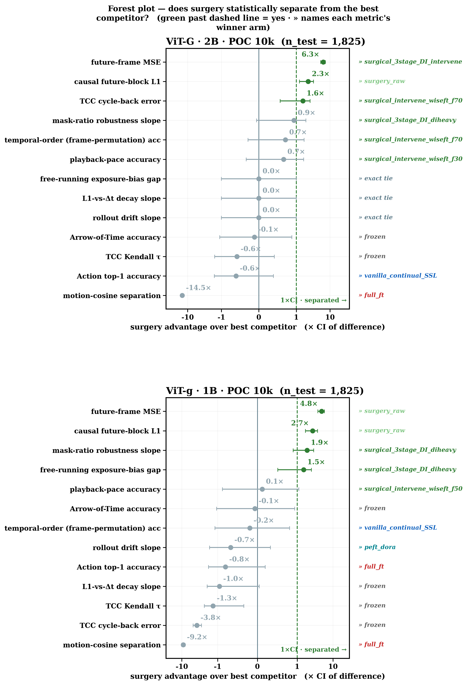
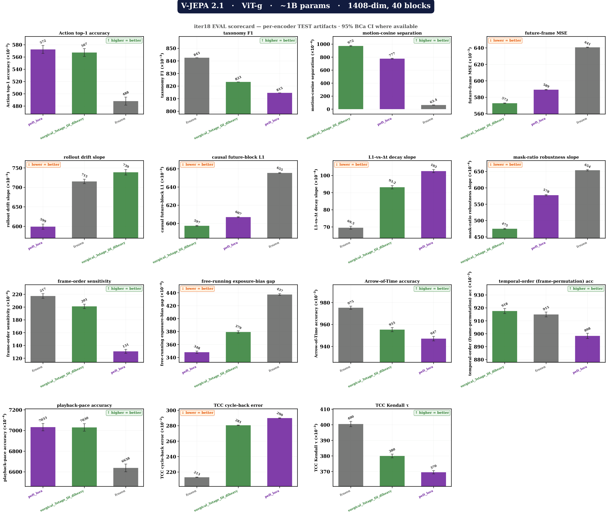
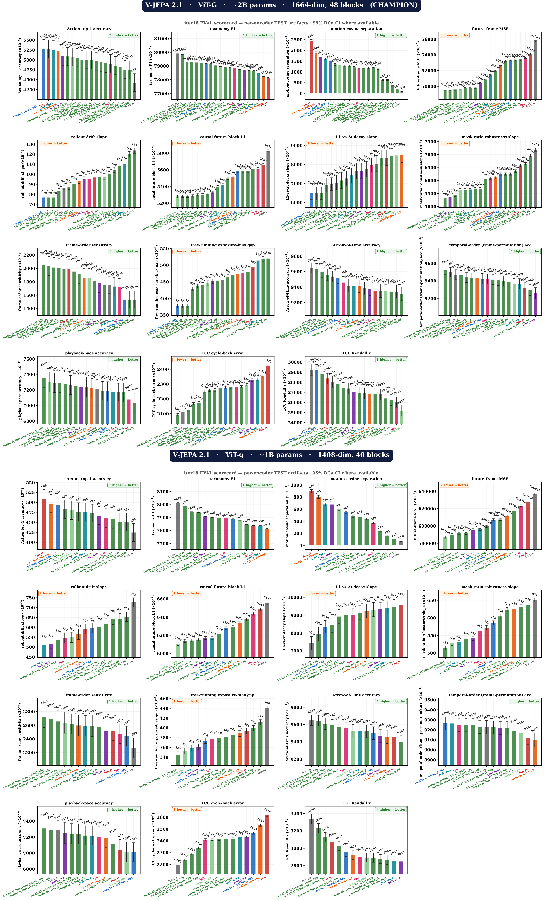
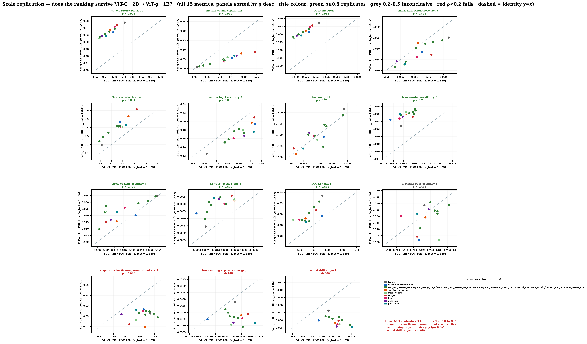

# FactorJEPA — Factorized Predictor Surgery for World Models in Dense, Heterogeneous Urban Scenes

**Anonymized code and evaluation artifacts for double-blind review.**

Same clip, same question, same attentive probe head — **only the encoder differs.**
The frozen V-JEPA 2.1 backbone answers incorrectly (red); FactorJEPA answers correctly (green).


A second card asks *"how fast is the motion in this clip?"* — same setup, same outcome:



*Source clips:* [`card_turn_direction.mp4`](assets/demo/card_turn_direction.mp4) ·
[`card_motion_speed.mp4`](assets/demo/card_motion_speed.mp4)

---

## Headline result

**Full scale — 1B V-JEPA 2.1, 23,106 held-out samples.** FactorJEPA against the frozen backbone,
and against LoRA (the strongest baseline evaluated at this scale):

| diagnostic | vs frozen | vs LoRA |
|---|---|---|
| future-latent L1 *(lower better)* | **−10.6 %** | **+2.8 %** |
| causal future-block L1 *(lower better)* | **−8.9 %** | **+1.6 %** |
| mask-ratio slope *(lower better)* | **−27.4 %** | **+17.8 %** |
| motion-cosine separation *(higher better)* | **×15.3** | **+25.2 %** |

Each of the four gains over frozen exceeds **70×** the 95 % confidence interval of the paired
difference. On the two prediction diagnostics, FactorJEPA separates in its favour against **all six**
adaptation techniques evaluated, at **both** backbone scales — 24 of 24 paired wins.

Every number is read from `outputs/**/metrics_watch/*/eval_metrics.json`; nothing here is
hand-transcribed.

---

## Evidence

**Does the advantage survive the 12× data jump (10k → 116k)?**



**Statistical separation from the frozen backbone** — points beyond the dashed 1×CI line are
separated; the right-hand column names the winning arm for each metric:



**Against the strongest competitor arm** (a tougher bar than frozen — includes full fine-tuning):



**Complete 15-diagnostic scorecard at full scale** (1B, n = 23,106):



**…and across both backbone scales at 10k** (2B: 20 arms, 1B: 14 arms):



**Method rankings replicate across backbone scale** (ρ = 0.895 to 0.978 on the four headline
diagnostics), establishing the 1B model as a half-cost proxy for 2B selection:



> The demo card at the top is an illustrative example selected for clarity. The quantitative
> claims are the tables and figures in this section.

---

## DENSEWORLD 1.0

| Property | Value |
|---|---|
| Videos | **115,687** (4–10 s each, ~8.6 s mean) |
| Source material | **714** long-form recordings |
| Cities | **22** (6 tier-1, 15 tier-2, Goa; plus monument sites) |
| Duration | **276 hours** |
| Size | 121 GB (WebDataset TAR shards) |
| Factor-annotated | **86,831** videos carry layout / agent / interaction targets |
| Held-out test | **23,106** |

Clips are produced by shot-aware segmentation (PySceneDetect `AdaptiveDetector`), then filtered;
`configs/pipeline.yaml → scene_detection` holds the 4.0 s / 10.0 s bounds.

---

> **Anonymization note.** This repository accompanies a paper under review. Author names,
> institutional affiliations, account handles, project-page URLs and hosting identifiers have been
> removed or replaced with neutral placeholders (`anon-org/...`). Some code paths therefore
> reference repositories that resolve only in the de-anonymized version; they are inert here and
> are provided so the pipeline is fully auditable.

---

## What is in this repository

```text
assets/       figures and demo cards used above
src/          the full pipeline, m00 -> m18
  m00-m03       corpus construction: download -> scene detect -> WebDataset shards
  m04*          VLM tagging, motion features (RAFT optical flow), action/taxonomy labels
  m05*          embeddings: V-JEPA + frozen baselines (DINOv2, I-JEPA, LeJEPA, CLIP)
  m09*          the adaptation arms — see the roster below
  m10/m11       factor-target construction (open-vocabulary detection + video segmentation)
  m12*          the 15-diagnostic evaluation suite
  m13           all paper figures (forest plots, scorecards, scale replication)
  m14-m17       qualitative demos
  utils/        shared helpers; arm_registry.py is the single source for the arm roster

scripts/      thin orchestration wrappers (all logic lives in src/)
configs/      every hyper-parameter, path and metric definition
  arm_registry.yaml     SINGLE SOURCE for the arm roster + plot labels
  metric_names.json     SINGLE SOURCE for the 15 metrics (name, direction, grouping)
  eval/paired_deltas.yaml   the pre-registered paired hypotheses
outputs/      evaluation artifacts backing every number above (JSON/CSV only)
```

**Not included:** model checkpoints, video data, and the per-clip label dumps
(`action_labels.json`, `taxonomy_labels.json`) — all regenerable from the pipeline
(`m04e`, `m04f`), and omitted here for size.

---

## Reproducing the numbers

Every headline figure is read from `outputs/**/metrics_watch/*/eval_metrics.json`:

```text
outputs/poc/vjepa_2_1_vitG_2B/eval/eval_10k/.../vjepa_2_1_vitG/eval_metrics.json   20 arms, n_test=1,825
outputs/poc/vjepa_2_1_vitg_1B/eval/eval_10k/.../vjepa_2_1_vitg/eval_metrics.json   14 arms, n_test=1,825
outputs/full/vjepa_2_1_vitg_1B/eval/full/.../vjepa_2_1_vitg/eval_metrics.json       3 arms, n_test=23,106
```

Per-technique head-to-head deltas (paired BCa bootstrap, every arm pair × metric) are in the
stage roll-ups: `probe_action/probe_paired_delta.json`,
`probe_motion_cos/probe_motion_cos_paired.json`,
`probe_future_mse/probe_future_mse_per_variant.json`,
`predictor_temporal/predictor_temporal_per_variant.json`,
`encoder_temporal/encoder_temporal_per_variant.json`.

Regenerate every figure above without a GPU:

```bash
python src/m13_eval_plot.py --POC \
    --output-dir      outputs/poc/vjepa_2_1_vitG_2B/eval/eval_10k/probe_plot \
    --outputs-root    outputs/poc/vjepa_2_1_vitG_2B/eval/eval_10k \
    --train-root      outputs/poc/vjepa_2_1_vitG_2B/train \
    --metrics-watch-out outputs/poc/vjepa_2_1_vitG_2B/eval/eval_10k/probe_plot/metrics_watch \
    --metrics-watch-only
```

---

## Arm roster

Defined once in `configs/arm_registry.yaml` and consumed everywhere (training, eval, plots).

| family | arms |
|---|---|
| **Ours** | `surgical_3stage_DI`, `surgical_noDI`, head variants, and the improvement arms (`diheavy`, `replay25`, `tccaux`, `intervene`) |
| **Ours (ablation)** | `surgery_raw` — identical schedule on raw clips, no factor targets |
| **Baselines** | `full_ft`, `lpft` (LP-FT), `peft_lora`, `peft_dora`, `surgical_autorgn` (Auto-RGN), `vanilla_continual_SSL` |
| **Reference** | `frozen` |

---

## Evaluation suite (15 diagnostics)

Names, directions and groupings are single-sourced in `configs/metric_names.json`.

| group | metrics |
|---|---|
| head / probe | Action top-1, taxonomy F1, motion-cosine separation |
| predictor | future-frame L1, rollout drift slope, causal future-block L1, L1-vs-Δt decay, free-running exposure-bias gap, mask-ratio robustness slope, frame-order sensitivity |
| encoder-temporal | Arrow-of-Time, temporal-order (frame permutation), playback-pace, TCC Kendall τ, TCC cycle-back |

All metrics carry 95 % BCa bootstrap confidence intervals (10K iterations).

---

## License

Code: MIT. The underlying video corpus is sourced from third-party recordings and is **not**
redistributed in this repository.
